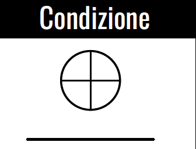
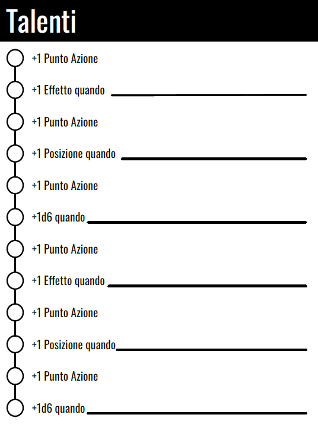

# Introduzione | Potenzia la tua narrazione


## Cos'è Charge

Charge è un gioco di ruolo da tavolo **gratuito**, **aperto** e **generico**.

È gratuito e mantenuto dalla [Fari Community](https://farirpgs.com/discord). Ciò significa che chiunque può contribuire alle regole del gioco.

È anche concesso in licenza aperta, il che significa che puoi usarlo gratuitamente. Puoi anche creare (e vendere) i tuoi giochi utilizzando Charge come base di riferimento.

<iframe frameborder="0" src="https://itch.io/embed/1196268" width="100%" max-width="552" height="167"><a href="https://fari-rpgs.itch.io/charge-rpg">Charge RPG di Fari RPGs (René-Pier Deshaies)</a></iframe>

## Dash


Per iniziare il più velocemente possibile con Charge, dai un'occhiata alla sua versione condensata: **Dash**, disponibile gratuitamente su [itch.io](https://fari-rpgs.itch.io/dash-it) e su [Fari Community](https://fari.community/creators/fari-rpgs/projects/dash.it).

<iframe frameborder="0" src="https://itch.io/embed/1444306" width="100%" max-width="552" height="167"><a href="https://fari-rpgs.itch.io/dash">Dash - Un gioco condensato di Charge di Fari RPGs (René-Pier Deshaies)</a></iframe>

## Charge SRD


Per ulteriori dettagli su come progettare giochi utilizzando Charge, consulta il Charge SRD disponibile anche su [itch.io](https://fari-rpgs.itch.io/charge-srd) e su [Fari Community](https://fari.community/creators/fari-rpgs/projects/charge-srd.it).

<iframe frameborder="0" src="https://itch.io/embed/1243992" width="100%" max-width="552" height="167"><a href="https://fari-rpgs.itch.io/charge-srd">Charge SRD di Fari RPGs (René-Pier Deshaies)</a></iframe>

## Crediti

Questo lavoro si basa su Blades in the Dark (disponibile su [http://www.bladesinthedark.com/](https://www.bladesinthedark.com/)), prodotto da One Seven Design, sviluppato e creato da John Harper, e concesso in licenza per il nostro uso in base alla licenza Creative Commons Attribution 3.0 Unported ([http://creativecommons.org/licenses/by/3.0/](https://creativecommons.org/licenses/by/3.0/)).

## Contributi

Una delle parti fondamentali che rende questo gioco unico è che **appartiene alla comunità**.

Il gioco è gratuito, rilasciato con una licenza di gioco aperta e accoglie i contributi.

Alcuni sistemi incoraggiano i game designer a sviluppare i propri giochi utilizzando le loro regole. Charge, d'altra parte, incoraggia i game designer ad aiutare a farlo crescere.

Ciò significa che puoi:

- Suggerire aggiornamenti alle regole principali
- Fornire nuovi Extra
- Contribuire a migliorare la qualità e la fruibilità del gioco attraverso la correzione di bozze o la traduzione, ecc.

Se contribuisci a questo progetto in qualsiasi modo, il tuo nome verrà aggiunto ai [crediti](#crediti) del gioco. Se hai progettato un Extra specifico per il gioco, il tuo nome verrà anche inserito nei crediti.

Sebbene Charge accetti donazioni, queste donazioni saranno reinvestite direttamente nel gioco tramite la commissione di illustrazioni ufficiali, il pagamento dell'editing, ecc.

Se desideri contribuire a Charge, unisciti al [server Discord della Fari Community](https://farirpgs.com/discord) o visita i [Charge Community Forums](https://fari-rpgs.itch.io/charge-rpg/community) su Itch.

Ora, costruiamo insieme qualcosa di incredibile.

## Link utili

- [Informazioni sulla licenza](/creators/fari-rpgs/projects/charge/licencing)
- [Pagina di Charge su Itch](https://fari-rpgs.itch.io/charge-rpg)
- [Charge SRD](https://fari.community/creators/fari-rpgs/projects/charge-srd.it)
- [Server Discord di Fari](https://farirpgs.com/discord)
- [Charge Community Forums](https://fari-rpgs.itch.io/charge-rpg/community)
- [Scheda riassuntiva di Charge](/creators/fari-rpgs/projects/charge/in-a-nutshell)

## Ringraziamenti

Desidero ringraziare velocemente i miei amici che mi hanno aiutato a rendere questa idea una realtà fin dall'inizio.

<ul class="people">
 <li>Alexandre L. Lescarbeau</li>
 <li>Béatrice Landry-Belleau</li>
 <li>François Genois</li>
 <li>Gabriel Lemire</li>
 <li>Jean-Loup Kahloun</li>
 <li>Wing Tak Wong</li>
 <li>Xavier Tétreault</li>
</ul>

# Obiettivi | Potenzia la tua narrazione


Ci sono migliaia di ottimi giochi di ruolo da tavolo là fuori. Alcuni sono generici, come Charge, mentre altri sono realizzati con un contesto molto specifico in mente. In quest'ultimo caso, le meccaniche sono spesso create per rafforzare il contesto.

Charge è generico, il che significa che puoi scegliere il mondo e l'ambientazione in cui desideri giocare. Puoi giocare in un contesto di fantascienza in cui nuovi pianeti vengono ancora scoperti e terraformati ogni anno, o sulla Terra durante la Rivoluzione Industriale Britannica. Spetta a te decidere.

Poiché le ambientazioni possono differire notevolmente, le meccaniche di gioco di Charge sono state sviluppate con obiettivi molto specifici per aiutarti a creare la storia che desideri raccontare.

## L'idea dietro Charge

Ecco alcune caratteristiche che rendono Charge speciale rispetto ad altri giochi che potresti aver giocato in passato.

> **È facile creare personaggi per qualsiasi ambientazione.**
>
> ——
>
> I personaggi sono facili da definire e allo stesso tempo unici nel loro modo. Charge ti offre un buon quadro per creare personaggi per le ambientazioni che desideri.
>
> Charge fa questo facendo risplendere i personaggi usando **dettagli dei personaggi** per definire chi sono e come sono collegati al mondo. Hanno **azioni** per mettere in risalto ciò in cui sono bravi e **talenti** per farli evolvere in modi interessanti.

> **Offre semplici regolazioni e extra per avventure "più oscure" o "più grandi della vita".**
>
> ——
>
> Da un'avventura di sopravvivenza post-apocalittica in cui ogni proiettile conta, a un grande space opera in cui gli eroi vincono sempre, le meccaniche possono essere facilmente regolate per riflettere il tipo di storia che vuoi raccontare.
>
> Puoi regolare l'impostazione principale di difficoltà del gioco o utilizzare uno dei numerosi **extra** disponibili per giocare nel modo che desideri.

> **È sia una cintura degli attrezzi che una cassetta degli attrezzi.**
>
> ——
>
> Charge è una cassetta degli attrezzi perché ha un insieme di meccaniche per risolvere problemi narrativi in modi diversi. È anche una cintura degli attrezzi perché ti offre un modo predefinito di giocare che è facile da imparare e usare.
>
> Puoi giocarci così com'è, o modificarlo come desideri.

Ti piacerà questo gioco se:

- ti piacciono i sistemi focalizzati sulla narrazione
- ti piace poter giocare in qualsiasi ambientazione
- pensi in generale che il fallimento sia più interessante del successo
- ti piace quando il tuo personaggio inizia competente e gradualmente diventa più flessibile
- ti piace giocare a giochi come Fate o Forged in the Dark

Charge porta anche nuove idee interessanti sul tavolo, come un framework di progressione flessibile e meccaniche per far sì che i giocatori desiderino interagire con il mondo invece di rimanere fermi in attesa del momento migliore per agire.

Speriamo che ti diverti con questo, perché ci siamo divertiti molto a scriverlo e giocarlo.

Ora, vediamo di cosa hai bisogno per giocare a Charge.

# Cosa ti serve per giocare | Potenzia la tua narrazione

Per giocare a Charge, hai bisogno di:

- Copie della [scheda del personaggio di Charge RPG](character-sheets)
- Una pila di cartoncini o piccoli pezzi di carta su cui disegnare cose.
- Un set di dadi a sei facce. Sarebbe ideale averne almeno 6.
- Tra due e cinque amici con cui giocare, uno dei quali farà da Game Master.

# Il gioco | Potenzia la tua narrazione

Charge è un gioco di ruolo generico da tavolo. Ciò significa che tu e i tuoi amici vi riunite per raccontare una storia interattiva su un gruppo di personaggi immaginari che create. Questi personaggi affrontano ostacoli e sfide e voi decidete come reagiscono. Il mondo cambia quindi in base a ciò che fanno i personaggi.

## Game Master e Giocatori

Una persona nel gruppo deve fare da **Game Master**, o **GM**. Il GM è responsabile del mondo e dei personaggi che vi vivono (quelli che non sono direttamente interpretati dagli altri giocatori al tavolo). Chiamiamo questi personaggi "personaggi non giocanti", o *PGN*.

Il resto del gruppo sono i **Giocatori**. I giocatori creano un personaggio che vive storie coinvolgenti in questo mondo. Chiamiamo questi personaggi giocanti, o *PG*.

Sebbene il GM sia di solito la persona principale responsabile del modo in cui il mondo cambia nel tempo, tutti al tavolo sono responsabili della storia.

Questo non è un tipo di gioco "GM contro Giocatori" o "Il GM è un dio". Se giocare a questo gioco fosse come fare un film, il **GM sarebbe il regista** e tutti i **giocatori sarebbero gli sceneggiatori**.

Tutti al tavolo contribuiscono a rendere la storia interessante e coinvolgente.

## Struttura del gioco

Tutto all'interno di Charge è collaborativo.

Si sceglie insieme un'ambientazione, si creano i personaggi insieme e si fa evolvere quel mondo insieme.

Ogni sessione è composta da **scene**, come in un film. Ogni scena si svolge con un susseguirsi di interazioni tra il GM e i giocatori. Il GM descrive come è la scena, i giocatori dicono al GM cosa fanno, e il GM fa reagire il mondo a quelle azioni in base ai risultati di determinati tiri di dado.

Ogni volta che tu e i tuoi amici vi incontrate per giocare a Charge, avete una **sessione** che può durare da 1 a 4 ore, o anche di più. La durata di ogni sessione dipende da molti fattori.

Ogni gruppo può giocare in modo molto diverso. Alcuni potrebbero prendersi il loro tempo, mentre altri potrebbero affrontare le cose direttamente, ma dipende anche dalla disponibilità di tutti.

Durante le sessioni, la tensione aumenta durante le scene e i giocatori incontrano situazioni narrative sconosciute. Per decidere cosa succede in quei momenti, il gruppo tira i dadi perché vogliono essere sulle spine. Vogliono essere sorpresi da ciò che accadrà nella storia.

Prima di vedere come creare i personaggi dei giocatori, dobbiamo parlare di creare un ambiente sicuro per tutti al tavolo.

# Sicurezza al tavolo | Potenzia la tua narrazione

## Strumenti di sicurezza

Se in qualsiasi momento durante il processo di creazione del gioco o durante lo svolgimento di una scena, qualcosa non va bene per qualcuno al tavolo, il gioco deve essere messo in pausa e le cose devono essere allineate e discusse in modo che **tutti siano sulla stessa pagina**.

Un modo in cui il GM può contribuire a rendere il tavolo più sicuro per tutti è utilizzare strumenti di sicurezza come la [**X-Card**](https://docs.google.com/document/d/1SB0jsx34bWHZWbnNIVVuMjhDkrdFGo1_hSC2BWPlI3A/edit) di John Stavropoulos o il [**Script Change RPG Toolbox**](https://briebeau.itch.io/script-change) di Beau.

Questo è estremamente importante e non deve essere preso alla leggera. Tutti al tavolo dovrebbero sentirsi al sicuro e a proprio agio.

Se non ti senti al sicuro al tavolo, è del tutto normale abbandonare il gioco e trovare un altro gruppo di persone con cui giocare. Non sentirti in colpa e, cosa ancora più importante, rispetta te stesso.

## Etichetta nel gioco di ruolo

Ricordati di essere empatico verso gli orari e le responsabilità delle persone. Alcune persone hanno figli, animali domestici, lavori e altre cose che rendono molto difficile pianificare le sessioni. Arriva in orario e sfrutta il tempo di gioco che puoi ottenere.

Poi, aspetta pazientemente fino alla prossima sessione. E mentre aspetti, ricorda e lodati per i momenti fantastici che sono accaduti nell'ultima sessione.


# Creazione del tuo personaggio | Creazione del personaggio

Come giocatore, crei un **personaggio**.

Il tuo personaggio è definito da determinati tratti e legato a certi elementi del mondo in cui vive. Influenzerà il mondo intorno a lui con le sue **azioni**. Se le sue azioni non sono completamente riuscite, ciò porterà a **conseguenze** che potrebbero infliggere **stress** o peggiorare le sue **condizioni**.

I **dettagli** dei tuoi personaggi sono un ottimo modo per rendere i tuoi personaggi unici nella finzione, ma Charge utilizza i **talenti** per conferire benefici meccanici ai personaggi quando effettuano un **tiro d'azione**.

Puoi trovare ciascuno di questi termini nella scheda del personaggio, ma vediamo cosa significano tutti loro e come li usiamo durante una sessione.

## Dettagli

I personaggi sono definiti da tratti descrittivi chiamati **dettagli**. Ogni personaggio di solito ne ha tra 2 e 5 per evidenziare chi sono e cosa è importante di loro. Questi dettagli non sono solo informazioni che danno colore al personaggio, ma dovrebbero essere gli aspetti del personaggio a cui prestiamo attenzione nella storia. Vengono anche utilizzati come guida per conoscere le diverse libertà narrative che un personaggio ha nella finzione.


### Concetto

Il **concetto** del tuo personaggio è come la versione dell'ascensore di chi è.

Sulla scheda del personaggio, scrivi una breve frase che li riassume rapidamente.

Un buon concetto potrebbe includere cose come:

- la sua professione o ruolo all'interno del gruppo
- da dove viene
- un tratto di personalità
- un talento unico che possiedono, ecc.

### Aspetto

Successivamente c'è l'**aspetto** del tuo personaggio.

Usa questa sezione per descrivere come appare il tuo personaggio. Puoi parlare della sua forma, delle dimensioni, di come si veste, ecc.

Questo aiuterà tutti al tavolo quando devono immaginare il tuo personaggio mentre interagiscono con esso.

### Legami

Poiché il tuo personaggio è uno dei protagonisti della storia, deve essere collegato alle diverse forze presenti nel mondo. Non è nato ieri (o forse sì?), quindi probabilmente ha fatto amicizia o si è inimicato diverse persone o organizzazioni.

Per stabilire questi legami, definiamo **legami**.

Un legame collega il tuo personaggio al personaggio di un altro giocatore, a un'organizzazione o ad altre [forze del mondo](creating-a-compelling-campaign).

Quando scrivi un legame per il tuo personaggio, cerca di rispondere **a chi è collegato il mio personaggio** e anche **come è collegato a loro**.

Questo aiuterà anche a stabilire un po' di storia generale per il tuo personaggio, senza dover scrivere 10 pagine di appunti che potrebbero rimanere inutilizzate.

> \#### Scelta dei dettagli durante il gioco
>
> Non è necessario sviluppare completamente il tuo personaggio prima di iniziare a giocare.
>
> Scegliere semplicemente il tuo **concetto** è più che sufficiente per cominciare.
>
> Dopo la prima o le prime due sessioni, avrai una migliore idea di chi è il tuo personaggio, quindi trovare quei dettagli successivamente va benissimo.
>
> Ma se hai bisogno di aiuto per sviluppare i tuoi personaggi, puoi sempre usare gratuitamente [Fari Story Builder](https://fari.app/story-builder) per far scorrere l'ispirazione!
> 

## Azioni

Se un personaggio giocatore desidera fare qualcosa di impegnativo o che potrebbe fallire, effettua un **tiro d'azione**.

Il fallimento è possibile se c'è qualche tipo di ostacolo da superare, come qualcosa che si frappone o qualcuno che cerca di fermarti.

Detto questo, non ogni interazione con il mondo richiede un tiro. Se ciò che il personaggio fa è qualcosa che ci aspettiamo che riesca semplicemente a fare, allora non tiri nulla. Lo fa semplicemente.

In Charge, ci sono **12 azioni** che i personaggi possono compiere.

Quando crei un personaggio, devi **distribuire 7 punti azione** tra queste 12 azioni. All'inizio di una campagna, un'unica azione non può avere più di 2 punti azione.

Questi punti rappresentano quanto il tuo personaggio sia bravo a fare le cose. Man mano che il gioco procede, guadagnerai punti aggiuntivi che renderanno il tuo personaggio più flessibile. Vedi [**Meccaniche&nbsp;»&nbsp;Progressione**](mechanics#progression).

Le 12 azioni sono raggruppate in 3 categorie chiamate **Attributi**. Ci sono **Fisico**, **Acume** e **Determinazione**. Ora vediamo le 12 diverse azioni.

### Le 12 Azioni


#### Fisico

Quando usi **Muscoli**, usi la tua forza per muoverti, superare o distruggere l'ostacolo di fronte a te.

> Potresti sollevare, colpire, afferrare, tagliare e squarciare. Potresti lottare con un animale selvaggio. Potresti far esplodere una porta. Potresti cercare di combattere in un duello formale (ma **Finezza** potrebbe essere migliore).

Quando usi **Finezza**, impieghi manipolazione agile o sottile distrazione.

> Potresti rubare qualcosa dalla tasca di qualcuno. Potresti hackerare un sistema di sicurezza. Potresti guidare i comandi di una nave. Potresti cercare di aprire una serratura (ma **Armeggiare** potrebbe essere migliore).

Quando usi **Muoversi**, ti sposti rapidamente in una nuova posizione o ti metti al sicuro.

> Potresti arrampicarti, nuotare, correre o saltare. Potresti sfuggire alla guardia. Potresti saltare sopra una buca con le punte. Potresti cercare di seminare qualcuno alle calcagna (ma **Furtività** potrebbe essere migliore).

Quando usi **Furtività**, attraversi abilmente e silenziosamente.

> Potresti passare di nascosto davanti a una guardia o nasconderti nell'ombra. Potresti cercare di pugnalare alle spalle un soldato in piena battaglia (ma **Muscoli** potrebbe essere migliore).

#### Acume

Quando usi **Sparare**, segui attentamente e spari a un bersaglio.

> Potresti sparare a un nemico a lunga distanza. Potresti lanciare una palla di fuoco per incendiare il campo di battaglia. Potresti puntare i cannoni laser della nave. Potresti cercare di gettare abilmente una freccette in un gioco da bar (ma **Finezza** potrebbe essere migliore).

Quando usi **Armeggiare**, capisci, crei o ripari meccanismi o organismi complessi.

> Potresti creare un nuovo dispositivo o modificare un oggetto esistente. Potresti curare una frattura. Potresti cercare di usare la tua competenza tecnica per controllare un veicolo (ma **Finezza** potrebbe essere migliore).

Quando usi **Studiare**, osservi attentamente i dettagli e interpreti le prove.

> Potresti raccogliere informazioni da documenti, giornali e libri. Potresti analizzare attentamente una persona per individuare bugie o veri sentimenti. Potresti cercare di esaminare gli eventi per comprendere una situazione urgente (ma **Notare** potrebbe essere migliore).

Quando usi **Notare**, osservi la situazione e prevedi gli esiti.

> Potresti cogliere dettagli importanti sul momento. Potresti anticipare il pericolo prima che accada. Potresti cercare di capire cosa sta rendendo qualcuno malato (ma **Studiare** potrebbe essere migliore).

#### Determinazione

Quando usi **Legare**, rassicuri e socializzi con amici e contatti.

> Potresti ottenere risorse, informazioni, persone o luoghi. Potresti fare una buona impressione o conquistare qualcuno con il tuo fascino, stile o empatia. Potresti cercare di manipolare i tuoi amici con la pressione sociale (ma **Influenzare** potrebbe essere migliore).

Quando usi **Comandare**, ottieni un'obbedienza rapida con abilità e rispetto.

> Potresti intimidire o minacciare per ottenere ciò che desideri. Potresti chiedere a una piccola milizia di prepararsi. Potresti ordinare ai tuoi non morti di sacrificarsi per te. Potresti chiedere al tuo famiglio di cercare qualcosa in una stanza (ma **Legare** potrebbe essere migliore).

Quando usi **Concentrarsi**, ti concentri per portare a termine un compito che richiede una grande forza mentale.

> Potresti meditare per entrare nel mondo degli spiriti. Potresti concentrarti per vincere una partita a scacchi. Potresti entrare in trance per completare un rituale importante. Potresti cercare di prestare attenzione più approfondita ai tuoi dintorni oltre a ciò che è visibile (ma **Notare** potrebbe essere migliore).

Quando usi **Influenzare**, persuadi con astuzia, fascino o argomenti.

> Potresti mentire in modo convincente. Potresti persuadere qualcuno a fare ciò che desideri. Potresti sostenere un caso convincente che non lascia spazio a una chiara confutazione. Potresti cercare di ingannare le persone per ottenere affetto o obbedienza (ma **Legare** o **Comandare** potrebbero essere migliori).

### Quale Azione Scegliere per un Tiro

Alcune azioni possono sovrapporsi ad altre. Questo è intenzionale. Man mano che la tua campagna procede, il tuo gruppo stabilirà anche quale azione è la più efficace in determinate situazioni.

Rendi questo gioco tuo.

Come giocatore, puoi scegliere quale azione tirare semplicemente dicendo cosa fa il tuo personaggio. La scelta di un approccio rispetto a un altro potrebbe influenzare il **rischio** o l'**effetto** della tua azione. Il Game Master dovrebbe fornirti questi dettagli prima di effettuare il tiro.

## Slancio

Lo **slancio** di un personaggio è una misura che rappresenta l'impatto del tuo personaggio sul mondo. Più interagisci con il mondo e le persone che lo abitano, più il tuo personaggio guadagna **cariche di slancio**.

All'inizio di ogni sessione, inizi con 2 cariche di slancio e le consumi per potenziare i tuoi tiri d'azione o aiutare i tuoi compagni di squadra.


## Stress e Condizioni

Quando il tuo personaggio affronta sfide pericolose e fallisce il suo **tiro d'azione**, succede qualcosa di negativo.

Forse la situazione diventa più complicata o addirittura pericolosa. Come alternativa, potresti rimanere ferito. Il GM è colui che decide se la **conseguenza** del tiro sia danno o qualcos'altro.

Quando rimani ferito, accumuli una certa quantità di **stress**, e ogni stress fa avanzare di una sezione l'**orologio dello stress** del tuo personaggio.

Ogni volta che il tuo personaggio subisce stress, devi aggiornare la **condizione** del personaggio e scrivere una breve **dettaglio** che descriva lo stato in cui si trova il tuo personaggio.



> \### Un'annotazione sugli Orologi
>
> Gli orologi sono cerchi divisi in 4, 6 o 8 sezioni utilizzati per tenere traccia delle cose che si sviluppano nel corso del gioco nel tempo.
>
> Vengono utilizzati per tenere traccia della condizione di un personaggio, dei diversi progetti a cui sta lavorando, delle complicazioni che sta creando attorno a sé e persino degli ostacoli che sta affrontando.
>
> Gli orologi saranno trattati più avanti in [**Meccaniche&nbsp;»&nbsp;Orologi**](meccaniche#orologi).

Quando un personaggio ha una condizione, le sue libertà narrative sono limitate da tale condizione.

Ad esempio, è quasi impossibile arrampicarsi sul tetto di una casa con una **caviglia slogata**. Quindi, anche se hai solo **2 sezioni** segnate sul tuo orologio dello stress, la tua condizione di per sé impone comunque restrizioni narrative su ciò che il tuo personaggio può fare.

Ecco un paio di esempi di condizioni:

- Quando il tuo orologio dello stress ha **1 o 2 sezioni** piene, potresti essere: esausto, umiliato, stanco, dolorante, affannato, malato, ecc.
- Quando il tuo orologio dello stress ha **3 sezioni** piene, potresti avere una ferita da proiettile, una lacerazione da una lama, una bruciatura di primo grado o essere completamente ubriaco.
- Quando il tuo orologio dello stress raggiunge **4 sezioni piene**, viene azzerato e sei messo fuori gioco per la scena. Potresti aver subito una bruciatura di secondo grado, una frattura alla gamba o il tuo cervello potrebbe non riuscire più a comprendere cosa sta accadendo.

## Talenti

I **talenti** sono un modo per far progredire i personaggi nel corso di una campagna.

Col passare del tempo, i personaggi ottengono nuovi **punti talento**, che fanno avanzare il loro albero dei talenti.



Ogni punto nell'albero dei talenti ti offre un nuovo **punto d'azione** o un **bonus situazionale**.

Un bonus situazionale rappresenta spesso un potenziamento nell'**effetto**, un aumento del **pool di dadi** o una riduzione del **rischio**, ma scatta solo in una determinata situazione.

Non devi preoccuparti dei talenti al momento, soprattutto se hai appena iniziato la tua campagna.

Quando la tua campagna raggiunge un punto di svolta significativo, puoi leggere [**Meccaniche&nbsp;»&nbsp;Progressione**](progressione#traguardi) per sapere come rendere i personaggi più flessibili.

## Progetti e Complicazioni


La sezione **Progetti e Complicazioni** della scheda del personaggio è qualcosa che il GM e i giocatori utilizzano per tenere traccia di progetti a lungo termine o pericoli in continua evoluzione che si estendono su più sessioni.


Non è necessario sapere come utilizzarlo immediatamente, quindi per saperne di più al riguardo, consulta [**Meccaniche&nbsp;»&nbsp;Progetti e Complicazioni**](progetti-e-complicazioni).

## Riepilogo del Personaggio


Questo copre le basi su come creare un personaggio per Charge.

Ora esamineremo tutte le meccaniche utilizzate nel gioco che servono a risolvere gli elementi sconosciuti nella narrazione.

> \#### La Scheda del Personaggio
>
> - Dettagli del personaggio per evidenziare chi sono (Concetto, Aspetto e Legami)
> - 7 punti azione distribuiti tra le 12 azioni per spiegare in cosa sono bravi.
> - Cariche di slancio per potenziare le azioni e aiutare i compagni di squadra.
> - Un **orologio dello stress** e una **condizione** per rappresentare lo stato fisico e mentale di un personaggio.
> - Una **linea dei talenti** per rendere il personaggio più potente.
> - Orologi per **progetti e complicazioni** per tenere traccia di sforzi che si estendono su più sessioni.

# Fiction First | Meccaniche


**Charge è un gioco "fiction first".**

Ciò significa che il GM e i giocatori raccontano una storia e successivamente consultano le regole per vedere se è necessario risolvere qualcosa utilizzando le meccaniche del gioco.

Puoi considerare le meccaniche in Charge come strumenti in una scatola, da utilizzare quando necessario. Risolvono situazioni in cui non si conoscono le risposte dirette a una domanda.

> **_Questo personaggio troverà ciò che sta cercando? Riuscirà questo personaggio a convincere questo mercante a parlare? Come reagirà questa fazione a questo grande evento? ecc._**

A volte, queste situazioni vengono risolte con una meccanica che si basa sulle abilità dei PG, mentre altre volte potrebbero essere risolte con meccaniche che si affidano interamente alla fortuna!

Facciamo questo per creare una sensazione di "wow" in situazioni sconosciute. Mentre la storia è creata da tutti al tavolo, le meccaniche agiscono come una guida che spinge la narrazione avanti con esiti inaspettati.

Queste meccaniche si basano principalmente sulla comprensione dei rischi e su ciò che sta accadendo. Viene quindi lanciato un set di dadi a sei facce, si interpretano i risultati e la storia continua.

# Tiro dei dadi | Meccaniche

Il gioco utilizza dadi a sei facce. Si tirano diversi dadi contemporaneamente, che chiamiamo "pool di dadi", e si legge il **risultato più alto** ottenuto.

- Se il dado più alto è un **6**, è un **successo completo**. Le cose vanno bene. Se si tira più di un **6**, è un **successo critico** e si ottiene un vantaggio aggiuntivo.
- Se il dado più alto è un **4 o 5**, si tratta di un **successo parziale**. Si fa ciò che si stava cercando di fare, ma ci sono delle conseguenze.
- Se il dado più alto è compreso tra **1 e 3**, è un **esito negativo**. Le cose vanno male. Non si raggiunge l'obiettivo e si subiscono delle conseguenze.

> **_Se devi effettuare un tiro ma hai zero (o un numero negativo di) dadi, tira due dadi e prendi il risultato più basso. Non puoi ottenere un successo critico se hai zero dadi._**

La maggior parte delle meccaniche del gioco si basa su questo formato di base.

# Tiro d'Azione | Meccaniche


**_Ho un brutto presentimento..._**

Si desidera raggiungere un obiettivo, ma qualcosa o qualcuno si frappone. Una persona potrebbe nascondere informazioni importanti che si necessitano disperatamente, una porta chiusa potrebbe impedire di avanzare per salvare un amico, o un gruppo di teppisti potrebbe intercettarti in un vicolo e voler vendicarsi per qualcosa che hai fatto loro in passato.

Questo è un ostacolo che deve essere superato.

Per vedere come va a finire, si effettua un **tiro d'azione** seguendo i seguenti passaggi:

## 1. Il giocatore stabilisce il proprio obiettivo

Il primo passo per sapere se il personaggio supera la sfida è capire cosa sta facendo e qual è il suo obiettivo.

Una volta stabilito l'obiettivo del personaggio, il giocatore decide quale delle **12 azioni** intende utilizzare. Sta "Legando" con un mercante locale o cerca di "Influenzarlo" convincendolo che i suoi prezzi sono troppo alti?

Il valore dell'azione viene utilizzato per determinare il pool di dadi iniziale del tiro.

> \#### Opposizione Attiva
>
> In Charge, i PNG non tirano per le loro azioni. I PNG riescono automaticamente nelle loro azioni a meno che i giocatori non tentino di intervenire. In questo caso, un tiro d'azione fa due cose contemporaneamente: **risolve l'azione del PG così come quelle dei PNG coinvolti**. Ciò incoraggia i giocatori a partecipare attivamente all'azione e ad essere pro

attivi, invece di restare passivi.
>
> Il tiro d'azione ci dice i risultati e le conseguenze di un'azione contemporaneamente.
>
> Con un **6**, il PG vince e ottiene ciò che desiderava. Con un **4 o 5**, sia il PG che il PNG hanno un effetto sul risultato. Con un **1-3**, il PNG vince e l'esito comporta una conseguenza per il PG.

## 2. Il GM stabilisce il Rischio

Il GM stabilisce il **rischio** dell'azione in base a quanto è stato stabilito nella narrazione.

Il rischio può essere **basso**, **moderato** o **alto**.

- Quando il rischio è **basso**, le cose sono sotto controllo. Anche se le cose vanno male, c'è un modo per uscirne.
- Quando il rischio è **moderato**, la situazione è pericolosa. Se fallisci, ci saranno ripercussioni.
- Quando il rischio è **alto**, le probabilità sono contro di te. Tentare di andare contro di esse potrebbe avere pesanti conseguenze.

Di default, un tiro d'azione ha un rischio **moderato**. Non tireresti se non ci fosse alcun rischio coinvolto.

Il GM utilizza il contesto narrativo per determinare quale rischio scegliere.

L'azione che viene utilizzata è un altro elemento che potrebbe influenzare il **rischio** di un tiro - cercare di convincere un mercante di cattivo umore potrebbe comportare un rischio **alto** se si usa la "Persuasione". "Creare legami", d'altra parte, potrebbe metterti in una posizione a **basso rischio**, considerando la situazione.

Il rischio aiuta a determinare come appare il fallimento.

## 3. Il GM stabilisce l'Effetto

Il rischio non è l'unico elemento che aiuta a determinare il risultato finale di un tiro. Anche in una situazione a **rischio elevato**, riuscire in un tiro potrebbe comunque avere un grande **effetto** sulla narrazione.

In Charge, ci sono 3 possibili valutazioni dell'effetto: **grande**, **standard** e **limitato**. Nella maggior parte degli scenari comuni, se stai lanciando per superare qualcosa, probabilmente stai cercando di ottenere un effetto **standard**. Il GM è responsabile di fornirti queste informazioni.

Se una pesante porta ti impedisce il passaggio, potresti usare "Destrezza" per scassinare la serratura. Questo potrebbe generare un **effetto standard**, poiché richiederà del tempo, ma il rischio del tiro sarebbe **basso**. Potresti anche provare a usare "Ingegno" e sfondare la porta con un esplosivo. Questo potrebbe creare un **grande effetto**, ma potrebbe essere una situazione a **rischio elevato** poiché potrebbe attirare molta attenzione indesiderata.

La valutazione dell'effetto aiuta a determinare come appare il successo.

> \#### La quarta valutazione dell'effetto
>
> Abbiamo detto che ci sono solo 3 valutazioni dell'effetto, ed in realtà è stata una piccola bugia, perché ce n'è una quarta chiamata **nessun effetto**.
>
> Il GM può utilizzarla quando un compito è così difficile che qualsiasi cosa il PG tenti, non c'è possibilità di successo.
>
> Ovviamente, non fare nulla è noioso. Ecco perché puoi aumentare quel **nessun effetto** ad un **effetto limitato** se ti sforzi utilizzando delle cariche di slancio. Ne parleremo in [Anche le probabilità](#anche-le-probabilità).

> \#### L'impatto di Effetto e Rischio
>
> L'**effetto** e il **rischio** ci aiutano a capire cosa accade nella narrazione, ma hanno anche un impatto meccanico sul gioco.
>
> Per conoscere l'effetto che hanno, vengono associati loro valori numerici.
>
> | Rischio      | Effetto      | Valutazione |
> | ------------ | ------------ | ----------- |
> | **Alto**     | **Grande**   | 3           |
> | **Moderato** | **Standard** | 2           |
> | **Basso**    | **Limitato** | 1           |
>
> Quando un tiro ha successo, si utilizza la **valutazione dell'effetto** per determinare quante porzioni avanzi su orologi di progresso, quante informazioni il personaggio ottiene da un'indagine, ecc.
>
> Quando un tiro crea una conseguenza, si utilizza la **valutazione del rischio** per determinare quante porzioni avanzi su orologi di pericolo, quanta tensione subisce un personaggio quando viene ferito, ecc.
>
> Sebbene di solito sia il GM a stabilire le valutazioni iniziali, l'intero tavolo dovrebbe partecipare alla discussione per assicurarsi che tutti gli aspetti della finzione siano presi in considerazione prima di effettuare un tiro d'azione.
>
> Maggiori informazioni sugli orologi in [**Meccaniche » Orologi**](meccaniche#orologi)

## 4. Il giocatore equipara le probabilità

Anche se le probabilità sono contro di loro, il tuo personaggio ha ancora carte da giocare.

Il giocatore può decidere se vuole equiparare le probabilità aggiungendo dadi bonus al proprio pool.

Di solito si possono ottenere due dadi bonus per il tiro d'azione.

Per un dado bonus, puoi ottenere l'aiuto di un compagno di squadra. Consumano **1 slancio**, spiegano come ti aiutano e ti danno un dado extra da **1d6**.

Per un altro dado bonus, puoi usare **uno** dei seguenti metodi.

### Spingerti oltre

Quando ti **spingi oltre**, consumi **2 slanci** **per ogni spinta** per ottenere uno dei seguenti bonus:

- Aggiungi un dado extra **1d6** al tuo gruppo di dadi.
- Aumenta l'**effetto** del tuo tiro.
- Prendi azione anche se sei stato eliminato.

### Aggiungi tensione

Quando **aggiungi tensione** a un tiro d'azione, puoi chiedere al GM _"Come apparirebbe l'aggiunta di tensione qui?"_. Il GM offre quindi una **conseguenza**, come segnare segmenti su un orologio del pericolo, infliggere stress al tuo personaggio o aggiungere più dramma alla narrazione.

Se accetti la **conseguenza**, aggiungi un dado extra **1d6** al tuo gruppo di dadi attuale.

Potrebbero esserci scenari in cui l'aggiunta di tensione non è un'opzione. In tal caso, il GM può semplicemente comunicarlo al giocatore in modo che possa cercare altre modalità per equilibrare le probabilità.

## Aiutare

Quando **aiuti** un PG, consumi **1 slancio** per dare un dado extra **1d6** al suo tiro. Facendo ciò, ti esponi anche al possibile pericolo.

Puoi anche equilibrare le probabilità utilizzando **uno** dei seguenti metodi.

> \#### Utilizzare una risorsa
>
> Le risorse sono una regola opzionale disponibile in [Extra&nbsp;»&nbsp;Extra delle risorse](#extra-risorse--extraextra-delle-risorse) che fornisce un modo aggiuntivo per equilibrare le probabilità.

## Riepilogo

Ora, facciamo un riepilogo di quanto accade quando effettui un tiro d'azione.

> \#### Tiro d'azione
>
> 1. Scegli un'azione e scopri quanti dadi devi tirare (il **valore dell'azione**).
> 2. Determina il **rischio** (**1 basso** ► **2 moderato** ► **3 alto**).
> 3. Determina il **valore dell'effetto** (**3 grande** ► **2 standard** ► **1 limitato**).
> 4. Aggiungi un dado **1d6** se: ti **spingi oltre** (consumi **2 slanci**) -o- se **aggiungi tensione** alla scena.
> 5. Aggiungi un dado **1d6** se hai **aiutato** (consumi **1 slancio**).
> 6. Tira i dadi e spera nel meglio!
>
> ——
>
> - Con un **66 successo critico**, superi nettamente l'ostacolo.
> - Con un **6 successo pieno**, superi l'ostacolo.
> - Con un **4-5 successo parziale**, superi l'ostacolo, ma ci sono delle **conseguenze**.
> - Con un **1-3 esito negativo**, non riesci a superare l'ostacolo e ci sono delle **conseguenze**.

> \#### Esempio
>
> _Il personaggio di Xavier vuole eliminare una guardia senza che se ne accorga. Decide di usare la **Furtività**. Il GM osserva la situazione e valuta che il rischio sia di **moderato livello**, poiché la guardia potrebbe non essere da sola, ma l'effetto sarebbe di **grande impatto** perché la guardia non è in allerta. Xavier non vuole lasciare tutto al caso e decide di equilibrare le probabilità. Dichiara che il suo personaggio si **spingerà oltre** per ottenere un dado extra **1d6** immergendosi nell'acqua per avvicinarsi alla guardia. Xavier tira il suo gruppo di dadi e... ottiene un **5**, successo parziale! Il GM afferma quindi che il personaggio di Xavier elimina la guardia, ma segna 2 segmenti su un "Orologio di allerta" a causa del rumore causato dal personaggio di Xavier che trascina la guardia in acqua._

# Conseguenze| Meccaniche


**_A volte le cose vanno per il verso giusto. Altre volte..._**

Se fai un tiro d'azione e ottieni un **successo parziale (4-5)** o un **risultato negativo (1-3)**, subisci una **conseguenza**.

Le conseguenze sono uno strumento che il GM può usare per rendere più interessante la storia. Il GM utilizza la fiction, lo stile e il tono stabiliti dal gruppo per determinare il tipo di conseguenza.

## Valutazione delle Conseguenze

Quando viene inflitta una conseguenza al personaggio di un giocatore, il **rischio** del tiro d'azione ci dice quanto è grave quella conseguenza.

Quindi, di solito, una conseguenza derivante da un tiro d'azione a **rischio alto** è peggiore di una conseguenza da un'azione a **rischio basso**.

Chiamiamo questo la **valutazione delle conseguenze**. Alcuni tipi di conseguenze utilizzano direttamente questa valutazione per collegare la conseguenza con alcune delle meccaniche di gioco.

| Rischio              | Valutazione delle Conseguenze |
| -------------------- | ----------------------------- |
| **Rischio alto**     | 3                             |
| **Rischio moderato** | 2                             |
| **Rischio basso**    | 1                             |

## Tipi di Conseguenze

Ecco alcuni tipi di conseguenze che possono essere utilizzate in caso di un tiro negativo:

### Effetto Ridotto

Questa conseguenza rappresenta una performance ridotta. L'azione del PG non è efficace come avevano previsto.

> **Riduci di un livello il valore dell'effetto dell'azione del PG.**
>
> ——
>
> _Li colpisci, ma è solo una ferita superficiale. Le telecamere di sicurezza sono spente, ma i tecnici sono consapevoli e stanno cercando di sistemarle il prima possibile._

### Complicazioni

Questa conseguenza rappresenta problemi, un pericolo crescente o una nuova minaccia.

> **Segna un segmento per ogni valutazione delle conseguenze su un orologio del pericolo, nuovo o esistente.**
>
> ——
>
> _Ti hanno sentito e stanno arrivando. Hai impiegato troppo tempo e ti sta quasi finendo l'aria._

### Opportunità Persa

Questa rappresenta un cambiamento di circostanze. Quello che hai provato non ha funzionato e ora c'è una nuova situazione che ti impedisce di riprovare. Devi trovare un approccio diverso.

> **Il tuo ultimo tentativo non ha funzionato. Se vuoi riprovare, devi usare un'azione diversa.**
>
> ——
>
> _Stavi seguendo qualcuno, ma ti hanno visto e scomparso. Stavi combattendo contro un robot, ma si sono adattati e ora sono in grado di anticipare ogni tua mossa._

### Rischio Accresciuto

Questa conseguenza rappresenta la perdita di controllo della situazione. L'azione ti porta in una situazione più rischiosa.

Forse salti sul tetto successivo, solo per finire appeso per le dita. Non hai fallito, ma non hai neanche avuto successo. Puoi riprovare, facendo un nuovo tiro con un rischio più alto.

Questa è una buona conseguenza da scegliere per mostrare un'azione crescente. Una situazione potrebbe passare da **controllata**, a **rischiosa**, a **disperata** mentre l'azione si sviluppa e il PG si caccia sempre più nei guai.

> **Aumenta di un livello il **rischio** per i futuri tiri legati a quell'azione.**
>
> ——
>
> _Hai mancato il colpo, ora sanno dove sei. Inizialmente avevano fiducia in te, ma ora hanno qualche dubbio e ti osserveranno più da vicino._

### Peggioramento della Condizione

Questa conseguenza rappresenta le ferite o il trauma inflitto a un personaggio.

Quando la tua condizione peggiora, prendi una certa quantità di **stress** che tieni traccia sul tuo **orologio dello stress** del personaggio. Devi anche aggiornare la tua **condizione** per rappresentare il nuovo stato in cui si trova il tuo personaggio.

La nuova condizione del tuo personaggio influenzerà i permessi narrativi e il modo in cui può interagire con il mondo.

Quando l'orologio dello stress è pieno, puoi cancellare tutti i segmenti e il tuo personaggio viene eliminato dalla scena.

> **Prendi 1 stress per ogni valutazione delle conseguenze sulla condizione del tuo personaggio**.
>
> ——
>
> _Hai sparato per sopprimere, ma sei stato colpito nel processo. Sei corso per ore per arrivare al posto, ma ora sei dolorante e stanco._

#### Annullare un Successo

**Non infliggere una complicazione che annulli un tiro riuscito**.

Se un PG cerca di acchiappare un nemico e ottiene un **4-5**, non dire che il nemico scappa. Il tiro del giocatore ha avuto successo, quindi il nemico è acchiappato... forse il PG deve lottare con lui per terra e durante la colluttazione il nemico afferra la sua pistola.

<br/>

> \#### Ho un'idea per una Conseguenza!
>
> Se qualcuno al tavolo ha un'idea per una buona conseguenza, ascoltali!
>
> Può essere intimidatorio come GM sapere sempre cosa succede in caso di fallimento. Questo è particolarmente vero se la fortuna non è dalla parte del giocatore e devi trovare molte conseguenze diverse nella stessa sessione.
>
> Come GM, non esitare a chiedere ai tuoi giocatori delle idee. Qualcuno potrebbe avere una suggestione affascinante, ma pensa che non sia il loro posto per parlarne. Mostra loro che non è così.

## Promemoria di Sicurezza

Solo un rapido promemoria che se pensi a una conseguenza durante una sessione e qualcuno al tavolo non si sente a suo agio, pensa a qualcos'altro.

Metti in pausa il gioco e assicurati che tutti siano d'accordo su ciò che sta accadendo nella finzione. Una volta che tutti sono sulla stessa pagina, riprendi e procedi con una conseguenza diversa.

Anche con le meccaniche di sicurezza in atto, gli incidenti possono accadere. Ecco perché dovresti sempre essere flessibile quando infliggi una conseguenza al gruppo.

## Riassunto

> \#### Conseguenze
>
> Se il risultato di un tiro d'azione è compreso tra **1-5**, il GM infligge **una** conseguenza:
>
> - **Effetto Ridotto**: riduci di un livello l'**effetto** dell'azione.
> - **Complicazione**: segna un segmento per ogni valutazione delle conseguenze su un **orologio del pericolo**, nuovo o esistente.
> - **Posizione peggiore**: aumenta di un livello il **rischio** dei futuri tiri d'azione correlati.
> - **Opportunità persa**: ciò che hai provato non ha funzionato, devi usare un'altra **azione**.
> - **Peggioramento della Condizione**: prendi **1 stress** per ogni valutazione delle conseguenze sulla condizione.

# Tiro Risolutezza | Meccaniche


**_Non mentre io ci sono! (sei pieno di determinazione)_**

Se un personaggio subisce una **conseguenza** che, come giocatore, non ti piace, puoi cercare di resistere ad essa.

Puoi farlo chiamando un **tiro risolutezza** per vedere quanto bene riesci a resistere alla conseguenza.

Effettui il tiro bruciando slancio. Crea un pool di d6 aggiungendo **1d6** per ogni carica di slancio.

Una volta deciso quante cariche vuoi consumare, tira e interpreta i risultati:

- Con un **1-3**, la **conseguenza** accade comunque.
- Con un **4-5**, la **conseguenza** viene ridotta.
- Con un **6**, la **conseguenza** viene evitata.
- Con un **66**, la **conseguenza** viene evitata e il **rischio** del tuo prossimo tiro viene abbassato.

Se lo desideri, puoi anche resistere a una conseguenza che non ti sta mirando direttamente. Se vuoi farlo, consulta [**Lavoro di Squadra&nbsp;»&nbsp;Proteggere**](team-work#protect).

## Riepilogo

> \#### Tiro Risolutezza
>
> - Tira un pool di d6 aggiungendo **1d6** per ogni carica di slancio che sei disposto a consumare per il tiro.
>   - Con un **1-3**, la **conseguenza** accade comunque.
>   - Con un **4-5**, la **conseguenza** viene ridotta.
>   - Con un **6**, la **conseguenza** viene evitata.
>   - Con un **66**, la **conseguenza** viene evitata e il **rischio** del tuo prossimo tiro viene abbassato.

# Flashback | Meccaniche

Le regole non distinguono tra azioni compiute nel momento presente e quelle compiute nel passato. Quando una scena è in corso, puoi invocare un **flashback** per effettuare un'azione nel passato che influisce sulla tua situazione attuale. Magari sei andato in un bar la sera precedente e hai fatto amicizia con un paio di guardie per farle ubriacare in modo che il giorno dopo si prendano un giorno di malattia. Poi fai una scena di **flashback** e effettui un tiro di **Legare** per vedere come è andata.

Il GM stabilisce un costo in **slancio** per attivare il flashback.

- **0 slancio**: Un'azione ordinaria per la quale hai avuto un'opportunità facile.
- **1 slancio**: Un'azione complessa o un'opportunità improbabile.
- **2 (o più) slancio**: Un'azione elaborata che coinvolge opportunità speciali o contingenze.

Dopo che lo slancio viene consumato, un'azione di flashback viene gestita allo stesso modo di qualsiasi altra azione. A volte comporterà un tiro di azione, perché c'è qualche pericolo o problema coinvolto.

A volte un flashback comporterà un tiro di fortuna, perché dobbiamo solo scoprire quanto bene (o quanto, o quanto a lungo, ecc.). A volte un flashback non richiederà affatto un tiro e sarà sufficiente consumare lo slancio.

Quando usi i flashback, ti concentri sui problemi che **accadono**, non sui problemi che **potrebbero** accadere.

## Limiti dei flashback

Un flashback non è un viaggio nel tempo. Non può "annullare" qualcosa che è appena accaduto nel momento presente. Se il GM ha descritto qualcosa nella scena, ora è stabilito nella finzione.

Anche se non puoi annullare ciò che è già accaduto, puoi manipolare e adattare le cose che sono state lasciate in sospeso.

Ad esempio, se un maître di sala sta facendo uno scandalo per impedirti di entrare in un ristorante di alto livello, è perché l'hai **Influenzato** a farlo la sera precedente in cambio di denaro per creare una distrazione per il resto del gruppo.

## Riepilogo

> \#### Flashback
>
> Usa questo per gestire l'imprevedibile.
>
> - Il GM stabilisce un costo in **slancio** (0-2) per farti fare una scena di **flashback**.
> - A seconda della finzione, o
>   - il giocatore ottiene ciò che vuole.
>   - il GM fa un tiro di fortuna per vedere cosa succede.
>   - il giocatore fa un tiro di azione per vedere cosa succede.

# Slancio | Meccaniche

Abbiamo parlato del fatto che i personaggi hanno una traccia di **slancio**, che parte con **2** cariche all'inizio di ogni sessione.

Abbiamo anche visto che lo slancio può essere consumato per **potenziare** i tiri d'azione, **assistere** gli alleati e fare scene di **flashback**.

Ora passeremo ai diversi metodi per guadagnare slancio durante le scene.

In sostanza, puoi guadagnare slancio come **risultato di un tiro d'azione**, o **aggiungendo tensione** alla scena.

## Slancio da un'azione

Ogni volta che fai un tiro d'azione, hai la possibilità di guadagnare nuove cariche di **slancio**.

Il motivo per cui ogni personaggio inizia con solo **2 slancio** all'inizio di una sessione è perché vogliamo che i giocatori che hanno poche risorse si impegnino con le meccaniche di gioco invece di starsene in disparte.

**Il modo principale per recuperare lo slancio è partecipare al gioco.**

**Di default**, guadagni slancio come risultato di un tiro d'azione riuscito.

- Se hai ottenuto un **4-5**, guadagni **1 slancio**.
- Se hai ottenuto un **6**, guadagni **2 slancio**.
- Se hai ottenuto un **66**, guadagni **3 slancio**.

**Inoltre, quando lo slancio viene speso per un tiro, quel tiro non può generare slancio a sua volta.**

Questa è la regola predefinita, ma ti incoraggiamo a te e al tuo gruppo a cambiarla come desiderate. Modificare il modo in cui si guadagna lo slancio, rendendolo più difficile o più facile, avrà un grande impatto sullo svolgimento del gioco.

### Impostazioni dello Slanciometro

Cambiare **quando** e **quanto** slancio viene guadagnato viene chiamato **impostazione dello slanciometro**. Il tuo gruppo potrebbe decidere di utilizzare l'impostazione predefinita per questo, poiché è un buon punto di partenza, ma potrebbe anche modificarla secondo le proprie preferenze.

Ad esempio, se vuoi enfatizzare il fatto che la vita è difficile e le risorse sono scarse, considera di rendere più difficile guadagnare slancio. Se, d'altra parte, vuoi raccontare la storia di personaggi eccezionali ma che comunque riescono a concludere ogni avventura con il loro cappello ancora in testa, considera di rendere più facile guadagnare slancio.

## Riepilogo

> \#### Slancio
>
> - Ogni volta che fai un **tiro d'azione**, hai la possibilità di guadagnare **slancio**.
> - Inizi ogni sessione con **2 slancio**.
>
> ——
>
> **Quando lo slancio viene speso per un tiro, quel tiro non può generare slancio a sua volta.**
>
> ——
>
> \#### Impostazione predefinita dello Slanciometro
>
> - Guadagna **1 slancio** per un **4-5**.
> - Guadagna **2 slancio** per un **6**.
> - Guadagna **3 slancio** per un **66**.

# Recupero | Meccaniche


**_Ora, respira..._**

Man mano che il gioco si svolge, i PG si stresseranno sempre di più e le loro condizioni peggioreranno.

Quando un PG accumula **stress**, le sue azioni sono limitate a causa delle restrizioni narrative create dalla sua **condizione**.

Non tutte le azioni avranno successo e fallire un'azione avrà delle conseguenze che, a loro volta, influenzeranno i personaggi per un certo periodo di tempo. L'orologio dello **stress** viene utilizzato per tenere traccia di ciò.

Le cose torneranno alla normalità e i PG si riprenderanno. Ma affinché il recupero avvenga, deve prima accadere nella **finzione**.

## Recupero nella Finzione

Quando un giocatore vuole far recuperare lo stress al proprio personaggio, deve esserci un periodo di **tempo libero** nella finzione.

Se il gruppo passa 3 sessioni combattendo mostri in un dungeon epico e la tensione è sempre alle stelle, allora la finzione non permette l'inizio del processo di recupero.

Detto questo, **tempo libero** non significa che tutti i PG debbano sedersi attorno a un falò e parlare finché non sono tutti a _"piena salute"_.

In Charge, la struttura di una sessione non è imposta, quindi i PG possono fare ciò che vogliono, quando vogliono. Questo è il motivo per cui ci saranno momenti in cui non ha senso che il PG si riprenda in quel momento.

Quindi l'unico modo per recuperare dallo **stress** è nella finzione. Puoi riposarti, abbassare il profilo o cercare cure mediche. In tal caso, il GM guarderà la finzione e ti dirà quanti segmenti (da 1 a 4) svuoterai dal tuo orologio dello **stress**.

Man mano che il tuo personaggio migliora, devi anche aggiornare la tua **condizione** per rappresentare lo stato attuale del tuo personaggio.

Non utilizziamo i dadi per supportare questa meccanica perché non riteniamo che la fortuna dovrebbe _generalmente_ influire sul processo di guarigione. Naturalmente, ci sono momenti in cui potrebbe farlo. Se vuoi, puoi utilizzare la meccanica del [Tiro della Fortuna](fortune-roll) per risolvere questo tipo di situazione.

## Riepilogo

> \#### Recupero
>
> Usalo per guarire e riprenderti.
>
> - Quando ti riposi, riduci il profilo o cerchi cure mediche, svuota da 1 a 4 segmenti dal tuo orologio dello **stress** e aggiorna la tua **condizione**.

# Tiro della Fortuna | Meccaniche


**_Il futuro è in costante flusso._**

Il tiro di fortuna è uno strumento che il GM può usare per svincolarsi dalla presa di decisioni in una situazione in cui i PG non sono direttamente coinvolti. Può essere utilizzato anche dai giocatori quando nessun altro tiro si applica alla situazione presente. Il risultato del tiro aiuta a guidare l'esito e a decidere quale direzione prenda la storia, ma non include **slancio** né **conseguenze**.

> **_Stai cercando tra le macerie di una nave; c'è ancora qualcuno vivo? Trovi una pistola per terra; ci sono ancora proiettili? Due fazioni sono in guerra; chi vincerà la battaglia finale?_**

Per effettuare un tiro di fortuna, crea un gruppo di dadi utilizzando un'azione specifica o aggiungendo **1d6** per ogni livello di probabilità che un evento si verifichi.

- Se c'è una probabilità del 50% di successo, tira **1d6**. Se è più di così, aggiungi più dadi al gruppo.
- Se è molto improbabile, tira **2d6** e prendi il risultato più basso.

Se due forze si oppongono l'una all'altra, tira due gruppi di dadi opposti e prendi il miglior risultato di ciascuno per interpretare chi ha "vinto" e di quanto.

Una volta che il/ i gruppo(i) di dadi è pronto, lanciali e interpreta i risultati.

- Con un **66**, è un successo critico. Ci sono grandi risultati e accade qualcosa di eccezionale.
- Con un **6**, è un successo completo. Ci sono ottimi risultati.
- Con un **4-5**, è un successo parziale. Ci sono risultati misti.
- Con un **1-3**, è un esito negativo. Ci sono risultati negativi.

> **_C'è ancora qualcuno vivo sulla nave e sta respirando. Ci sono proiettili nella pistola, ma l'arma stessa è rotta e non può essere usata._**

Non pensarci troppo, perché questa regola non dovrebbe ostacolare il gioco. Questa meccanica serve per **agire rapidamente** durante una scena in cui c'è un elemento sconosciuto e vogliamo vedere come si sviluppa.

## Riepilogo

> \#### Tiro della Fortuna
>
> - Crea un gruppo di dadi utilizzando un'azione specifica o aggiungendo **1d6** per ogni livello di probabilità che un evento si verifichi, tira e interpreta i risultati.
> - Se è molto improbabile, tira **2d6** e prendi il risultato più basso.
>
> ——
>
> - Con un **66**, è un successo critico. Ci sono grandi risultati e accade qualcosa di eccezionale.
> - Con un **6**, è un successo completo. Ci sono ottimi risultati.
> - Con un **4-5**, è un successo parziale. Ci sono risultati misti.
> - Con un **1-3**, è un esito negativo. Ci sono risultati negativi.

# Recupero | Meccaniche


**_Ora, respira..._**

Man mano che il gioco si svolge, i PG si stresseranno sempre di più e le loro condizioni peggioreranno.

Quando un PG accumula **stress**, le sue azioni sono limitate a causa delle restrizioni narrative create dalla sua **condizione**.

Non tutte le azioni avranno successo e fallire un'azione avrà delle conseguenze che, a loro volta, influenzeranno i personaggi per un certo periodo di tempo. L'orologio dello **stress** viene utilizzato per tenere traccia di ciò.

Le cose torneranno alla normalità e i PG si riprenderanno. Ma affinché il recupero avvenga, deve prima accadere nella **finzione**.

## Recupero nella Finzione

Quando un giocatore vuole far recuperare lo stress al proprio personaggio, deve esserci un periodo di **tempo libero** nella finzione.

Se il gruppo passa 3 sessioni combattendo mostri in un dungeon epico e la tensione è sempre alle stelle, allora la finzione non permette l'inizio del processo di recupero.

Detto questo, **tempo libero** non significa che tutti i PG debbano sedersi attorno a un falò e parlare finché non sono tutti a _"piena salute"_.

In Charge, la struttura di una sessione non è imposta, quindi i PG possono fare ciò che vogliono, quando vogliono. Questo è il motivo per cui ci saranno momenti in cui non ha senso che il PG si riprenda in quel momento.

Quindi l'unico modo per recuperare dallo **stress** è nella finzione. Puoi riposarti, abbassare il profilo o cercare cure mediche. In tal caso, il GM guarderà la finzione e ti dirà quanti segmenti (da 1 a 4) svuoterai dal tuo orologio dello **stress**.

Man mano che il tuo personaggio migliora, devi anche aggiornare la tua **condizione** per rappresentare lo stato attuale del tuo personaggio.

Non utilizziamo i dadi per supportare questa meccanica perché non riteniamo che la fortuna dovrebbe _generalmente_ influire sul processo di guarigione. Naturalmente, ci sono momenti in cui potrebbe farlo. Se vuoi, puoi utilizzare la meccanica del [Tiro della Fortuna](#tiro-della-fortuna--meccaniche) per risolvere questo tipo di situazione.

## Riepilogo

> \#### Recupero
>
> Usalo per guarire e riprenderti.
>
> - Quando ti riposi, riduci il profilo o cerchi cure mediche, svuota da 1 a 4 segmenti dal tuo orologio dello **stress** e aggiorna la tua **condizione**.

# Tiro della Fortuna | Meccaniche


**_Il futuro è in costante flusso._**

Il tiro di fortuna è uno strumento che il GM può usare per svincolarsi dalla presa di decisioni in una situazione in cui i PG non sono direttamente coinvolti. Può essere utilizzato anche dai giocatori quando nessun altro tiro si applica alla situazione presente. Il risultato del tiro aiuta a guidare l'esito e a decidere quale direzione prenda la storia, ma non include **slancio** né **conseguenze**.

> **_Stai cercando tra le macerie di una nave; c'è ancora qualcuno vivo? Trovi una pistola per terra; ci sono ancora proiettili? Due fazioni sono in guerra; chi vincerà la battaglia finale?_**

Per effettuare un tiro di fortuna, crea un gruppo di dadi utilizzando un'azione specifica o aggiungendo **1d6** per ogni livello di probabilità che un evento si verifichi.

- Se c'è una probabilità del 50% di successo, tira **1d6**. Se è più di così, aggiungi più dadi al gruppo.
- Se è molto improbabile, tira **2d6** e prendi il risultato più basso.

Se due forze si oppongono l'una all'altra, tira due gruppi di dadi opposti e prendi il miglior risultato di ciascuno per interpretare chi ha "vinto" e di quanto.

Una volta che il/ i gruppo(i) di dadi è pronto, lanciali e interpreta i risultati.

- Con un **66**, è un successo critico. Ci sono grandi risultati e accade qualcosa di eccezionale.
- Con un **6**, è un successo completo. Ci sono ottimi risultati.
- Con un **4-5**, è un successo parziale. Ci sono risultati misti.
- Con un **1-3**, è un esito negativo. Ci sono risultati negativi.

> **_C'è ancora qualcuno vivo sulla nave e sta respirando. Ci sono proiettili nella pistola, ma l'arma stessa è rotta e non può essere usata._**

Non pensarci troppo, perché questa regola non dovrebbe ostacolare il gioco. Questa meccanica serve per **agire rapidamente** durante una scena in cui c'è un elemento sconosciuto e vogliamo vedere come si sviluppa.

## Riepilogo

> \#### Tiro della Fortuna
>
> - Crea un gruppo di dadi utilizzando un'azione specifica o aggiungendo **1d6** per ogni livello di probabilità che un evento si verifichi, tira e interpreta i risultati.
> - Se è molto improbabile, tira **2d6** e prendi il risultato più basso.
>
> ——
>
> - Con un **66**, è un successo critico. Ci sono grandi risultati e accade qualcosa di eccezionale.
> - Con un **6**, è un successo completo. Ci sono ottimi risultati.
> - Con un **4-5**, è un successo parziale.

 Ci sono risultati misti.
> - Con un **1-3**, è un esito negativo. Ci sono risultati negativi.

# Lavoro di Squadra | Meccaniche


**_È pericoloso andare da soli, prendi questo!_**

Ci sono molteplici modi in cui i personaggi dei giocatori possono aiutarsi a vicenda in Charge. Possono **assistere** gli altri, fare un'**azione di preparazione** o addirittura **proteggere** qualcuno dal pericolo.

## Aiutare

Quando **aiuti**, aiuti un altro giocatore che sta facendo un tiro d'azione. Descrivi cosa fa il tuo personaggio per aiutare. Nel farlo, ti esponi anche a possibili pericoli.

> **Consuma **1 slancio**, e dagli un **1d6** aggiuntivo per il suo tiro.**
>
> ——
>
> _Non riesco a raggiungerlo, mi dai una spinta?_

## Protezione

Intervieni per affrontare una conseguenza che altrimenti uno dei tuoi compagni affronterebbe. Descrivi come intervieni.

Puoi fare un **tiro risolutezza** per cercare di ridurre o annullare la conseguenza.

> **Tu subisci la conseguenza al posto loro. Puoi richiedere un **tiro risolutezza** per ridurre o annullare la conseguenza.**
>
> ——
>
> _Mettersi dietro al mio scudo!_

## Preparazione

Quando esegui un'azione di preparazione, fai un **tiro d'azione** per avere un effetto indiretto su un ostacolo. Se la tua azione ha il risultato desiderato, ogni membro del team che segue la tua manovra ottiene un **effetto migliorato** o un **rischio ridotto** per il loro tiro.

Tu scegli il beneficio, in base alla natura della tua azione di preparazione.

> **Fai un tiro d'azione per migliorare la valutazione dell'effetto o ridurre il rischio di un futuro tiro d'azione.**
>
> ——
>
> _Prima li distraggo. Poi devi correre via. Va bene?_

Questo è un ottimo modo per contribuire a un'operazione quando non hai una buona valutazione nell'azione in questione. Un'azione di preparazione intelligente ti consente di aiutare il team in modo indiretto, sia nel momento presente che tramite un **flashback**. Più azioni di seguito possono approfittare della tua preparazione purché abbia senso nella fiction.

### Da Zero a Limitato

Poiché un'azione di preparazione può aumentare l'effetto delle azioni successive, è anche utile quando il team si trova di fronte a una forte opposizione.

Anche se i PG hanno un effetto ridotto a **zero** a causa di svantaggi in una situazione, l'azione di preparazione fornisce un bonus che consente un effetto **limitato**.

Questo dà loro una possibilità di combattere.

# Orologi | Meccaniche


Un **orologio** è un cerchio **diviso in 4, 6 o 8 segmenti**. Disegna un orologio quando devi tenere traccia di uno sforzo continuo contro un ostacolo che non può essere risolto con un semplice tiro d'azione.

Vuoi intrufolarti in una zona vietata? Crea un orologio per tenere traccia del livello di allarme delle guardie di pattuglia. Quando i PG subiscono conseguenze da successi parziali o fallimenti nei tiri, riempi i segmenti dell'orologio finché l'allarme non viene lanciato.

In generale, più complesso è il problema, più segmenti dovrebbe avere l'orologio.

Un ostacolo complesso ha 4 segmenti. Un ostacolo più complicato ha 6 segmenti. Un ostacolo difficile ha 8 segmenti.

I segmenti dell'orologio vengono segnati dopo un tiro d'azione. Le **valutazioni dell'effetto e del rischio** aiutano a decidere quanti segmenti vengono segnati come risultato del tiro.

Gli orologi devono sempre riguardare l'ostacolo da superare e non il "come". L'azione del personaggio si occupa già di spiegare il "come".

Ecco un paio di esempi di come gli orologi potrebbero essere usati per rappresentare alcune situazioni che potrebbero sorgere durante le scene.

> \### Orologi di Progresso
>
> Rappresentano lo sforzo continuo di qualcuno per raggiungere il proprio obiettivo.
>
> Quando un PG riesce in un tiro d'azione, puoi usare un **orologio di progresso** e:
>
> - Segnare 1 segmento per un **effetto limitato**.
> - Segnare 2 segmenti per un **effetto standard**.
> - Segnare 3 segmenti per un **effetto eccellente**.
>
> ——
>
> _Quanti soldi ci servono prima di poter riparare la nave? Quanti danni può sopportare la città prima che non ci sia più niente da salvare?_

> \### Orologi di Pericolo
>
> Rappresentano il pericolo imminente che il giocatore sta per affrontare.
>
> Quando un PG subisce una conseguenza da un tiro d'azione, puoi usare un **orologio di pericolo** e:
>
> - Segnare 3 segmenti per un'azione a **alto rischio**.
> - Segnare 2 segmenti per un'azione a **rischio moderato**.
> - Segnare 1 segmento per un'azione a **basso rischio**.
>
> ——
>
> _Quanto tempo ci vorrà prima che si accorgano che siamo qui? Quanta ossigeno ci rimane?_

> \### Orologi Opposti
>
> Rappresentano il progresso di due parti in conflitto nel raggiungimento del loro obiettivo. Le valutazioni **effetto** e **rischio** possono essere usate per segnare uno o l'altro orologio.
>
> ——
>
> _Possiamo vincere la gara contro il favorito del pubblico? Possiamo convincere il giudice che siamo accusati ingiustamente prima della fine del processo?_

## Riepilogo

> \#### Orologi
>
> Usati per definire ostacoli complessi.
>
> - Il GM crea un orologio per rappresentare ostacoli di lunga durata.
>   - Dividi in 4 segmenti per un ostacolo complesso.
>   - Dividi in 6 segmenti per un ostacolo complicato.
>   - Dividi in 8 segmenti per un ostacolo difficile.
>
> ——
>
> Quando un PG riesce in un tiro d'azione, puoi usare un **orologio di progresso** e:
>
> - Segnare 1 segmento per un **effetto limitato**.
> - Segnare 2 segmenti per un **effetto standard**.
> - Segnare 3 segmenti per un **effetto eccellente**.
>
> Quando un PG subisce una conseguenza da un tiro d'azione, puoi usare un **orologio di pericolo** e:
>
> - Segnare 3 segmenti per un'azione a **alto rischio**.
> - Segnare 2 segmenti per un'azione a **rischio moderato**.
> - Segnare 1 segmento per un'azione a **basso rischio**.

# Progressione | Meccaniche


**_È qualcosa che non dimenticherò mai._**

Fin dall'inizio della storia, i personaggi di Charge sono talentuosi e proattivi.

Dopotutto, sono i protagonisti della nostra storia. Se falliscono in un compito, è _probabilmente_ più a causa di circostanze impreviste che per mancanza di abilità.

Man mano che il tempo avanza, i personaggi si evolvono e diventano più versatili, ma ciò accade solo in determinati **traguardi**.

### Sessioni

Alla fine di ogni **sessione\***, ogni giocatore può guardare la propria scheda del personaggio e **aggiornare i dettagli** del proprio personaggio\*\***.

Puoi approfittare di questa opportunità per aggiornare i loro **legami**, **aspetto** o persino il loro **concetto** se è successo qualcosa di importante nell'ultima sessione.

Questo è facoltativo, ma puoi vedere questa come un'opportunità per aggiornare chi è il tuo personaggio dopo ogni sessione e come si evolvono nel tempo.

### Traguardo

Un **traguardo** avviene **alla fine di un grande evento** nella storia. Questo accadrà _di solito_ ogni 3-5 sessioni. I giocatori investono quei traguardi nel proprio **albero dei talenti** per rendere i loro personaggi più forti e versatili.

Un **talento** fornisce un nuovo **punto azione** da investire nelle **azioni** del personaggio, o un nuovo **talento situazionale** che offre un aumento temporaneo al personaggio in circostanze specifiche.


Quando un giocatore ottiene un **talento situazionale**, deve decidere una situazione specifica che attiva il talento. Il giocatore sceglie ciò che ritiene sia meglio per il proprio personaggio e annota le proprie decisioni riempiendo gli spazi vuoti sulla propria scheda del personaggio. Per ispirazione, guarda ciò che è già stato stabilito nel mondo di gioco e scegli qualcosa che faccia brillare il tuo personaggio.

Il GM probabilmente sentirà quando è il momento di un traguardo, ma come giocatore puoi sempre ricordare al GM "_Ehi, sembrava un evento importante nella storia, potrebbe essere un traguardo?_".

Semplicemente segui ciò che sembra giusto e adatta se necessario.

Ottenere un nuovo talento sarà come un soffio di aria fresca. Non renderà i tuoi personaggi sovraumani o divini, ma li renderà più flessibili o specializzati.

> \#### Curva di Progressione
>
> Solo come promemoria, più tempo ci vuole perché si verifichi un traguardo, più tempo ci vorrà affinché i personaggi diventino più forti.
>
> Questo è importante tenerlo presente a seconda del tipo di curva di progressione che desideri avere.
>
> Vuoi avere una breve campagna in cui i personaggi diventeranno abbastanza forti rapidamente, o stai cercando una campagna che si estenda per un anno in cui i personaggi evolveranno principalmente cambiando i loro dettagli e in cui i traguardi saranno più rari?
>
> Puoi arrivare anche a dare al personaggio del giocatore solo 2-3 Talenti durante un'intera campagna, oppure premiarli più spesso.
>
> Non c'è una risposta giusta o sbagliata qui. Dipende al 100% dal tipo di campagna che desideri avere. Questo è anche qualcosa che puoi discutere con il gruppo per assicurarti che tutti abbiano le stesse aspettative.

> \#### Talent di Partenza
>
> Alcuni gruppi hanno già un'idea abbastanza chiara di chi sia il loro personaggio e in cosa sono bravi.
>
> Se è il caso con il tuo gruppo, potrebbe essere una buona idea offrire loro un talento di partenza nella forma di **+1 Effetto quando**.
>
> Ciò darà loro un vantaggio in determinate situazioni, senza rompere l'equilibrio del gioco.
>
> C'è una [scheda del personaggio adattata](#scheda-personaggi) per iniziare.

### Talenti Situazionali

Alcuni talenti sono situazionali. Ciò significa che vengono attivati solo quando ti trovi in un **contesto specifico** e stai usando un'**azione specifica**.

Ad esempio, quando ottieni un **1 Effetto quando**, dovrai completare la fine di quella frase scegliendo una delle **12 Azioni** e una certa **Situazione** che attiverà il talento.

Basta guardare ciò che è già stato stabilito nel mondo o nei dettagli del tuo personaggio, per ispirazione.

Per mantenere il flusso del gioco equilibrato, il GM avrà il potere di veto su quale situazione sia abbastanza valida per il tuo talento. Non esitare a sperimentare con questo e affinare in seguito se necessario.

Il fatto che scrivere talenti situazionali richieda un po' di lavoro è la ragione per cui non ottieni alcun punto talento di default durante la creazione del personaggio.

Vogliamo che la creazione del personaggio sia il più semplice possibile. Dedica del tempo a capire e scoprire chi è il tuo personaggio prima di tutto.

Più avanti nella campagna, quando si verifica un traguardo, allora puoi pensare a nuovi modi per renderli veramente unici usando i **talenti**.

> _Il personaggio di Yann è un cacciatore di mostri. Di conseguenza, è abile nello **Studiare** e nella **Forza** in generale. Yann ha appena ottenuto un nuovo **punto talento** e vorrebbe eccellere nel rintracciare specificamente i mostri. Poiché i mostri non sono incontrati così frequentemente nel gioco, chiede al GM se il suo talento potrebbe essere "**Rischio Ridotto quando sparo ai mostri**". Il GM acconsente. Ora, il personaggio di Yann dovrebbe essere temuto dalla maggior parte delle creature che vagano per le terre._
>
> _In un'altra sessione, il GM si rende conto che il talento di Yann è forse troppo generico e potrebbe essere migliorato. Quindi chiede se potrebbe essere riscritto come qualcosa del tipo "**Rischio Ridotto quando sparo ai mostri nel bosco**" o qualcosa di simile. Yann accetta, dicendo "Il mio personaggio ha vissuto nel bosco per tutta la sua vita e potrebbe essere intimidito dalle grandi città. Mi piace, andiamo avanti con questo per ora!"_

# Progetti e Complicazioni | Meccaniche

La scheda del personaggio di Charge ha una sezione denominata **Progetti e Complicazioni** che contiene un insieme di **orologi** vuoti.

Questi orologi rappresentano progetti a lungo termine o pericoli in continua evoluzione sui quali il personaggio lavorerà o che esperimenterà durante più sessioni.

## Progetti a Lungo Termine

Forse il tuo personaggio sta accumulando denaro per poter permettersi qualcosa di bello per la propria famiglia, o forse sta cercando un modo per invertire i danni causati da una pericolosa nuova malattia che affligge la città.

In ogni caso, una volta per sessione, se la narrazione lo consente, un personaggio può effettuare un tiro d'azione per lavorare su questi obiettivi a lungo termine. Il giocatore collabora con il GM per descrivere quale azione sta intraprendendo per far avanzare il proprio obiettivo e stabilire l'**effetto** e il **rischio** del tiro.

Questi progetti sono monitorati utilizzando **orologi di progresso** sulla scheda del personaggio. Il punteggio di **effetto** del tiro determina quanto progredisce il progetto quando il personaggio ci lavora.

Al completamento di un progetto, il PG ottiene ciò per cui stava lavorando. La risoluzione di tale progetto crea un nuovo filo narrativo spiegato dal GM. Questo filo è qualcosa che il gruppo può decidere di perseguire o meno.

## Complicazioni

Forse il dipartimento di polizia sta iniziando a rendersi conto che mancano pezzi nel deposito prove, o forse stai attirando sempre più attenzione su di te e sulla tua squadra dopo gli ultimi lavori.

Quando si verifica una **complicazione** come risultato di una **conseguenza** di un tiro d'azione, il GM può dire al giocatore di avviare o avanzare un **orologio del pericolo** sulla scheda del personaggio.

Queste complicazioni non sono legate alla scena. Invece, sono legate al personaggio o al gruppo nel suo complesso.

Al completamento dell'orologio del pericolo di una complicazione, il GM svela al gruppo una nuova situazione pericolosa che rappresenta ciò che accade come risultato delle loro azioni.

A seconda del contesto, questa nuova complicazione potrebbe essere **imposta o rivelata** al gruppo.

- **Quando è imposta**, i personaggi devono risolverla al più presto. La storia non può continuare senza prima aver risolto questo problema.
- **Quando è rivelata**, il GM può prevedere che la vita del gruppo sarà un po' più complicata a causa di una determinata situazione derivante da quella complicazione.

L'obiettivo qui è sottolineare che ogni azione provoca una reazione nel mondo, anche se non è immediata.

# In breve | Meccaniche

Questo capitolo ripercorre i punti più importanti del libro in un breve riassunto, in modo da poterlo utilizzare facilmente come riferimento.

## Creazione del personaggio

> \### Dettagli
>
> Definisci chi è il tuo personaggio.
>
> - **Concetto**: La presentazione sintetica del tuo personaggio.
> - **Aspetto**: Come appare il tuo personaggio.
> - **Legami**: Connessioni con gli altri personaggi dei giocatori o con forze nel mondo di gioco.
>
> \### Azioni
>
> Distribuisci **7 punti azione** tra le **12 azioni** per definire quanto il tuo personaggio sia bravo a fare le cose.
>
> Durante la creazione del personaggio, una singola **azione** non può avere più di **2 punti azione**.
>
> \#### Fisico
>
> - Quando usi **Muscoli**, usi la tua forza per muoverti, superare o distruggere l'ostacolo di fronte a te.
> - Quando usi **Finezza**, utilizzi la manipolazione abile o la sottile distrazione.
> - Quando usi **Muoversi**, ti sposti rapidamente in una nuova posizione o ti metti al sicuro.
> - Quando usi **furtività**, attraversi abilmente e silenziosamente.
>
> \#### Intuito
>
> - Quando usi **Sparare**, punti con cura e spari a un bersaglio.
> - Quando usi **Armeggiare**, capisci, crei o ripari meccanismi o organismi complessi.
> - Quando usi **Studiare**, esamini i dettagli e interpreti le prove.
> - Quando usi **Notire**, osservi la situazione e prevedi gli esiti.
>
> \#### Determinazione
>
> - Quando usi **Legare**, rassicuri e socializzi con amici e contatti.
> - Quando usi **Comandare**, costringi ad ubbidire rapidamente con abilità, rispetto o intimidazione.
> - Quando usi **Concentrarsi**, ti concentri per compiere un compito che richiede grande forza mentale.
> - Quando usi **Influenzare**, influenzi con astuzia, fascino o argomentazioni.
>
> \### Slancio
>
> - Ogni volta che effettui un **tiro azione**, hai la possibilità di guadagnare **slancio**.
> - All'inizio di ogni sessione, hai **2 slancio**.
>
> **Quando il slancio viene speso per un tiro, quel tiro non può a sua volta generare slancio.**
>
> \#### Impostazione predefinita del Slancio
>
> - Guadagna **1 slancio** per un **4-5**.
> - Guadagna **2 slancio** per un **6**.
> - Guadagna **3 slancio** per un **66**.
>
> \#### Utilizzo del Slancio
>
> | Costo            | Risultato                                                         |
> | ---------------- | ----------------------------------------------------------------- |
> | **2 slancio**   | **Ti sforzi** e aggiungi **+1d6** al tuo tiro azione.              |
> | **1 slancio**   | **Assisti** un alleato, aggiungi **+1d6** al suo tiro azione.      |
> | **0-2 slancio** | Fai una scena di **flashback**.                                    |

> \### Stress
>
> In caso di fallimento di un tiro azione, il GM può infliggere **stress** a un PG.
>
> Il numero di stress inflitto dipende dal **rischio** dell'azione:
>
> - **Basso Rischio**: **1 stress**
> - **Rischio Moderato**: **2 stress**
> - **Alto Rischio**: **3 stress**
>
> Ogni stress segna un segmento nell'orologio dello stress del PG. Quando segni lo stress, devi anche aggiornare la tua **condizione**.
>
> Quando l'orologio si riempie, il tuo personaggio è fuori scena e l'orologio dello stress viene azzerato.

> \### Progetti e Complicazioni
>
> Usa questi **orologi** quando un giocatore ha un progetto a lungo termine o quando il GM infligge una complicazione come **conseguenza**.

## Fare le cose

> \### Tiro Azione
>
> Usa questo quando qualcuno o qualcosa ti sta ostacolando.
>
> 1. Scegli un'**azione** e scopri quanti dadi devi tirare.
> 1. Determina il **rischio** (**1 basso** ► **2 moderato** ► **3 alto**)
> 1. Determina il **valore dell'effetto** (**3 grande** ► **2 standard** ► **1 limitato**)
> 1. Scegli uno:
>    - Aggiungi **+1d6** se **ti sforzi** (**2 slancio**)
>    - Aggiungi **+1d6** se **aggiungi tensione** all'azione.
> 1. Aggiungi **+1d6** se hai **assistenza** (consumano **1 slancio**)
> 1. Tira i dadi e spera nel meglio!
>
> _Se non hai alcun punto azione e non puoi **sforzarti**, **aggiungere tensione** o **chiedere assistenza**, tira **2d6** e prendi il risultato più basso._
>
> | Risultato | Nome                 | Spiegazione                                                           |
> | --------- | -------------------- | --------------------------------------------------------------------- |
> | **66**    | **Successo Critico** | Superi nettamente l'ostacolo.                                          |
> | **6**     | **Successo Completo** | Superi l'ostacolo.                                                     |
> | **4-5**   | **Successo Parziale** | Superi l'ostacolo, ma ci sono delle **conseguenze**.                   |
> | **1-3**   | **Esito Negativo**   | Non riesci a superare l'ostacolo e ci sono delle **conseguenze**.       |

> \### Tiro Risolutezza
>
> Usa questo per resistere a una conseguenza o a uno **stress** imminente.
>
> - Crea un gruppo di d6 aggiungendo **1d6** per ogni carica di slancio che sei disposto a consumare per il tiro.
>   - Con un **1-3**, la **conseguenza** si verifica comunque.
>   - Con un **4-5**, la **conseguenza** si riduce.
>   - Con un **6

**, la **conseguenza** viene evitata.
>   - Con un **66**, la **conseguenza** viene evitata e il **rischio** del tuo prossimo tiro viene abbassato.

> \### Recupero
>
> Usa questo per guarire e riprenderti.
>
> - Quando ti riposi, ti mantieni nascosto o cerchi cure mediche, cancella da 1 a 4 segmenti dal tuo **orologio dello stress** e aggiorna la tua **condizione**.

## Lavoro di squadra

> \### Assistenza
>
> Usa questo per aiutare un altro PG a portare a termine la sua azione.
>
> - Consuma **1 slancio** e aggiungi **1d6** al suo tiro.
> - Ciò espone anche l'assistente a eventuali conseguenze derivanti dal tiro.

> \### Protezione
>
> Usa questo per proteggere un altro PG dal pericolo.
>
> - Tira per resistere a una conseguenza altrui.

> \### Preparazione
>
> Usa questo per migliorare le tue possibilità di superare un ostacolo.
>
> - Tira per migliorare il **valore dell'effetto** o ridurre il **rischio** dei successivi tiri azione effettuati dal tuo team.

## Varie

> \### Conseguenze
>
> Usa questo quando si ha un **esito negativo** in un tiro azione di un PG.
>
> Scegli una delle seguenti opzioni:
>
> - L'**effetto** del tiro viene ridotto.

> - Si verifica una **complicazione** narrativa (puoi tener traccia di questa sulla scheda del personaggio).
> - L'opportunità è persa e il PG deve provare un nuovo approccio.
> - Il **rischio** aumenta.
> - Il PG subisce **stress**:
>   - **1 stress** per un'azione a **basso rischio**
>   - **2 stress** per un'azione a **rischio moderato**
>   - **3 stress** per un'azione ad **alto rischio**

> \### Progressione
>
> Usa questo per far evolvere i personaggi e renderli più forti nel tempo.
>
> \#### Sessione
>
> - Si svolge ogni sessione.
> - Alla fine di ogni sessione, puoi aggiornare i **dettagli** del tuo personaggio.
>
> \#### Obiettivo
>
> - Si svolge ogni 3-5 sessioni, di solito dopo un grande evento.
> - Ottieni **+1 punto talento**.

> \### Talenti
>
> I talenti rendono il tuo personaggio più forte e versatile nel tempo.
>
> - Ottieni **+1 punto talento** ogni **obiettivo**.
>
> \#### Tipi di Talenti
>
> Un talento fornisce:
>
> - **+1 punto azione** da spendere su un'azione.
> - Un nuovo **talento situazionale**. Un bonus che si applica a un'**azione** in una determinata **situazione** (riempi la lacuna: \_\_\_\_).

> \### Tiro di Destino

> \#### Tiro di Destino
>
> - Crea un gruppo di dadi usando un **numero di d6** pari ai punti azione che hai speso per un'azione.
> - Ogni **6** è un successo. Puoi usare questi successi per superare un ostacolo o creare un effetto narrativo positivo.

> \#### Tiro di Destino di Squadra
>
> - Combina i tuoi dadi con quelli di un altro PG.
> - Puoi anche aggiungere **1d6** per ogni carica di slancio che sei disposto a consumare.

## Ambientazione

> \### Stato del Mondo
>
> Descrivi lo stato del mondo di gioco e come si presenta al momento.
>
> \### I Luoghi
>
> Descrivi i luoghi importanti nel mondo di gioco e cosa li rende speciali o interessanti.
>
> \### Le Fazioni
>
> Descrivi le diverse fazioni e come si relazionano tra loro e con i PG.
>
> \### Il Background
>
> Descrivi l'evento o il contesto che ha portato i PG a trovarsi nella situazione attuale.
>
> \### Gli Eventi
>
> Descrivi gli eventi importanti che sono accaduti nel mondo di gioco e come hanno influenzato la situazione attuale.
>
> \### I Segreti
>
> Descrivi i segreti che sono nascosti nel mondo di gioco e come i PG potrebbero scoprirli o essere coinvolti in essi.

# Creazione di una Campagna Coinvolgente | Preparazione del Gioco

Hai un Game Master e dei giocatori. Sei relativamente a tuo agio con le meccaniche di base ed è pronto per giocare a Charge.

Fantastico!

Ora arriva la domanda importante che influenzerà tutti nelle prossime settimane/mesi: **di cosa dovrebbe trattare la storia e come dovrebbe svolgersi?**

Nel prossimo capitolo, esamineremo come trovare un buon contesto in cui giocare, come organizzare la campagna e come svolgerla.

Queste sono solo suggerimenti e possono essere presi con le pinze.

Sia che si tratti del tuo primo giro o meno, riteniamo che siano buoni punti di partenza per godersi una buona campagna in generale.

Questo esercizio dovrebbe essere svolto in gruppo, anche se alcune fasi potrebbero essere svolte solo dal Game Master, a seconda del tipo di gioco che si desidera avere.

Quindi, prima di tutto, devi scegliere un contesto.

## Trovare un'ambientazione

Charge è un gioco generico, quindi non ha un mondo predefinito in cui giocare. Ciò significa che ti lasciamo il piacere di parlare con il resto del gruppo per trovare un contesto che entusiasmi tutti al tavolo.

Un buon modo per avviare la conversazione è chiedere al gruppo di parlare dei loro media preferiti, ad esempio libri, videogiochi, film, serie TV, ecc. Se non riescono a pensare a nulla, chiedi loro cosa hanno guardato/letto/giocato di recente.

Per ogni media che viene menzionato, cerca di discutere ciò che lo ha reso interessante. Era il contesto, i personaggi, la magia, la politica?

A partire da lì, prendi un foglio di carta e elenca tutto ciò che viene discusso. Potresti iniziare a vedere una tendenza, come un genere specifico che sembra interessare alla maggior parte del gruppo.

Una volta che le persone al tavolo esauriscono le idee, puoi esaminare l'elenco di tutti i suggerimenti e vedere se tutti possono mettersi d'accordo su un contesto specifico esistente.

## Definire il Mondo

Quando il gruppo si mette d'accordo su quale contesto desidera utilizzare, è importante fare un rapido riepilogo dei fatti di questo contesto.

Questo è come **definire il mondo**.

Per farlo, guarda cosa rende unico questo mondo e lancia domande intorno al tavolo per assicurarti che tutti siano allineati sulle risposte.

Se ci sono poteri magici nel mondo: chi può usarli? cosa è necessario per farlo? quali sono i limiti? ...ecc.
Se ti trovi nello spazio: in quale galassia ti trovi? la maggior parte dei pianeti è terraformata? ...ecc.

Non tutto deve essere reso fattuale. Altrimenti, finiresti per parlare di molti dettagli minuziosi per ore. Questo non è lo scopo.

Ciò che non viene trattato qui verrà affrontato in seguito durante una sessione di gioco. Lo scopo è principalmente ottenere una comprensione generale di ciò che è accessibile e possibile.

Questo esercizio potrebbe richiedere un po' più di lavoro se il gruppo decide di creare un nuovo contesto che non sia direttamente tratto da media esistenti, ma può essere molto gratificante comunque.

## Aggiungi Problemi al Mondo

Quindi, ora abbiamo tutti gli ingredienti principali per creare una grande campagna, ma ci manca una cosa fondamentale: gli ingredienti segreti.

Dobbiamo aggiungere dei problemi nel nostro mondo in modo che la campagna si sviluppi in modo interessante nel tempo. Che i personaggi dei giocatori interagiscano con questi eventi è un altro argomento, ma ciò che vogliamo fare è rendere il mondo reale.

Questo può essere fatto come gruppo, ma potrebbe anche essere fatto solo dal Game Master.

Dipende davvero dal tipo di gioco che si desidera avere. Vuoi che tutto sulla storia sia trasparente per tutti, o preferisci che il Game Master pensi a queste cose da solo e riservi delle sorprese per il gruppo?

Il tavolo è tuo, tu decidi.

Quindi, per rendere il mondo reale, definiamo da 1 a 3 **Forze del Mondo**.

> Una **Forza** è qualcosa o qualcuno con obiettivi che cercano di cambiare lo status quo in modi significativi e narrativamente interessanti.

Usiamo il termine **Forza** invece di nemico, avversario o grande cattivo, perché una forza non è necessariamente una persona.

Ecco perché non dovresti sempre pensare a una forza come qualcosa che si scontrerà contro i PG.

Spetta interamente ai PG decidere come desiderano interagire con le **Forze del Mondo**. Il gruppo potrebbe opporsi ad alcune di esse, allearsi con altre e rimanere neutrale per il resto.

> Una **Forza** potrebbe essere una persona, ma potrebbe anche essere un'organizzazione, un paese, un pianeta, la Madre Natura o il Continuum Spazio-Temporale!

Una volta che hai trovato una o due **Forze del Mondo** interessanti, devi pensare al loro **Obiettivo**.

Il loro obiettivo definisce l'impatto che la forza avrà sul mondo. Un **obiettivo** non è necessariamente buono o cattivo, è semplicemente ciò che la forza vuole raggiungere. Può anche essere considerato "buono" dalla **Forza** stessa, ma altri potrebbero avere una visione diversa sull'argomento.

> Un **Obiettivo** potrebbe essere riprendere il trono, proteggere la galassia dai ladri e dai teppisti o aprire un portale che si collega a un altro mondo.

Ora che abbiamo una **Forza** e quella forza ha un **Obiettivo**, scopriamo come interagiscono con il mondo per raggiungere detto obiettivo. Lo facciamo definendo i loro **Metodi**.

I Metodi di una Forza rappresentano ciò che fanno per avvicinarsi al loro obiettivo. Ogni Forza ha circa **2-3 Metodi**.

> I **Metodi** potrebbero essere cose come cercare di reclutare persone in un esercito, cercare di corrompere funzionari governativi o aumentare la sorveglianza militare su un certo artefatto.

Puoi ripetere questo esercizio quante volte desideri a seconda di quante forze iniziali vuoi avere nel tuo mondo.

Ogni **Forza** vivrà quindi nel tuo mondo e, mentre i giocatori interagiscono con il mondo, le forze faranno lo stesso.

Col passare del tempo, agiranno con i loro **Metodi**, che li avvicineranno o allontaneranno dal loro **Obiettivo**.

> \#### Esempio di Forza
>
> **Le Forze Ribelli** vogliono **sbarazzarsi dell'usurpatore che siede sul trono facendo:**
>
> - _Raccogliere informazioni compromettenti sul governo per denunciare la corruzione._
> - _Convincere il vero re a riprendersi ciò che gli spetta._
> - _Raccogliere denaro per assumere mercenari in caso di guerra._

## Definisci il Gruppo come una Forza

Ora che abbiamo dato più vita al nostro mondo, possiamo determinare cosa rappresenta il gruppo.

Fare questo è abbastanza semplice. Semplicemente esegui lo stesso esercizio che abbiamo fatto sopra, ma ora la **Forza** che stiamo creando rappresenta il gruppo dei personaggi dei giocatori.

Per definire il gruppo come una **Forza**, tutti i giocatori devono accordarsi su cosa rappresentano. Per farlo, dovrebbero guardare le **Forze del Mondo** e decidere come si sentono nei confronti di esse. Sono allineati, neutrali o contrari agli obiettivi delle diverse Forze?

Ecco perché abbiamo definito le **Forze del Mondo** prima della **Forza dei Giocatori**.

Una volta che i giocatori hanno un'idea generale di ciò che rappresenta il loro gruppo, scrivi una **Forza**, un **Obiettivo** e 2-3 **Metodi** che li rappresentino.

# Prima di Iniziare | Preparazione del Gioco

Ecco un paio di consigli e trucchi che dovresti leggere prima di iniziare a giocare.

## Per i Game Master

- **Sii un fan dei giocatori.** Non sei lì per intrappolarli o vederli perdere. Sei lì per aiutare a facilitare una storia interessante. Stai sul bordo della sedia quando vengono messi alla prova e applaudi quando hanno successo!
- **Non pianificare, gioca.** Non è necessario passare ore a pianificare tutti i dettagli di ogni singola sessione. Nessun piano sopravvive all'incontro con i giocatori, quindi risparmia tempo e gioca per scoprire cosa succede invece.
- **Quando sei in dubbio, fai domande.** I giocatori hanno un sacco di idee meravigliose se li ascolti. Non è necessario sapere tutto. Fai domande ai tuoi giocatori e riempi il mondo con le loro risposte.

## Per i Giocatori

- **Fatevi coinvolgere e fatevi avanti.** Non aspettatevi che il Game Master vi dia tutto. Contribuite all'immaginazione collettiva. Siete al tavolo per raccontare una storia insieme.
- **Non cercate di vincere.** Non c'è una vittoria definitiva in questo gioco. L'obiettivo è divertirsi e creare una storia coinvolgente. Concentratevi sull'esplorazione del mondo e dei personaggi.
- **Collaborate tra di voi.** Non siete in competizione l'uno con l'altro. Collaborate per raggiungere obiettivi comuni e creare relazioni interessanti tra i personaggi.

Ricorda, questi sono solo suggerimenti e consigli per aiutarti a ottenere il massimo dal tuo gioco. Ogni gruppo è diverso e può adattare le regole e le dinamiche a proprio piacimento.

Adesso che hai tutto pronto, puoi iniziare a giocare a Charge!

# Come Modificare | Modificare il Gioco

Hai letto le regole e le migliori pratiche, e il tuo primo pensiero è:

**_È fantastico! Ora, come posso modificare tutto ciò?_**

Fantastico!

Charge viene fornito con un set predefinito di regole, ma la maggior parte di esse può essere modificata per **aiutarti a creare il tuo gioco unico**.

Questo capitolo fornisce alcune linee guida su cosa può essere modificato di base. Fornisce anche alcune idee su come progettare nuove meccaniche basate su ciò che già esiste per mantenere la "sensazione di Charge".

## Modificare i Dettagli del Personaggio

La sezione dei dettagli del personaggio è probabilmente la sezione più semplice da modificare poiché non influisce sulla meccanica o sull'equilibrio del gioco.

Di default, un personaggio è definito da brevi descrizioni chiamate **dettagli**.

Hanno un **concetto** per spiegare chi sono, un **aspetto** per sapere come appaiono e **legami** per collegarli al mondo.

### Modificare i Dettagli

Per creare i tuoi dettagli, pensa a ciò che è importante nel tuo contesto.

Se il tuo contesto si concentra molto su quale dio i PG adorano, aggiungi un dettaglio su **Dio**. Se i personaggi hanno un ruolo specifico nel gruppo, aggiungi anche un dettaglio per questo.

Sebbene questi descrittori non vengano _realmente_ utilizzati dalla meccanica di gioco, sono comunque rilevanti nel sottolineare **ciò che è importante nel tuo gioco**.

## Modificare le Azioni

Un altro ottimo modo per adattare Charge è modificare le **12 azioni** standard.

### Modificare le Parole

Le parole sono importanti. Quando scelte con cura, aiutano a trasmettere un significato.

Charge viene fornito con un set predefinito di azioni generiche. Poiché sono generiche, potrebbero non adattarsi necessariamente all'ambientazione scelta.

Se alcune di queste parole sembrano inadeguate, rinominale.

Sostituisci **Armeggiare** con **Artigianato** o **Hacking**. O sostituisci **Influenzare** con **Negoziare** o **Dibattere**.

Anche un piccolo cambiamento di terminologia può influire sul tono sottostante dell'azione.

Usa questo per evocare un genere e sottolineare le azioni rischiose che i PG compiranno.

### Modificare il Numero delle Azioni

Se ritieni che 12 azioni da ricordare siano troppe, puoi ridurre l'elenco a 9 o addirittura 6 azioni.

Ridurre il numero di azioni significa anche che ogni azione coprirà più utilizzi. Considera questo quando scegli le parole delle azioni.

Pensa anche al **livello massimo dell'azione** (di default è 4) e al **numero di punti azione** (di default sono 7) che ogni personaggio ottiene all'inizio del gioco.

## Modificare lo Slancio

Lo slancio è modificabile di default grazie all'esistenza del **dado dello slancio**.

Quando avvii una nuova campagna, verifica se il **dado dello slancio** predefinito ti sembra adeguato per te e il tuo gruppo.

Hai la sensazione che i PG guadagnino lo slancio troppo spesso? O pensi che, quando viene guadagnato, la quantità guadagnata dovrebbe essere più generosa? Non esiste una soluzione magica, ogni storia è diversa.

Per creare il tuo **dado dello slancio**, guarda semplicemente **quando** viene generato lo slancio. Quindi considera **quanto** slancio viene guadagnato quando viene generato.

Modifica queste due variabili fino a quando le cose sembrano essere giuste.

## Modificare i Talenti

I talenti esistono per rendere interessante la progressione del personaggio. L'albero dei talenti rende il personaggio un po' più forte, ma soprattutto lo rende più versatile.

### Modificare l'Albero

Un modo per modificare i talenti è cambiare il contenuto dell'albero dei talenti. Di default, un talento ti dà un **nuovo punto azione** o un **bonus situazionale**.

Potresti cambiare il contenuto di quell'albero per rendere certi tipi di talento più comuni di altri. Potresti anche creare nuovi tipi di talento che coinvolgeranno maggiormente i giocatori nel tuo gioco.

### Modificare il Momento in Cui si Ottengono i Punti Talento

Di solito i punti talento vengono ottenuti dopo **traguardi narrativi**. A seconda del genere, potresti modificarlo e far ottenere i punti talento in diverse situazioni.

Un giocatore potrebbe ottenere un punto talento quando fallisce un tiro **disperato** o quando completa un **cronometro di progetto** nella scheda del personaggio.

I talenti sono un ottimo incentivo per i giocatori, quindi modificarli è un modo semplice per rafforzare i comportamenti che desideri dai tuoi giocatori.

### Modificare il Costo per Attivare un Talento

Puoi anche modificare il costo per usare un talento. Di default, i talenti possono essere attivati gratuitamente, ma non è obbligatorio.

Un costo facile da impostare per attivare un talento potrebbe essere l'utilizzo dello slancio.

Se imposti un costo di **1 slancio**, i talenti potrebbero essere considerati come un modo per ottenere bonus a un costo inferiore rispetto a **spingersi oltre**.

Se imposti un costo di **2 slancio** per un talento, considera di dare un bonus più grande rispetto a quello che darebbe una **spinta** normale.

Ricorda solo di mantenere le cose eque!

## Modificare le Condizioni

Le condizioni di un PG fungono da meccanismo di ritmo per i combattimenti, ma anche come modo per rappresentare lo stato di salute attuale del personaggio.

### Modificare l'Orologio dello Stress

Se i personaggi nel tuo mondo dovrebbero essere più o meno resistenti, cambia il numero di segmenti nell'orologio dello stress.

Questa è una modifica semplice che ha un grande impatto sulle sfide in gioco.

Tieni presente che avere orologi dello stress più grandi può rendere i conflitti più lunghi. Questo può essere una cosa buona o cattiva, a seconda di ciò che stai cercando.

### Modificare il Recupero

Un altro dettaglio importante sulle condizioni è che si suppone che si riprendano nel tempo.

Di default, un orologio dello stress si riprende **un segmento per sessione**, se la fiction lo permette.

Potresti offrire altre opportunità ai PG per migliorare. Ad esempio, andando a trovare un medico o interagendo con il "medico" del gruppo.

Ciò influenzerà ciò che i PG faranno immediatamente dopo grandi battaglie, perché di solito non amano rimanere "feriti" per molto tempo.

> \#### Recupero Basato sulla Fortuna
>
> Stai attento a basare il recupero sulla fortuna.
>
> Se usi tiri d'azione o di fortuna per recuperare, un paio di cattivi tiri consecutivi possono rendere molto noiose diverse sessioni per un giocatore.
>
> Questo è qualcosa che di solito cerchiamo di evitare.

### Introdurre Penalità

Oltre alle limitazioni narrative, le condizioni non infliggono penalità ai personaggi. Questo è intenzionale.

In Charge, preferiamo incoraggiare i buoni comportamenti piuttosto che infliggere punizioni semplicemente per aver giocato. Il gioco si tratta di premiare le interazioni e di gestire i fallimenti.

Ciò non significa che vogliamo scoraggiarti dal fare qualcosa di diverso nel tuo gioco.

Vogliamo principalmente evidenziare perché Charge è come è, affinché tu lo consideri quando progetti nuove modifiche alle regole.

### Introdurre Deterioramento

Per alcuni tipi di giochi, potresti voler considerare se le condizioni possono peggiorare se i PG le ignorano.

Cose come il veleno o le ferite non curate possono rendere la vita del personaggio più difficile nel tempo.

Per fare ciò, puoi pensare a modi per far avanzare automaticamente gli orologi dello stress in base a determinati trigger. Determina quali sono quei trigger e quanti segmenti vengono segnati quando si verificano.

Dovresti anche pensare a opportunità per i giocatori di prendersi cura di quei deterioramenti in modo che smettano di essere inflitti ai loro personaggi.

# Creazione di Libretti | Modificare il Gioco

In Charge, non offriamo un elenco di libretti, archetipi o classi tra cui scegliere all'inizio di un nuovo gioco. Ciò perché vogliamo che i giocatori possano creare il personaggio che desiderano, senza limitare la loro creatività.

Ciò non significa che non debbano esistere. I libretti sono una soluzione straordinaria per il sindrome della pagina bianca durante la creazione di un personaggio.

Con un po' di preparazione, il game master può creare un set di libretti tra cui i giocatori possono scegliere. Gli sviluppatori che vogliono utilizzare Charge come framework per il loro gioco possono utilizzare questo metodo per il loro gioco.

## Ricetta per Libretti

Ecco una ricetta su come creare un libretto per Charge utilizzando la scheda di personaggio predefinito come base.

### Dettagli

Trova un nome per il tuo libretto. Una volta trovato un buon nome accattivante, scrivilo come **concetto** del personaggio.

Lascia vuota la casella **aspetto** per consentire al giocatore di compilarla. Scrivi anche un elenco di **vincoli** possibili tra cui il giocatore può scegliere quando crea il suo personaggio.

### Azioni

Ogni libretto dovrebbe avere 3 punti azione preassegnati sulla scheda di personaggio predefinita. Ciò aiuta il giocatore a capire in cosa questo tipo di personaggio eccelle di default.

Ciò lascia 4 punti azione che possono assegnare dove vogliono per personalizzare l'implementazione del libretto.

### Talenti

Ogni libretto dovrebbe dare una sensazione di gioco leggermente diversa dagli altri.

Nella sezione **talenti**, precompila i talenti situazionali con cose che hanno senso per quel libretto.

### Ripeti il Processo

Una volta completato un libretto, ripeti il processo un paio di volte per offrire agli altri giocatori archetipi diversi.

Ciò dovrebbe aiutare i giocatori a trovare idee interessanti per i loro personaggi, poiché è noto che le restrizioni aiutano la creatività.

# Generatore di World Force di Keita | Risorse della Community

[Keita Creations](https://keitacreates.itch.io/) ha pubblicato un fantastico [Generatore di World Force](https://keitacreates.itch.io/charge-ttrpg-world-force-generator) per Charge.

Basta cliccare alcune volte sul pulsante **Randomize** per generare Forze fantastiche da aggiungere al tuo mondo.

Hanno anche pubblicato una guida passo passo [qui](https://itch.io/t/1783551/keitas-world-force-generator) su come utilizzare questo strumento nella community di Charge su itch.io.

Puoi trovare altre creazioni di Keita su:

- [Itch.io](https://keitacreates.itch.io/)
- [Twitter](https://twitter.com/KeitaCreates)

Randomizza a volontà!

<iframe src="https://null.perchance.org/gex3b4ueer" style="width:100%; height:600px; border:none;"></iframe>

# Cosa Fare Dopo | Conclusioni

Ora che hai letto il gioco dall'inizio alla fine, potresti chiederti cosa devi fare dopo.

Potresti sentirti abbastanza sicuro da parlare con un gruppo di amici e iniziare subito il tuo gioco di Charge. Se è così, fantastico!

Forse ti è piaciuto ciò che hai letto, ma vuoi personalizzarlo per adattarlo a uno stile specifico. In tal caso, puoi rileggere il capitolo su [modificare il gioco](#modificare-il-giococome-modificare) per avere delle linee guida su cosa puoi modificare e come farlo. Puoi anche rileggere la sezione sugli [extra](what-are-extra) che contiene modifiche create dalla community che puoi utilizzare nel tuo gioco! Puoi anche inviare i tuoi stessi extra sulla [community di Charge su Itch.io](https://itch.io/category/1543442/new-topic) per ottenere feedback dalla community.

Se ciò che hai letto ti ha ispirato a creare il tuo gioco **Powered by Charge**, dai un'occhiata all'[SRD di Charge](/en/srds/fari-rpgs/charge-srd) come punto di partenza.

Per parlare con persone che hanno già giocato o modificato il gioco, unisciti al [Server Discord di Fari](https://fari.app/discord) per discussioni interessanti su tutto ciò che riguarda Charge!

Infine, se ti è piaciuto ciò che hai letto, considera la possibilità di [donare](https://fari-rpgs.itch.io/charge-rpg) qualche soldo su itch.io.

Tutti i fondi vengono reinvestiti nel gioco per acquistare arte originale, pagare editor o traduttori.

Grazie, e buon divertimento con le tue storie!

<iframe frameborder="0" src="https://itch.io/embed/1196268?bg_color=ffffff&amp;fg_color=324149&amp;link_color=2d436e&amp;border_color=58676f" width="100%" height="167"><a href="https://fari-rpgs.itch.io/charge-rpg">Charge RPG | Free, Open and Generic by Fari RPGs</a></iframe>

# Crediti | Conclusioni

| Nome                           | Ruolo                                    | Discord         | Twitter                                  | Itch                                  |
| ------------------------------ | ---------------------------------------- | --------------- | ---------------------------------------- | ------------------------------------- |
| **René-Pier Deshaies-Gélinas** | autore originale, mantenitore principale | rpdeshaies | [Link](https://twitter.com/RPDeshaies)   | [Link](https://fari-rpgs.itch.io/)    |
| **Alexandre L. Lescarbeau**    | consulente                               |                 |                                          |                                       |
| **Valdy**                      | contributore extra                       | 5-142857#7577   |                                          |                                       |
| **Nugat**                      | contributore extra                       |                 |                                          |                                       |
| **Keita Creations**            | contributore extra                       |                 | [Link](https://twitter.com/KeitaCreates) | [Link](https://keitacreates.itch.io/) |
| **Othelarian**                 | contributore extra                       | o               |                                          |                                       |

thelarian#5063            |                                            | [Link](https://othelarian.itch.io/)     |
| **Stx11**                      | contributore                      | Stx11#0278                 |                                            | [Link](https://stx11.itch.io/)          |
| **Dylan Greene**               | contributore                      | American Space Prince#2381 | [Link](https://twitter.com/dgcloudrunner)  |                                         |
| **David Haslem**               | contributore                      | therabidbanana#9231        | [Link](https://twitter.com/therabidbanana) | [Link](https://therabidbanana.itch.io/) |

# Licenza | Conclusioni

Charge RPG è rilasciato con la licenza Creative Commons Attribution [CC-BY](https://creativecommons.org/licenses/by/4.0/).

Ciò significa che sei libero di utilizzare il contenuto di questo SRD per il tuo gioco, a patto di dare il giusto credito.

Poiché Charge si basa su Blades in the Dark, dovresti anche dare credito agli autori di quel gioco.

Per farlo, copia il testo qui sotto nel tuo gioco, e tutto dovrebbe andare per il verso giusto.

## Attribuzione

Questa opera si basa su Charge, prodotto di Fari RPGs, sviluppato e creato da René-Pier Deshaies-Gélinas, e concesso in licenza per il nostro utilizzo secondo i termini della licenza Creative Commons Attribution 4.0 (https://creativecommons.org/licenses/by/4.0/).

Questa opera si basa anche su Blades in the Dark (reperibile su [http://www.bladesinthedark.com/](https://www.bladesinthedark.com/)), prodotto di One Seven Design, sviluppato e creato da John Harper, e concesso in licenza per il nostro utilizzo secondo i termini della licenza Creative Commons Attribution 3.0 Unported ([http://creativecommons.org/licenses/by/3.0/](https://creativecommons.org/licenses/by/3.0/)).

## Powered By Charge

Se vuoi, puoi includere anche le seguenti immagini nel tuo gioco per indicare che è basato su Charge.

<div style="display: flex;">
	
	
</div>

### Charge Scheda del Personaggio con Talenti iniziali

<details>
	<summary>
		Charge Scheda Personaggio (Talenti Iniziali).pdf
	</summary>
	<object data="/catalog/creators/fari-rpgs/charge/downloads/charge-scheda-personaggio.pdf" type="application/pdf" width="100%" height="700px">
		<embed src="/catalog/creators/fari-rpgs/charge/downloads/charge-scheda-personaggio_talenti-iniziali.pdf">
			<p>Questo browser non supporta i PDF. Scaricare il PDF per visualizzarlo: <a href="/catalog/creators/fari-rpgs/charge/downloads/charge-scheda-personaggio_talenti-iniziali.pdf">Download PDF</a>.</p>
		</embed>
	</object>
</details>

## Templates

- [Affinity Publisher](/catalog/creators/fari-rpgs/charge/downloads/charge-scheda-personaggio.aftemplate)


# Glossario | Conclusioni

## Traduzioni

### Generale

| Inglese     | Francesce     | Portoghese | Svedese    | Italiano    |
| ----------- | ------------- | ---------- | ---------- | ----------- |
| Game Master | Maître du Jeu |            | Spelledare | Game Master |
| Player      | Joueur        |            | Spelare    | Giocatore   |
| Scene       | Scène         |            | Scen       | Scena       |
| Session     | Session       |            | Spelomgång | Sessione    |

### Character Sheet

| Inglese       | Francesce     | Portoghese | Svedese        | Italiano      |
| ------------- | ------------- | ---------- | -------------- | ------------- |
| Details       | Détails       |            | Detaljer       | Dettagli      |
| Concept       | Concept       |            | Koncept        | Concetto      |
| Appearance    | Apparence     |            | Utseende       | Aspetto       |
| Ties          | Liens         |            | Kopplingar     | Legami        |
| Actions       | Actions       |            | Handlingar     | Azioni        |
| Stress        | Stress        |            | Stress         | Stress        |
| Condition     | Condition     |            | Tillstånd      | Condizioni    |
| Talents       | Talents       |            | Talanger       | Talenti       |
| Project       | Projets       |            | Projekt        | Progetto      |
| Complications | Complications |            | Komplikationer | Complicazioni |

### Slancio

| Inglese        | Francesce      | Portoghese | Svedese       | Italiano            |
| -------------- | -------------- | ---------- | ------------- | ------------------- |
| Slancio        | Élan           |            | Slancio       | Slancio             |
| Push Yourself  | Se surpasser   |            | Forcera       | Spingerti al limite |
| Assist an Ally | Aider un allié |            | Assistera     | Aiutare un alleato  |
| Flashback      | Flashback      |            | Tillbakablick | Flashback           |

### Tiri

| Inglese            | Francesce            | Portoghese | Svedese           | Italiano         |
| ------------------ | -------------------- | ---------- | ----------------- | ---------------- |
| Action Roll        | Jet d’action         |            | Färdighetsslag    | Tiro d'azione    |
| Position           | Position             |            | Position          | Posizione        |
| Effect             | Effet                |            | Effekt            | Effetto          |
| Determination Roll | Jet de détermination |            | Beslutsamhetsslag | Tiro risolutezza |

### 12 Azioni

| Inglese      | Francesce        | Portoghese | Svedese           | Italiano           |
| ------------ | ---------------- | ---------- | ----------------- | ------------------ |
| **Physique** | **Physique**     |            | **Kroppsbyggnad** | **Fisico**         |
| Muscle       | Forcer           |            | Kraftfullt        | Muscoli            |
| Finesse      | Finesse          |            | Fingerfärdigt     | Finezza            |
| Move         | Bouger           |            | Snabbt            | Muoversi           |
| Sneak        | Faufiler         |            | Tyst              | Furtività          |
| **Insight**  | **Perspicacité** |            | **Koncentration** | **Acume**          |
| Shoot        | Tirer            |            | Träffsäkert       | Sparare            |
| Tinker       | Bricoler         |            | Underfundigt      | Armeggiare         |
| Study        | Étudier          |            | Studerande        | Studiare           |
| Notice       | Remarquer        |            | Uppmärksamt       | Notare             |
| **Resolve**  | **Volonté**      |            | **Beslutsamhet**  | **Determinazione** |
| Bond         | Sociabiliser     |            | Uppmuntrande      | Legare             |
| Command      | Ordonner         |            | Beordrande        | Comandare          |
| Focus        | Concentrer       |            | Fokuserat         | Concentrarsi       |
| Sway         | Manipuler        |            | Manipulerande     | Influenzare        |

### Modifiche

| Inglese      | Francesce     | Portoghese | Svedese | Italiano        |
| ------------ | ------------- | ---------- | ------- | --------------- |
| Attachments  | Connections   |            |         | Allegati        |
| Asset        | Atout         |            |         | Risorsa         |
| Quick Charge | Charge Rapide |            |         | Charge Rapido |

# Cosa sono gli Extra | Extra

Il contenuto del capitolo precedente conteneva tutte le regole di base necessarie per giocare a Charge. Con questo, sei completamente attrezzato per divertirti giocando sia una semplice partita singola che una campagna che si estende per un intero anno.

Ora, questo prossimo capitolo riguarda gli **Extra**.

Gli Extra sono meccaniche aggiuntive che puoi aggiungere ai tuoi giochi per imitare determinati tipi di gameplay o personalizzare il gioco secondo i tuoi gusti.

## Creare un Extra

Charge è un gioco aperto, il che significa che chiunque può proporre degli extra aggiuntivi da aggiungere al gioco.

Per farlo, invia la tua idea sulla [Community Board di Charge](https://itch.io/category/1543442/new-topic) utilizzando il tag **extra-submission**.

Abbiamo un gruppo di volontari che lo valuteranno e forniranno feedback, commenti e suggerimenti.

Una volta che l'extra viene approvato dalla comunità, puoi inviare un messaggio a RPDeshaies per includerlo nel gioco.

Puoi contattare RP su Discord (RPDeshaies#4116) o su [Twitter](https://twitter.com/RPDeshaies).

Sebbene i documenti in formato markdown siano preferiti, accetteremo e considereremo anche altri tipi di documenti come documenti di Google, documenti di Word, PDF e idee pubblicate direttamente sulla Community Board!

Per rendere Charge il più omogeneo possibile, di seguito trovi un template in markdown che puoi utilizzare per progettare il tuo extra.

Non vediamo l'ora di vedere cosa creerai!

```
\# {Nome dell'Extra} | Extra

{Breve descrizione}

\- Di {nome dell'autore}

——

{Descrizione dettagliata dell'extra e come dovrebbe essere utilizzato}

\## Regola {Nome dell'Extra}

{La parte principale del documento che spiega come utilizzare l'extra e tutte le sue regole}

\#### Esempio

_Esempio di un gioco che utilizza l'extra_

\## Crediti

- {credito #1}
- {credito #2}

\## Riassunto

{Versione abbreviata dell'extra da utilizzare come riferimento rapido}

\*\*
```

# Extra: Risorse | Extra

Un extra di Charge RPG per rendere interessante la scoperta degli oggetti

\- Di René-Pier Deshaies

---

Le Risorse sono un extra che puoi utilizzare come alternativa per **sforzarti** o **aggiungere tensione** a una scena per ottenere un dado bonus quando effettui un tiro d'azione.

## Regola Risorse di Bottino

La Risorsa di Bottino è una meccanica aggiuntiva che ti dà la possibilità di trovare bottino prezioso che avrà un impatto meccanico sul gioco quando saccheggi un luogo.

Dopo che un conflitto tra più parti viene risolto, o quando la tensione generale in una scena si riduce, puoi effettuare un **tiro della fortuna** di **1d6** per trovare bottino o per cercare un luogo.

- Con un **6**, crei **1 asset**.
- Con un **66**, crei **2 asset**.

Prendi nota di questo asset nella tua scheda del personaggio e usalo al momento opportuno per ottenere un extra di **1d6** o un **effetto aumentato** su un tiro d'azione.

> \#### Tiro del Bottino
>
> - Tira **1d6**.
>   - Con un risultato da 1 a 5: non succede nulla.
>   - Con un 6: crei un asset.
>   - Con un critico (66): crei due asset.

> - Se è stato creato un asset, prendi nota di esso nella scheda del personaggio di qualcuno.
=
### Regola Risorse di Favore

È sempre sorprendente quando un giocatore si immerge completamente nel proprio personaggio o ha un'idea fantastica che è troppo brillante per essere ignorata.

Per rendere quei momenti ancora più speciali, il GM può premiare quel giocatore con una **risorsa**.

In pratica, il GM dice: è stato fantastico, ecco **1d6** o un **effetto aumentato** da utilizzare in futuro per un tiro.

# Extra: Solo | Extra

Un extra di Charge RPG per rendere le lotte impari più fantastiche

\- Di Valdy

---

A volte vuoi giocare una partita con un solo personaggio giocante, e in altri momenti sei da solo o la tua squadra è stata eliminata.

Questo extra è per questi momenti.

## La Regola dell'Ultimo Restante

Quando sei da solo, sei **l'ultimo restante**.

Se accade, **sforzarti** costerà solo **1 slancio per ogni sforzo**.

### Perché usarlo?

Questo è pensato per quei momenti in cui sei da solo, sei l'ultima speranza e poi trovi una nuova energai che ti consente di superare le insormontabili difficoltà che ti circondano.

### Considerazioni di design

Tendo a fare giochi uno contro uno (un GM e un giocatore) e Charge si basa sul fatto di guadagnare e spendere Slancio.

Quasi tutte le meccaniche che riguardano la spesa di Slancio si basano sul fatto di avere qualcun altro a disposizione per aiutarti. Quindi, riducendo il costo di Sforzarsi, si consente un flusso più elevato di Slancio, il che è più equo dato che nessuno può aiutarsi reciprocamente.

Quindi, in breve:

- Se sei da solo, hai meno opzioni per essere fantastico.
- Quindi riduciamo il costo delle opzioni rimanenti.
- Questo consente alle situazioni da solista di essere altrettanto fantastiche.

# Extra: Allegato | Extra

Un extra di Charge RPG per focalizzare maggiormente su determinati dettagli dei personaggi.

\- Di René-Pier Deshaies, Nugat & Keita Creation

---

L'Extra Allegato è un extra che puoi utilizzare per rendere più importanti alcuni aspetti dei tuoi personaggi nel gioco.

## Regola Extra Allegato

I personaggi sono definiti utilizzando **dettagli** per rappresentare chi sono, come sono e a chi sono legati. Per impostazione predefinita, i dettagli non hanno alcun utilizzo meccanico nel gioco se non quello di fornire libertà narrativa.

Se vuoi che alcuni di questi dettagli siano più importanti nel tuo gioco, puoi considerarli come **allegati**.

Un **allegato** può essere un importante pezzo di equipaggiamento (una spada, uno scudo, un bastone, un libro, un'armatura), una relazione (un alleato, un legame) o persino un famiglio.

Un **allegato** è un **dettaglio** del personaggio che puoi scegliere di perdere temporaneamente per resistere a una **conseguenza** imminente.

Questo viene chiamato "rompere" l'**allegato** e annulla immediatamente la **conseguenza**. Ciò significa che il giocatore non deve effettuare un **tiro risolutezza**.

Tuttavia, ciò può essere fatto solo quando ha senso narrativamente e quell'**allegato** particolare non può essere utilizzato finché non si prende il tempo per ripararlo o riacquistarlo.

Poiché possono essere utilizzati per annullare completamente le conseguenze, i personaggi hanno solo tra **1-2 allegati** ciascuno.

> \#### Esempio
>
> _Il personaggio di Jean-Loup è circondato da un'orda di mostri mentre è dentro il suo Mech. Ha appena fallito un tiro d'azione **disperato** che farà avanzare di 3 segmenti l'orologio dello stress del suo personaggio._
>
> _Per evitare ciò, Jean-Loup propone di rompere il suo allegato **Nucleo del Reattore del Mech** per innescare un'esplosione, uccidere alcuni mostri e dare al suo personaggio l'opportunità di fuggire._
>
> _Il GM accetta e chiede a Jean-Loup di avviare un nuovo orologio di progresso del progetto se vuole richiedere un nuovo nucleo in futuro_.

## Recupero di un Allegato

Come i **dettagli** del personaggio, gli allegati forniscono autorizzazioni narrative ai personaggi. Quando vengono rotti, queste autorizzazioni narrative vengono perse.

Per riacquistare o riparare un allegato, il PG deve avviare un **orologio di progresso del progetto** e tenerlo tracciato sulla propria scheda del personaggio.
=======

L'orologio inizia con 4 segmenti, ma può avere più segmenti se l'allegato è complicato da riparare, se è stato gravemente danneggiato o se è difficile da riottenere.

Per progredire nel progetto, un personaggio può effettuare un **tiro d'azione** per riparare un allegato "rotto" solo quando ha il tempo appropriato.

Il numero di tiri d'azione effettuati dovrebbe essere collegato narrativamente al tempo di inattività del personaggio. Restare svegli tutta la notte accanto a un falò potrebbe richiedere un solo tiro, ma se il personaggio ha una settimana libera potrebbe effettuare tre o più tiri.

A seconda di ciò che viene riparato, il giocatore potrebbe dover effettuare diversi **tiri d'azione** con conseguenze diverse per il recupero.

> \#### Esempio
>
> _L'allegato **Spada delle Fiamme** del personaggio di Aria è stato rotto in battaglia._
>
> _Aria decide di effettuare un **tiro d'azione** per riparare l'allegato durante una pausa nel viaggio._
>
> _Aria ottiene un risultato di 5 e il GM gli dice che ha completato metà del progetto di riparazione dell'allegato. Mancano ancora due tiri d'azione per completare il recupero._

### Note di design

L'extra Allegato fornisce ai giocatori un modo per sacrificare momentaneamente qualcosa di importante per evitare conseguenze negative. Ciò aggiunge una scelta tattica al gioco e crea momenti di tensione narrativa.

Tuttavia, è importante mantenere un equilibrio tra la meccanica degli allegati e il flusso generale del gioco. Se un personaggio può recuperare troppo facilmente un allegato rotto, potrebbe rendere il gioco meno interessante. Pertanto, è consigliabile limitare il numero di allegati che un personaggio può avere e imporre requisiti narrativi per il loro recupero.

# Extra: del Mondo | Extra

Un Extra di Charge RPG per rendere il mondo più vivo

- Di René-Pier Deshaies

---

L'Extra del Mondo è una meccanica aggiuntiva che risulta molto utile se desideri creare un gioco personalizzato basato su Charge che sia unico nel suo genere.

Questo extra richiede anche che il GM utilizzi un mazzo standard di carte da gioco.

## Regola dell'Extra del Mondo

Durante le sessioni, i PG affronteranno missioni per raggiungere gli obiettivi. Torneranno quindi alla loro sede per fare il resoconto, riposarsi e recuperare.

All'inizio di una campagna, o **ogni volta che i PG tornano alla loro sede**, il GM pesca **3 carte** "aggancio" da un mazzo standard di carte da gioco.

- La prima carta ci dice qualcosa riguardo a [Tema \#1].
- La seconda carta ci dice qualcosa riguardo a [Tema \#2].
- La terza carta dice al GM qual è la prossima missione dei PG.

Il GM può utilizzare questi ganci per creare filoni narrativi che i PG possono esplorare e dare vita al mondo di gioco.

> \#### Note di design
>
> Modifica i temi per adattarli all'ambientazione del tuo gioco.
>
> - Un gioco incentrato sull'equipaggio di una nave spaziale che cerca di sbarcare il lunario potrebbe avere: **La Nave** / **L'Equipaggio** / **Il Prossimo Lavoro**.
> - Un gioco incentrato su una banda di ladri potrebbe avere: **La Banda** / **Le Altre Fazioni** / **Il Prossimo Colpo**.
> - Un gioco sui supereroi che combattono il crimine in una metropoli potrebbe avere: **La Città** / **Le Notizie** / **Il Prossimo Crimine**

<details open>
	<summary>
   **1ª Carta: [Tema #1]**
	</summary>
- **Asso**: [spunto]
- **2**: [spunto]
- **3**: [spunto]
- **4**: [spunto]
- **5**: [spunto]
- **6**: [spunto]
- **7**: [spunto]
- **8**: [spunto]
- **9**: [spunto]
- **10**: [spunto]
- **Fante**: [spunto]
- **Regina**: [spunto]
- **Re**: [spunto]
</details>

<details>
	<summary>
   **2ª Carta: [Tema #2]**
	</summary>
- **Asso**: [spunto]
- **2**: [spunto]
- **3**: [spunto]
- **4**: [spunto]
- **5**: [spunto]
- **6**: [spunto]
- **7**: [spunto]
- **8**: [spunto]
- **9**: [spunto]
- **10**: [spunto]
- **Fante**: [spunto]
- **Regina**: [spunto]
- **Re**: [spunto]
</details>

<details>
	<summary>
   **3ª Carta: La Missione**
	</summary>
- **Asso**: [spunto]
- **2**: [spunto]
- **3**: [spunto]
- **4**: [spunto]
- **5**: [spunto]
- **6**: [spunto]


- **7**: [spunto]
- **8**: [spunto]
- **9**: [spunto]
- **10**: [spunto]
- **Fante**: [spunto]
- **Regina**: [spunto]
- **Re**: [spunto]
</details>

Una volta che sono state pescate le 3 carte, il GM utilizza le indicazioni delle prime due per spiegare cosa è successo mentre i PG erano assenti. I PG possono poi dedicare del tempo all'esplorazione di tali filoni come meglio ritengono.

Quando i PG sono pronti per la loro prossima missione, il GM effettua un **tiro di missione**.

Per farlo, il GM guarda le 3 carte che ha pescato e costruisce un gruppo di dadi di **1d6** per ogni carta rossa (<span style="color:red">♥ ♦</span>).

Se non ci sono carte rosse, si tirano **2d6** e si seleziona il numero più basso.

Il risultato di questo tiro ci dice quale sarà il **rischio** iniziale in cui i PG si troveranno all'inizio della loro prossima missione.

- Con un risultato di **1-3**, i PG iniziano in una situazione di **alto rischio**.
- Con un risultato di **4-5**, i PG iniziano in una situazione di **rischio moderato**.
- Con un risultato di **6**, i PG iniziano in una situazione di **basso rischio**.
- Con un risultato di **66**, i PG iniziano in una situazione di **basso rischio** e ottengono un beneficio aggiuntivo.

Il GM presenta la missione ai PG e loro decidono come affrontare la situazione.

Una volta decisa la strategia, il GM passa alla prima scena della missione utilizzando il risultato del tiro di missione per descrivere il livello di rischio attuale dei PG.

Una volta che la missione è finita, i PG tornano alla loro sede e il ciclo ricomincia.

> \#### Esempio
>
> _I PG sono appena tornati alla loro nave spaziale dopo aver compiuto un colpo molto riuscito. Mentre tornano, il GM pesca 3 carte da un mazzo di carte._
>
> _Il GM quindi legge i 3 spunti associati alle carte:_
>
> - _**L'IA**: L'IA della nave ha appena scoperto l'ironia. (**Carta Rossa**)_
> - _**La Nave**: Non ci sono più tubi di cibo in cucina. (**Carta Nera**)_
> - _**Il Prossimo Colpo**: È stata appena emessa una taglia su un gruppo di pirati pazzi nei pressi della fascia asteroidale. (**Carta Rossa**)_
>
> _Il GM rivela gradualmente questi ganci narrativi ai giocatori mentre interagiscono con la loro nave._
>
> _Quando i PG sono pronti per iniziare la loro prossima missione, il GM tira **2d6** (uno per ogni carta rossa). Esce un **4**, quindi la missione inizierà con una situazione di **rischio moderato**._
>
> _Il GM pensa quindi a un modo per complicare la taglia sui pirati. Decide che quando i PG arriveranno, ci sarà già un'altra squadra di malviventi lì che cercherà di catturare la taglia._

> \## Riepilogo
>
> Quando i PG tornano alla loro sede, il GM pesca 3 carte da un mazzo standard di carte da gioco.
>
> Ogni carta fornisce un nuovo spunto di storia al GM per rendere il mondo più vivo.
>
> Per determinare come inizierà la prossima missione dei PG, si tirano **1d6** per ogni carta rossa pescata. Il risultato di questo tiro ci dice qual è il livello iniziale di **rischio** in cui i PG si troveranno all'inizio della loro prossima missione.
>
> - Con un risultato di **1-3**, i PG iniziano in una situazione di **alto rischio**.
> - Con un risultato di **4-5**, i PG iniziano in una situazione di **rischio moderato**.
> - Con un risultato di **6**, i PG iniziano in una situazione di **basso rischio**.
> - Con un risultato di **66**, i PG iniziano in una situazione di **basso rischio** e ottengono un beneficio aggiuntivo.

# Extra: Charge Rapido | Extra

Un extra di Charge RPG che semplifica il gioco per ridurre il "tempo di preparazione"

- Di René-Pier Deshaies

---

Charge Rapido è un extra che semplifica le regole di base di Charge per renderlo più facile da imparare e giocare.

Puoi usarlo per una singola partita veloce, per introdurre Charge a nuovi giocatori, o semplicemente perché preferisci regole più snelle.

Alcuni testi sono stati copiati dal resto del gioco per rendere questo Extra autonomo, ma ecco un breve riassunto delle modifiche per i veterani di Charge che leggono:

- Ci sono solo 2 dettagli del personaggio: il **concetto** e l'**aspetto**.
- L'elenco delle azioni è stato ridotto a 6 azioni. All'inizio della creazione del personaggio, assegnate 4 punti azione tra le seguenti azioni:
  - **Muscoli**: usi la tua forza per muoverti, superare o distruggere l'ostacolo di fronte a te.
  - **Finezza**: impieghi una manipolazione agile o una sottile distrazione.
  - **Muoversi**: ti sposti rapidamente in una nuova posizione o esci dal pericolo.
  - **Studiare**: scruti i dettagli e interpreti le prove.
  - **Influenzare**: rassicuri, socializzi o influenzi con gentilezza, astuzia, fascino o argomentazione.
  - **Concentrarsi**: ti concentri per portare a termine un compito che richiede grande forza mentale.
- Il valore di **effetto** viene determinato dal risultato del tiro dell'azione:
  - Un **66** dà un **effetto +3**.
  - Un **6** dà un **effetto +2**.
  - Un **4-5** dà un **effetto +1**.
- Il valore di conseguenza viene determinato dal risultato del tiro dell'azione:
  - Un **1-3** crea una **conseguenza +2**
  - Un **4-5** crea una **conseguenza +1**
- I progressi vengono segnati utilizzando il valore **effetto** del tiro dell'azione.
- I pericoli vengono segnati utilizzando il valore **conseguenza** del tiro dell'azione.
- Anche l'orologio dello stress viene segnato utilizzando il valore **conseguenza** del tiro dell'azione.

---

## Charge Rapido

### Creazione del Personaggio

I personaggi sono definiti da tratti descrittivi chiamati **dettagli**. Questi mettono in evidenza chi sono e cosa è importante di loro. Questi dettagli non sono solo informazioni per dare colore al personaggio, ma dovrebbero essere gli aspetti del personaggio a cui prestiamo attenzione nella storia. Sono anche utilizzati come guida per conoscere le diverse libertà narrative che un personaggio ha nella finzione.

Durante la creazione di un nuovo personaggio, annota:

- **Concetto**: una versione sintetica di chi è il personaggio.
- **Aspetto**: come appare il personaggio, cosa indossa, ecc.

#### Azioni

Quando un PG ha bisogno di superare un ostacolo e c'è un rischio, utilizza una delle sue **azioni**.

Durante la creazione del personaggio, i giocatori assegnano **4 punti azione** tra l'elenco delle azioni seguenti:

Assegna **4 punti azione** a:

- **Muscoli**: usi la tua forza per muoverti, superare o distruggere l'ostacolo di fronte a te.
- **Finezza**: impieghi una manipolazione agile o una sottile distrazione.
- **Muoversi**: ti sposti rapidamente in una nuova posizione o esci dal pericolo.
- **Studiare**: scruti i dettagli e interpreti le prove.
- **Influenzare**: rassicuri, socializzi o influenzi con gentilezza, astuzia, fascino o argomentazione.
- **Concentrarsi**: ti concentri per portare a termine un compito che richiede grande forza mentale.

#### Condizione

La condizione di un personaggio viene tenuta traccia utilizzando un orologio suddiviso in 4 segmenti chiamato **orologio dello stress ⨁**.

Quando vengono feriti, l'orologio viene riempito.

Quando i 4 segmenti dell'**orologio dello stress** sono pieni, il PG viene escluso dalla scena e il suo orologio dello stress viene azzerato. Poiché è stato escluso, le scene successive dovrebbero gestire come avverrà il recupero del personaggio nella finzione.

### Tiro dei dadi

Il gioco utilizza dadi a sei facce. Si tirano diversi dadi contemporaneamente, che chiamiamo un gruppo di dadi, e si legge il **risultato più alto**.

- Se il dado più alto è un **6**, è un **successo completo**. Le cose vanno bene. Se si ottiene più di un **6**, è un **successo critico** e si ottiene un ulteriore vantaggio aggiuntivo.
- Se il dado più alto è un **4 o 5**, è un **successo parziale**. Fai ciò che stavi cercando di fare, ma ci sarà una conseguenza.
- Se il dado più alto è **1-3**, è un **risultato negativo**. Le cose vanno male. Non raggiungi il tuo obiettivo e subisci una conseguenza.

_Se devi lanciare i dadi ma non ne hai (o ne hai un numero negativo), lancia due dadi e prendi il risultato più basso. Non puoi ottenere un successo critico quando non hai dadi._

La maggior parte delle meccaniche del gioco ruota attorno a questo formato di base.

### Tiri diAzione

Quando c'è una sfida da superare e c'è il rischio di fallire, un giocatore effettua un **tiro d'azione**.

Il numero di dadi da lanciare dipende dall'**azione** che il personaggio sta compiendo.

Il tiro d'azione agisce in modo duplice. Ciò significa che risolve ciò che il PG sta facendo, così come il PNG.

Ecco cosa succede quando un giocatore effettua un tiro d'azione:

#### 1. Il Giocatore Stabilisce il Suo Obiettivo

Il giocatore dichiara il suo obiettivo e quale **azione** sta utilizzando.

#### 2. Il GM Spiega il Rischio

Non lanceresti i dadi se non ci fossero rischi. Quindi il GM dovrebbe spiegare al giocatore in cosa si sta cacciando.

#### 3. Il Giocatore Livella le Probabilità

Il giocatore decide se vuole livellare le probabilità.

Possono:

- **Spingersi al limite**: Consumare **2 slancio** per ottenere **+1d6** o un livello di effetto migliorato.
- **Aggiungere tensione** alla scena, per ottenere **+1d6**.

Possono anche ricevere l'aiuto di un altro PG per un ulteriore **1d6**.

#### 4. Tiro dei Dadi

Infine, il giocatore lancia i dadi e il gruppo valuta il risultato.

- Con un **66** è un successo critico. Si raggiunge l'obiettivo in modo _eccezionale_ con un **+3 di effetto**
- Con un **6** è un successo completo. Si raggiunge l'obiettivo con un **+2 di effetto**
- Con un **4-5** è un successo parziale. Si raggiunge l'obiettivo con un **+1 di effetto**, ma c'è una **+1 di conseguenza**.
- Con un **1-3** è un esito negativo. Le cose vanno male e c'è una **+1 di conseguenza**.

Se il risultato del dado è superiore a **3**, il PG guadagna **slancio** dall'azione, a meno che non si sia spremuto.

### Slancio

Quando un giocatore effettua un tiro d'azione, quel tiro ha la possibilità di generare **slancio**.

Inizi ogni sessione con **2**, e ne generi di più quando effettui tiri d'azione riusciti.

- Con un **4-5**, guadagni **+1 di slancio**.
- Con un **6**, guadagni **+2 di slancio**.
- Con un **66**, guadagni **+3 di slancio**.

I PG consumano il loro **slancio** per potenziare le loro azioni, aiutare un alleato o resistere a una **conseguenza**.

**Quando il slancio viene speso per un tiro, quel tiro non può generare a sua volta slancio.**

### Potenziare i Tiri d'Azione

Se vuoi, puoi aggiungere dadi bonus al tuo tiro d'azione usando **uno** dei seguenti metodi.

#### Spingersi al limite

Quando ti **spingi al limite**, consumi **2 di slancio** per ottenere uno dei seguenti bonus.

- Aggiungi **+1d6** al tuo pool di dadi.
- Ottieni un livello di effetto **+1** per il tuo tiro.
- Fai azione anche se sei stato messo fuori gioco.

#### Aggiungi Tensione

Quando **aggiungi tensione** a un tiro d'azione, puoi chiedere al GM _"Come apparirebbe l'aggiunta di tensione qui?"_. Il GM offre quindi una **conseguenza**, come segnare segmenti su un orologio di pericolo, infliggere stress al tuo personaggio o aggiungere più dramma alla narrazione.

Se accetti la **conseguenza**, aggiungi **+1d6** al tuo pool di dadi corrente.

### Lavoro di Squadra

I PG possono aiutarsi a vicenda in modi diversi per assicurarsi che le squadre superino le diverse sfide che li attendono.

#### Aiutare

Quando **aiuti** un PG, consumi **1 di slancio** per dare **+1d6** al loro tiro. Nel farlo, ti esponi anche a un possibile pericolo.

#### Protezione

Quando proteggi un PG, intervieni per affrontare una conseguenza che altrimenti affronterebbero loro. Descrivi come intervieni e subisci tu stesso la conseguenza per loro.

Puoi effettuare un **tiro risolutezza** per cercare di ridurre o annullare la conseguenza.

#### Preparare

Quando esegui un'azione di preparazione, effettui un **tiro d'azione** per avere un effetto indiretto su un ostacolo. Se la tua azione ha il risultato desiderato, ogni membro del team che segue la tua manovra ottiene un livello di effetto **+1** per il loro tiro.

Scegli il beneficio in base alla natura della tua azione di preparazione.

### Tiro risolutezza

Se un personaggio subisce una **conseguenza** che, come giocatore, non ti piace, puoi cercare di resistere ad essa.

Lo fai chiamando un **tiro risolutezza** per vedere quanto bene resisti alla conseguenza.

Costruisci un pool di d6 aggiungendo **+1d6** per ogni carica di slancio che sei disposto a consumare per il tiro.

Una volta deciso quante cariche vuoi consumare, lancia e interpreta i risultati:

- Con un **1-3**, la **conseguenza** si verifica comunque.
- Con un **4-5**, la **conseguenza** viene ridotta.
- Con un **6**, la **conseguenza** viene evitata.
- Con un **66**, la **conseguenza** viene evitata e ottieni qualche altro beneficio.

### Orologi

Gli orologi sono cerchi divisi in 4, 6 o 8 segmenti.

Usali per tenere traccia di situazioni, pericoli o progressi nel tempo.

Quando qualcosa riempie tutti i segmenti dell'orologio, succede qualcosa di significativo.

#### Orologio del Pericolo

L'orologio del pericolo è un modo per misurare la minaccia che un gruppo di PNG rappresenta per i PG.

Quando il pericolo interviene e il GM lancia i dadi per loro, usano l'orologio del pericolo per risolvere il loro comportamento.

#### Orologio di Recupero

L'orologio di recupero tiene traccia del recupero di un PG che è stato escluso dalla scena.

Al termine di una scena, i PG possono lanciare i dadi per vedere quanto sono riusciti a recuperare durante il tempo trascorso.

# Extra: Magia | Extra

Un Extra di Charge RPG per guidarti su come introdurre la magia nel tuo gioco

- Di Nugat

---

Questo extra è pensato per emulare la magia a basso livello, quindi potrebbe non essere il migliore da usare in ambientazioni ad alto potere o in ambientazioni in cui la magia è ovunque.

## Tarare la Magia

Innanzitutto, devi decidere **quale azione utilizzare**, anche se non sei limitato nel numero di azioni che puoi selezionare nello stesso contesto o per un singolo incantesimo:

La magia è fatta di rituali che richiedono molto tempo per raccogliere una certa quantità di potere magico? Allora hai bisogno di **Concentrarsi**.

La magia richiede movimenti accurati o persino danze che devi eseguire perfettamente? Ciò richiederebbe una certa quantità di **Finezza**.

La magia è fatta di alchimia e incantesimi? Questo suona come **Armeggiare**.

La magia è qualcosa che si basa su un linguaggio runico che devi decifrare, arie che devi conoscere a memoria o disegni complessi? Spero tu sia bravo nello **Studiare** (ma la **Concentrarsi** potrebbe funzionare, specialmente se hai un libro in mano!).

Usi l'ipnosi o il Kototama (magia giapponese)? Potrebbe essere **Influeanzare** o **Comandare**.

Forse devi usare il tuo **Legare** con un dio specifico per richiamare i loro poteri particolari.

Sii creativo con la magia! Forse un incantesimo richiede più azioni, o forse un incantesimo può essere lanciato in modi diversi.

> _Per il suo gioco specifico sui maghi con libri e incantesimi, Alice ha deciso che la magia può essere utilizzata in due modi: il personaggio può **Concentrarsi** sulla lettura del libro, oppure può semplicemente ricordare uno **Studiare** precedente se il personaggio non ha il libro a portata di mano. Ma per un rituale per evocare un essere da un altro mondo, ha deciso che l'incantesimo richiede un orologio da riempire. La metà deve essere riempita con **Focalizzazione** mentre il personaggio recita incantesimi dal libro, ma l'altra metà deve essere riempita con **ComandareConcentrarsi**, poiché devono vincolare l'essere alla loro volontà._

## Il Costo della Magia

A seconda del tono del tuo gioco, la magia può avere costi diversi e avere effetti diversi:

Per il costo, la magia potrebbe richiedere:

- Una certa quantità di **slancio**.
- Tempo (richiede un **orologio** da riempire).
- Rischio (ti mette in una determinata **posizione** di default).
- Pericolo (un **orologio** per segnare le conseguenze che è presente nelle **complicazioni** del tuo personaggio nella scheda).
- Materiali (non c'è bisogno di tenere traccia di un inventario, usa il buon senso).
- Requisiti per il lancio (di notte; sul posto; con un tomo degli incantesimi).
- Limiti di lancio (una volta al giorno; una volta per sessione; una volta nell'intera campagna).
- Svantaggi (creare danni collaterali; causare stress).
- Effetti a lungo termine sul mago (ad esempio, potrebbe avere un impatto sulla loro salute o potrebbe corromperli [se qualcuno crea un Extra di corruzione, aggiungilo qui]).

Assicurati solo che l'effetto che stai dando alla magia si adatti al costo, in modo che i tuoi giocatori siano sempre tentati di usarla.

> _Per il rituale di evocazione precedente, Alice decide che dovrebbe essere un processo che richiede tempo e molta attenzione. Decide che l'incantesimo è un orologio a otto segmenti, e che ogni segmento rappresenta un'ora di gioco in cui il personaggio deve concludere il rituale. Ovviamente, richiederà anche una stanza vuota interamente dedicata all'evocazione. Se il personaggio fallisce in qualsiasi momento, Alice potrebbe far fallire l'intero incantesimo, ma decide qualcos'altro: per ogni conseguenza, segna un segmento da un orologio a quattro segmenti. Quando è pieno, l'essere viene evocato, ma sarà ostile al giocatore che lo ha evocato._

## Gli Effetti della Magia

### Magia con Utilizzi Multipli e Oggetti Magici

Quando crei un oggetto magico o quando usi una magia che può essere utilizzata più volte nello stesso lancio, probabilmente dovresti definire dei limiti per l'incantesimo:

- Utilizza l'Extra [Allegato](#extra-allegato) per un oggetto protettivo.
- Utilizza un orologio di "carica magica" che si esaurisce con l'uso (può o non può essere ripristinato dal mago) che può essere tracciato nella scheda del personaggio, utilizzando **progetti**.
- Per entrambi gli oggetti sopra citati, puoi utilizzare le regole di riparazione e ripristino di [Keita Creation](https://keitacreates.itch.io/repairs-and-restorations).
- Rendi l'incantesimo molto più difficile da lanciare e più pericoloso per utilizzi successivi nella stessa scena.
- Fai sì che ulteriori utilizzi dell'effetto abbiano un costo (vedi sopra).
- Per un oggetto, permetti al personaggio che lo indossa di tirare per l'incantesimo al posto del mago (dai loro il permesso narrativo di fare qualcosa).
- Puoi trattare l'oggetto come una [Risorsa](#extra-risorse) per incantesimi con effetto ritardato.
- Puoi anche trattarli come una [Risorsa](#extra-risorse) per incantesimi con utilizzi multipli utilizzando un orologio, sia con effetto fisso, sia con effetti diversi a seconda del numero di segmenti segnati (vedi sotto).

### L'effetto della magia

Utilizza il valore dell'effetto dell'incantesimo o i segmenti vuoti (se l'incantesimo è un orologio) per determinarne l'effetto. Quando segni gli orologi, segui le normali regole. Se l'incantesimo è destinato ad aiutare un alleato o ostacolare il nemico, si applica un bonus (solo ai tiri in cui l'effetto potrebbe essere rilevante):

Un incantesimo con effetto **limitato** (1 segmento) avrà solo un piccolo impatto su ciò che stai facendo: fornisce solo un effetto migliore o una posizione migliore.

Un incantesimo con effetto **normale** (2 segmenti) è più potente: ti dà un d6 extra quando tiri.

Un incantesimo con effetto **grande** (3 segmenti) è potente: ti offre sia un effetto o una posizione migliore, sia un d6 extra quando tiri.

I successi critici sugli incantesimi aumentano l'effetto di un livello per ogni d6 aggiuntivo oltre il primo. Un successo critico su un incantesimo che aveva già un effetto **grande** può avere due effetti: o fornisce un effetto, una posizione migliore e un d6 extra, o consente semplicemente al personaggio di riuscire automaticamente in un tiro in cui si applica l'effetto (in questo caso, il valore dell'effetto rimane lo stesso).

> _L'essere è stato evocato con successo, ed è ora rappresentato da un post-it con un nome e un orologio. Decide che lo spirito è uno spirito **normale** che può essere comandato in qualsiasi momento dallo stregone per fornire un d6 extra quando si tira un dado quando avrebbe senso che lo spirito possa agire per conto del personaggio. Poiché agisce al posto del personaggio, Alice decide che lo spirito ha un proprio orologio di stress da segnare sulle conseguenze._
>
> _Ma poiché questo è un effetto potente, ha anche un svantaggio potente: utilizzare lo spirito è gravoso sia per il corpo che per la mente, e ogni utilizzo dello spirito segna un segmento dell'orologio delle condizioni del personaggio. Inoltre, non appena il personaggio viene eliminato, lo spirito si libera dell'incantesimo e diventa ostile al gruppo._

# Extra: Cicatrici | Extra

Questo extra introduce un nuovo tipo di **dettaglio** che cambia permanentemente il tuo personaggio quando la barra dello stress si riempie.

\- Di Krister Svanlund

---

_AVVISO: Questo extra tratta argomenti di danni corporei grafici e affronta temi associati alla salute mentale._

Questo extra è destinato a sostituire la semplice regola predefinita di _"Quando la tua barra dello stress raggiunge **4 segmenti completi**, la svuoti e sei messo fuori scena"_ in modo che mettersi in situazioni rischiose abbia un effetto permanente effettivo.

I giochi che possono trarre vantaggio da queste regole sono principalmente quelli che mirano a un tono più cupo, in cui l'eroe non si riprende immediatamente, ma viene invece costretto a confrontarsi con le conseguenze delle sue azioni.

Questo extra aggiunge alcuni concetti alla base di Charge RPG, in particolare:

- **cicatrici** - Un nuovo tipo di **dettaglio** del personaggio che indica un cambiamento permanente al tuo personaggio, sia fisico che mentale.
- **uscire di scena** - L'atto di lasciare i tuoi amici a gestire un conflitto per evitare conseguenze più gravi per te.
- essere **temprati** - Gli aspetti benefici di avere un **dettaglio** di **cicatrice**; ti consente di sopportare più stress in determinate circostanze.

---

> \## Avviso sulle cicatrici

> _Gli argomenti di questo Extra hanno un rapporto complicato sia con la vita reale che con i tropi nei media popolari. Pertanto, quando usi queste regole, ricorda che la cultura popolare in generale non ha trattato le disabilità gentilmente, ma che abbiamo un'opportunità fantastica di cambiarlo collettivamente. Queste regole non sono destinate a rendere il tuo personaggio inutilizzabile, ma a creare un registro permanente sulla tua scheda del personaggio e su come interpreti il tuo personaggio delle avventure che hai vissuto. Ma ricorda sempre di prestare attenzione e ascoltare ciò che gli altri con cui condividi il tavolo hanno da dire al riguardo, e rispetta sempre chi vuole che tu rimanga lontano da determinate condizioni o disabilità._
>
> _Queste regole ti danno la possibilità di abbracciare i cambiamenti ai tuoi personaggi e mostrare come ciò non li rende meno competenti, anche se hanno difficoltà a causa delle cicatrici che hanno. Lo scopo di ciò non è causare una spirale di morte, ma far sì che il mondo abbia un'impressione sul personaggio simile a come i personaggi hanno un'impressione sul mondo._

## Regola delle cicatrici

Quando la tua barra dello stress raggiunge **4 segmenti completi**, non la svuoti, ma invece aggiungi una **cicatrice** ai dettagli del tuo personaggio e aggiorni la condizione in qualcosa che rappresenta la tua **incapacità**. Quando ti riprendi dall'essere incapace, che sia rice

Un personaggio incapacitato non può accumulare altre **cicatrici**, ma ulteriori danni al corpo possono cambiare la natura della **cicatrice**, ad esempio una bruciatura che si estende di più, o invece di avere una cicatrice profonda, si può ottenere una rete intricata di cicatrici profonde.

> \### Sovrapposizione di cicatrici
>
> _In alcuni casi, le **cicatrici** finiscono per sovrapporsi a ciò che colpiscono, come perdere il braccio sinistro dopo aver lasciato la mano sinistra, e in quei casi, è del tutto accettabile unire quelle **cicatrici** in una sola cicatrice. Se una **cicatrice** non cambia nulla nel tuo personaggio, non ha alcuna utilità sulla scheda del personaggio._

Ricorda di aggiornare anche il tuo aspetto se necessario quando aggiungi **cicatrici**.

> \### Impostazione opzionale: Sanguinamento
>
> _Per alcuni giochi, una **cicatrice** fresca dovrebbe richiedere qualche tipo di **azione** da parte di un altro personaggio per far tornare in gioco il personaggio cicatrizzato. Questo può essere "convincere a desistere", "fermare il sanguinamento" o "prendersi cura delle ustioni". Questa regola, in particolare, potrebbe essere eccessiva per alcuni gruppi, quindi assicurati di includerla solo con il consenso di tutti, come tutte le regole che riguardano il danno corporeo o mentale._

### Definizione di una cicatrice

Una **cicatrice** è un dettaglio del personaggio basato sulla **condizione** che hai ottenuto riempiendo l'indicatore dello stress. Similmente alle condizioni, le **cicatrici** fisiche e mentali non sono tenute separate ma sono registrate come una lista unica di dettagli. La parte importante è che la **cicatrice** non è la **condizione** stessa, ma ciò che rimane dopo un certo periodo di tempo.

> \##### Esempi di cicatrici
>
> - "una cicatrice profonda sull'addome"
> - "mano sinistra e braccio mancanti"
> - "pensieri intrusivi sull'occhio senza palpebra cicatrizzato di Gazh".

Come per le **condizioni**, alcune **cicatrici** possono limitare le tue libertà narrative. _Ad esempio, di solito non puoi impugnare due armi se hai solo una mano._

### Essere temprati

Quando hai una **cicatrice**, significa anche che sei **temprato** in qualche misura. Ciò significa che ogni volta che una delle tue **cicatrici** causa problemi reali a te o ai tuoi amici, puoi **cancellare una tacca** dell'indicatore dello stress consumando **1 slancio**. Ciò che viene definito come "problemi reali" spetta al GM, ma dovrebbe essere conseguente allo scopo del tuo personaggio o del gruppo.

> \#### Esempi di problemi reali
>
> - Essere cacciato fuori dal piccolo paese perché le cicatrici da ustione sono considerate un segno di malvagità.
> - Dimenticare la mano mancante e usarla per cercare di afferrare l'arma lanciata verso di te.
> - Rannicchiarsi per paura, incapace di venire in aiuto dei tuoi amici, sentendo suonare le campane maledette.

> \#### Nota sulle cicatrici come sketch comico
>
> _Una nota importante è che le **cicatrici** che ti causano "problemi" non sono intese per scopi comici. Questo varierà naturalmente tra i gruppi, ma ricorda di trattare le **cicatrici** con lo stesso rispetto di qualsiasi altro dettaglio del personaggio._

### Impostazione opzionale: Compensazione

In alcuni casi, e per certi ambienti, può avere senso consentire in qualche modo di "compensare" una **cicatrice**. Questo non la rimuove o la annulla, ma compensa in parte la perdita di abilità. Esempi di ciò possono essere l'acquisto di una protesi meccanica, un innesto cutaneo o semplicemente una terapia. Ciò non impedisce di beneficiare dell'essere **temprati**, ma riduce le probabilità che la **cicatrice** causi problemi.

_Un problema di equilibrio importante da tenere presente per il GM è che una **compensazione** non dovrebbe, di default, consentire al personaggio con la **cicatrice** di fare tutto ciò che un personaggio senza cicatrice può fare, né dovrebbe essere considerata un punto debole del personaggio. Tuttavia, può essere utilizzata come obiettivo in-game per un miglioramento futuro, a seconda del tipo di ambientazione e tono._

### Rinunciare

_Questa regola potrebbe non essere adatta a tutti i gruppi. Non utilizzarla se rischia di creare conflitti interpersonali tra i giocatori. Lo scopo della regola è quello di consentire ai giocatori una certa autonomia nel decidere se prendere o meno una **cicatrice**. Se lasciare i propri amici in difficoltà non è visto come **un costo**, questa regola non è adatta al vostro gruppo._

Man mano che ti avvicini a riempire l'indicatore dello stress, hai l'opzione di **rinunciare** anziché subire una **conseguenza** che riempirebbe il tuo indicatore dello stress. Fai ciò comunicando al GM, prima di effettuare l'azione finale che rischia di riempire il tuo indicatore dello stress, che desideri **rinunciare**. Questo significa che narrerai come il risultato dell'azione ti fa lasciare la scena o ti lascia **incapacitato**, e non potrai riunirti al gruppo nella stessa scena. Se ciò comporta lasciare almeno un amico in difficoltà, potrai cancellare 2 tacche del tuo indicatore dello stress.

> \#### Esempio: Rinunciare
>
> _Il personaggio del giocatore 1 ha 3 punti stress, con la condizione "sopraffatto e colpito alla spalla destra"._
>
> _**GM:** Il Bruto si precipita verso di te mentre i proiettili volano nell'aria, sembra che voglia buttarti contro il muro alle tue spalle, ti trovi in una **posizione disperata**._
>
> _**Giocatore 1:** Ok, quindi voglio **muovermi** per evitarlo, ma dato che ho 3 punti stress voglio anche **rinunciare**._
>
> _**GM:** Sì, certo, va bene. Hai un **effetto standard** per quello, ma questo lascia <Giocatore 2> in una situazione abbastanza difficile ora che te ne vai e lui si ritrova a dover affrontare sia il Bruto che il Taglia. Come lasci il combattimento?_
>
> _**Giocatore 1:** [Tirando i dadi] Ok, in realtà riesco a riuscire a **muovermi** senza complicazioni, quindi mi sposto e uso il mio effetto per infliggere 2 punti stress al Bruto quando si schianta contro il muro. Ma l'unico modo per schivare è buttarmi oltre il bordo a destra e cadere nel fiume sottostante, dove vengo trascinato via._
>
> _**GM:** Ok, cancella 2 tacche dal tuo indicatore dello stress e potrai tornare quando la lotta sarà finita._

### Impostazione opzionale: Iniziare il gioco con cicatrici

Le **cicatrici** rappresentano la storia del personaggio incisa nel suo corpo, nella sua mente e nell'anima. Per questo motivo, **non** c'è l'opzione di prendere **cicatrici** per ottenere abilità extra, punti azione o simili. Se vuoi che il tuo personaggio abbia **cicatrici** all'inizio, deve esserci una storia ad essa associata. Una storia che li ha plasmati fondamentalmente in ciò che sono all'inizio del gioco. Idealmente, ogni **cicatrice** dovrebbe avere una storia che potrebbe essere raccontata attorno al fuoco di un accampamento, anche le **cicatrici** aggiunte durante il gioco.

Tuttavia, naturalmente, non tutte le cicatrici devono essere **cicatrici** nel senso meccanico, una cicatrice puramente decorativa fa parte dell'aspetto e della personalità del personaggio.

> \### Esempio di prendere una cicatrice
>
> _Il personaggio del giocatore 2 ha subito solo 1 punto stress finora ed è "affannato"._
>
> _**GM:** Il Taglia si è rialzato e mentre pulisci la visiera del tuo casco, lo vedi avvicinarsi a te._
>
> _**Giocatore 2:** Ok, ma ho visto che <Giocatore 1> è saltato oltre la ringhiera, giusto? Quindi comincio a circondare il Taglia per vedere se riesco a guardare giù e vedere se <Giocatore 1> è sopravvissuto._
>
> _**GM:** Certamente, ma ciò significherà anche avvicinarsi al Bruto, anche se sai che è piuttosto inattento e, al momento,

 combatte contro <Giocatore 3>. Vuoi rischiare?_
>
> _**Giocatore 2:** Assolutamente! Ecco come me la cavo. Voglio provare a **osservare** il Bruto senza fargli accorgere che sto avvicinandomi. Ma in caso di fallimento, voglio anche **prendere una cicatrice** dal suo attacco. Ho solo 1 punto stress, quindi non posso permettermi di riempire l'indicatore._
>
> _**GM:** Capito. Bene, tiriamo i dadi per vedere come te la cavi con l'osservazione e, in caso di fallimento, determiniamo anche la **cicatrice** che otterrai._

Ricorda che le **cicatrici** sono un dettaglio narrativo importante e dovrebbero essere trattate come tali. Ogni **cicatrice** dovrebbe avere una storia e un impatto sulla vita del personaggio. Assicurati di discutere con il tuo GM come le **cicatrici** possono influenzare il gioco e come possono essere incorporate in modo significativo nella trama e nelle interazioni del personaggio.

# Extra: Obiettivi | Extra

**Un modo alternativo di pensare alla progressione in Charge**

\- Di othelarian

---

A volte è più facile capire come un personaggio progredisce dichiarando degli obiettivi e vedere se riesce a raggiungerli. Qui, caro lettore, troverai un modo per simulare questo.

## Le Mie Parole, I Miei Obiettivi

### Cos'è un Obiettivo?

Un **obiettivo** è qualcosa che un personaggio desidera realizzare, come una missione o una ricerca. È anche un modo per definire ciò che il personaggio deve fare, a cosa si sta preparando.

Un personaggio può avere un singolo **obiettivo** importante o più piccoli obiettivi. Questi possono essere stabiliti durante la creazione del personaggio o emergere durante il gioco.

Quando un giocatore definisce un **obiettivo** per il proprio personaggio, deve pensare a due cose:

- Il nome dell'**obiettivo**
- La difficoltà dell'**obiettivo**

Il nome deve essere sufficientemente dettagliato per tutti, lasciando poco spazio per dubbi sulla progressione dell'**obiettivo**.

La difficoltà può essere **facile**, **media** o **difficile**.

### Avanzamento di un Obiettivo

Un **obiettivo** ha un orologio associato con 8 segmenti (vedi le opzioni successive per ulteriori idee su questo punto). Quando un personaggio progredisce verso uno dei propri **obiettivi**, è il momento di segnare i segmenti, a seconda della difficoltà dell'**obiettivo**:

| Difficoltà | Numero di segmenti segnati |
| ---------- | ------------------------- |
| Facile     | 3                         |
| Media      | 2                         |
| Difficile  | 1                         |

Nota: per seguire la progressione classica di Charge, una buona linea guida è richiedere il progresso alla fine di una sessione.

### Completamento di un Obiettivo

Quando l'orologio di un **obiettivo** è completo, l'**obiettivo** è completo e il personaggio riceve un certo numero di **punti talento** in base alla difficoltà.

| Difficoltà | Numero di punti talento ottenuti |
| ---------- | ------------------------------- |
| Facile     | 1                               |
| Media      | 2                               |
| Difficile  | 3                               |

Il personaggio può applicare immediatamente i suoi nuovi **punti talento**, ma devono essere tematici per l'**obiettivo**. Ad esempio, potrebbe non essere una buona scelta mettere un punto in Muscoli se l'**obiettivo** è "scrivere una ricetta delicata con i fiori come ingrediente principale".

## Tiro per Avanzare

Invece di segnare automaticamente un certo numero di segmenti quando un **obiettivo** progredisce, è possibile tirare i dadi per vedere se avanza anche parzialmente o meno.

Poiché Charge è un gioco narrativo nel suo cuore, per determinare il gruppo di dadi da usare segui questa linea guida:

- Il personaggio ha corso un rischio solo per far avanzare il proprio **obiettivo**?
- Lavorare sull'**obiettivo** ha influenzato il personaggio (relazione con le condizioni, ecc.)?

Se è complicato, ecco una regola rapida e semplice: _usa 2 dadi_.

Il numero di segmenti segnati dipende dal risultato e dalla difficoltà.

| Risultato | Nome            | Cosa significa                                          |
| --------- | --------------- | ------------------------------------------------------ |
| 1-3       | Esito Negativo  | Nessun segmento segnato                                |
| 4-5       | Successo Parziale | -1 segmento segnato (quindi nessun segno per **facile**) |
| 6         | Successo Completo | Segna normalmente i segmenti                            |
| 66        | Successo Critico | +1 segmento segnato (quindi 4 segmenti per **facile**)  |

## Tiro per Risolvere

Un'altra opzione è tirare i dadi per risolvere l'**obiettivo**. Le due idee alla base del tiro per risolvere sono:

- Aggiungere un modo per creare più narrazione attorno alla risoluzione dell'**obiettivo**
- Autorizzare un giocatore a testare la propria fortuna e cercare di completare un **obiettivo** in anticipo

Il tiro è simile a un Tiro d'Azione, con il numero di dadi lanciati correlato allo stato dell'orologio dell'**obiettivo**:

| Stato dell'orologio         | Numero di segmenti segnati | equivalente in punti azione |
| -------------------------- | ------------------------- | -------------------------- |
| Meno di 1/4 dell'orologio   | 0-2                       | Nessun tiro, è troppo presto |
| Tra 1/4 e 1/2              | 3-4                       | Come avere **0** punto      |
| Tra 1/2 e 3/4              | 5-6                       | 1 punto                    |
| Più di 3/4                 | 7                         | 2 punti                    |
| Orologio completo          | 8                         | 3 punti                    |

Nota: "numero di segmenti segnati" è per un orologio con 8 segmenti.

È ora di scoprire come leggere il risultato:

| Risultato | Cosa accade                                                |
| --------- | ---------------------------------------------------------- |
| 1-3       | L'**obiettivo** è fallito, è una sconfitta                  |
| 4-5       | Successo parziale, un punto talento in meno o subire una conseguenza |
| 6         | Successo! Prendi i tuoi punti talento!                      |
| 66        | Successo critico! Prendi un punto talento in più di quanto previsto! |

## Cambiare l'Orologio

È assolutamente possibile cambiare l'orologio predefinito per accelerare la frequenza con cui i giocatori ottengono obiettivi intermedi. Prima di farlo, è una buona idea rileggere il [capitolo sull'orologio](https://fari.games/creators/fari-rpgs/projects/charge/clocks).

Inoltre, se desideri rendere la progressione del personaggio più difficile, prova un nuovo orologio: **l'orologio a 12 segmenti**!

## Crediti

L'idea originale proviene dai "vows" di [Ironsworn](https://ironswornrpg.com). Gli **obiettivi** sono un'umile adattamento di essi per Charge.

Un ringraziamento speciale a LynnJones per aver migliorato la leggibilità, a RP per i preziosi feedback per renderlo più in linea con Charge e a therabidbanana per la guida sulla progressione.

# Extra: Gruppi | Extra

Un Extra per Charge che aggiunge struttura narrativa e vantaggi meccanici al gruppo di personaggi rappresentati dai giocatori.

\- Di David Haslem

<iframe frameborder="0" src="https://itch.io/embed/1351580?bg_color=ffffff&amp;fg_color=222222&amp;link_color=8b5abb&amp;border_color=7c6685" width="552" height="167"><a href="https://therabidbanana.itch.io/charge-gruppo-extra">Charge gruppo Extra di therabidbanana</a></iframe>

## Panoramica

Il gruppo di giocatori in questo extra è chiamato **gruppo**. Questo gruppo ha una **scheda del gruppo** separata che tiene traccia dei **dettagli** su come sono percepiti dal mondo circostante, oltre a mantenere orologi di **pericolo** e **progresso** a livello di gruppo.

La **scheda del gruppo** può rappresentare cose come la loro "sede" o "nave". Può anche essere utilizzata per rappresentare le relazioni con fazioni importanti o PNG specifici.

> \#### Esempio
>
> Il gruppo di gioco vuole raccontare la storia di una piccola banda di combattenti della resistenza che desidera ribellarsi contro un malvagio impero spaziale. Decidono di voler iniziare la loro storia con una nave spaziale prototipo rubata e poco altro. Hanno alcune idee per i personaggi e sanno che vogliono iniziare in una stazione spaziale isolata.

### Dettagli del Gruppo

La **scheda del gruppo** tiene traccia dei **dettagli** sul gruppo, in modo simile alle schede dei personaggi che hanno **dettagli** sul personaggio. Come con la scheda del personaggio, questi dettagli possono offrire libertà narrative per consentire al gruppo di compiere determinate azioni. Inoltre, questi dettagli hanno una **disposizione** che può essere positiva, negativa o neutra. La **disposizione** influisce su qualsiasi tiro correlato al dettaglio sulla **scheda del gruppo**.

I **dettagli di supporto** vengono raccolti in quattro categorie, riassunte in quattro **dettagli** più ampi chiamati **concetti chiave**. Se la maggior parte dei dettagli sotto il **concetto chiave** è positiva (o negativa), la **disposizione** del **concetto chiave** diventa positiva (o negativa). La **disposizione** del **concetto chiave** funziona allo stesso modo dei **dettagli di supporto**, ma su una scala più ampia, influenzando tutti i tiri correlati alla categoria.

> \#### Esempio
>
> Il gruppo decide quanto segue per iniziare la loro **scheda del gruppo** per rappresentare la storia che hanno creato:
>
> Autorità, rappresentante l'impero malvagio, con un **concetto chiave** di "Nemici dell'Impero Kabraxiano", e due **dettagli di supporto** negativi di "spina nel fianco del governatore regionale" e "registrazione falsificata dell'astronave".
>
> Risorse, con un **concetto chiave** di "gruppo di combattenti determinati a lottare" e un **dettaglio di supporto** positivo di "astronave di ultima generazione 'liberata' di recente".
>
> Alleati, con un **concetto chiave** di "nessuno ama l'Impero", un **dettaglio di supporto** positivo di "Maven, proprietario di un bar amichevole verso i ribelli" e un **dettaglio di supporto** neutro di "lavoratori del molo stanchi dei soldati dell'Impero che li maltrattano".
>
> Avversari, con un **concetto chiave** di "i nemici dei miei nemici sono i miei amici?" e un **dettaglio di supporto** neutro di "Jebralt, il losco trafficante di armi".
>
> Poiché tutti questi **concetti chiave** sono ancora neutrali nella **disposizione**, il gruppo riceverà vantaggi o svantaggi solo nei tiri quando si tratta dei **dettagli di supporto** specifici elencati. L'Autorità diventerà negativa se ottiene un altro **dettaglio di supporto** negativo: il team dovrà mantenere un profilo basso e occuparsi di quella "registrazione falsificata dell'astronave" se vogliono evitare di trovarsi in situazioni **disperate** ogni volta che tirano contro l'Impero.

### Orologi di Pericolo e Progresso del gruppo

Oltre ai **concetti chiave** e ai loro **dettagli di supporto** correlati, la **scheda del gruppo** ha anche un orologio di **pericolo** e uno di **progresso**.

Se un tiro d'azione produce una **conseguenza**, il GM può valutare di segnare l'orologio di **pericolo** sulla **scheda del gruppo** per rappresentare una complicazione che potrebbe influenzare il gruppo in seguito. Questo orologio tiene traccia di una posizione generalmente deteriorata nella società: perdita di risorse, avversari che diventano più ostili o alleanze che cambiano. Allo stesso modo, l'orologio di **progresso** è disponibile quando avvengono eventi significativi durante una sessione che potrebbero migliorare la posizione del gruppo.

Quando uno di questi orologi si riempie, vengono azzerati e uno dei **dettagli di supporto** cambia. Se l'orologio di **pericolo** si riempie, questo cambiamento è generalmente peggiorativo. Se l'orologio di **progresso** si riempie, il cambiamento è generalmente positivo.

### Come la Scheda del gruppo Influenza i Tiri

I dettagli sulla scheda del gruppo possono offrire un supporto meccanico oltre al loro impatto narrativo.

Quando i **concetti chiave** o i **dettagli di supporto** hanno una disposizione positiva, i tiri relativi ad essi possono ricevere un bonus all'**effetto** o alla **posizione**. Una disposizione negativa influenza i tiri in modo simile.

In caso di necessità, i segni sull'orologio di progresso possono essere utilizzati come sostituto dello **slancio**.

## Concetti e Dettagli

> \#### Note di design
>
> I **Concetti chiave** e i **Dettagli di supporto** possono essere un modo per i progettisti di giochi per guidare i tipi di storie che hanno senso nel loro scenario. Le categorie fornite di seguito sono intese come punto di partenza generico che può essere personalizzato per adattarsi al contesto - rinominarle è una facile personalizzazione per creare l'atmosfera giusta!
>
> Ulteriori strutture possono essere aggiunte ai dettagli di supporto per sottolineare i punti chiave dell'ambientazione, ad esempio, chiedendo ai giocatori di scegliere un avversario e un alleato specifici da un elenco di forze mondiali disponibili.
>
> Le posizioni di partenza di questi dettagli chiave possono contribuire a guidare ulteriormente una storia su cui il gruppo di giocatori può costruire. Un equipaggio che cerca il suo primo grande colpo potrebbe non avere molte risorse o alleati, ma probabilmente non è abbastanza grande da essere nell'obiettivo di nessuno come avversario. Un gruppo di resistenza contro un regime repressivo potrebbe partire da una posizione terribile nei confronti dell'autorità, ma avere un elenco più ampio di alleati su cui fare affidamento.

Sia i **dettagli di supporto** che i **concetti chiave** sono **dettagli** come descritto nelle [regole di creazione del personaggio](https://fari.games/creators/fari-rpgs/projects/charge/creating-your-character#details) di Charge. I **dettagli di supporto** dovrebbero essere persone, luoghi o cose specifiche, come specifiche **forze mondiali**, mentre i **concetti chiave** sono più estesi.

Come per la creazione del personaggio, i **dettagli** sulla **scheda del gruppo** sono fatti sul gruppo che possono essere utilizzati per raccontare storie. Offrono anche libertà narrativa, dando potenzialmente ai giocatori il permesso di compiere determinate azioni. Sebbene il GM abbia l'ultima parola, l'intero gruppo dovrebbe avere la possibilità di contribuire allo sviluppo e alla decisione di questi dettagli durante la creazione dei personaggi. Come i dettagli del personaggio, ci sarà anche la possibilità di cambiarli nel tempo attraverso il gioco.

### Ingrandimento e riduzione

Ogni **concetto chiave** è un **dettaglio** che si concentra ampiamente sulla posizione del **gruppo** in una categoria importante. Dal punto di vista narrativo, si allargano e offrono una visione più ampia del quadro generale. I **concetti chiave** sono ampi - creano un valore predefinito per tutto ciò che riguarda quella categoria che non è già un **dettaglio di supporto**.

I **dettagli di supporto** aggiungono dettagli ai **concetti chiave** concentrandosi su persone, luoghi o cose specifiche legate al gruppo in qualche modo (ad esempio, una relazione con una specifica **forza mondiale**).

I quattro **concetti chiave** descrivono la posizione del gruppo nelle seguenti categorie:

- **Risorse** - Rappresenta le risorse disponibili del gruppo, incluse le finanze e qualsiasi equipaggiamento disponibile.
- **Alleati** - Rappresenta gli alleati del gruppo, che potrebbero essere contatti chiave specifici o intere organizzazioni pronte a sostenere il gruppo.
- **Avversari** - Rappresenta gli avversari del gruppo, che potrebbero essere nemici potenti specifici o un'intera civiltà decisa alla loro distruzione.
- **Autorità** - Rappresenta la relazione del gruppo con l'autorità, quanto gli appartiene o quanto l'autorità (o coloro che ne fanno parte) gradisce (o disprezza) il gruppo.

Sono disponibili esempi per ogni **concetto chiave** e relativi **dettagli di supporto** più avanti in questo documento.

### Disposizioni

I **dettagli di supporto** hanno una disposizione positiva (buona per i giocatori, +1 al concetto chiave), o una disposizione neutra (+0 al concetto chiave), o una disposizione negativa (cattiva per i giocatori, -1 al concetto chiave). Queste disposizioni possono essere utilizzate per modificare la **posizione** di un tiro. La **disposizione** può alterare il valore di conseguenza di una **posizione** e potrebbe essere utilizzata direttamente dal GM per stabilire la **posizione** di un tiro quando ha senso.

| Disposizione | Posizione predefinita | Valutazione delle conseguenze                        |
| ------------ | --------------------- | ---------------------------------------------------- |
| Positiva (+) | Controllata           | -1 nella valutazione delle conseguenze               |
| Neutra (0)   | Rischiosa             | Nessuna modifica nella valutazione delle conseguenze |
| Negativa (-) | Disperata             | +1 nella valutazione delle conseguenze               |

La collezione di **dettagli di supporto** per un **concetto chiave** può essere convertita in un punteggio numerico compreso tra -4 e +4. Il **concetto chiave** generale viene considerato neutro fino a quando la _maggioranza_ dei **dettagli di supporto** è negativa (punteggio inferiore a -2) o positiva (punteggio superiore a 2) - cambiando la **disposizione** del **concetto chiave** per adattarsi. Quando il **concetto chiave** cambia disposizione, dovrebbe essere riscritto per rappresentare il cambiamento di fortuna del gruppo.

Nei casi in cui i **dettagli di supporto** o i **concetti chiave** hanno disposizioni contrastanti che potrebbero influenzare un tiro, si annulleranno a vicenda fino a ottenere una disposizione neutra.

### Creazione del Gruppo

All'inizio di una campagna, il gruppo dovrebbe iniziare con ogni **concetto chiave** a -1, 0 o +1, con uno o due **dettagli di supporto** scritti per ogni concetto. Questo evita che il gruppo di gioco debba pianificare troppo all'inizio e offre spazio per espandersi man mano che la storia si sviluppa. Questo può essere spinto ulteriormente per creare equilibri interessanti che si adattino alla storia che il gruppo di gioco desidera raccontare.

### Altri Esempi

#### 1. Risorse

Questo rappresenta le risorse disponibili del gruppo, incluse le finanze e qualsiasi equipaggiamento disponibile. Un **concetto chiave** positivo potrebbe essere qualcosa come "un'organizzazione ben finanziata e attrezzata", mentre uno negativo potrebbe essere qualcosa come "un gruppo disorganizzato sempre in ritardo con l'affitto e alla ricerca di un grande colpo".

**Dettagli di supporto** Positivi (+)

I **dettagli di supporto** positivi per le risorse potrebbero includere una nave di lusso con l'ultima attrezzatura, l'accesso a grandi conti bancari o una scorta segreta di monete d'oro.

**Dettagli di supporto** Neutrali (0)

I **dettagli di supporto** neutrali per le risorse potrebbero essere equipaggiamenti o risorse che comportano svantaggi: il gruppo potrebbe avere una nave che ha costantemente bisogno di riparazioni o avere accesso a un prestito che sicuramente avrà delle condizioni da rispettare se il gruppo cerca di usarlo.

**Dettagli di supporto** Negativi (-)

I **dettagli di supporto** negativi per le risorse potrebbero essere un grosso prestito che il gruppo non riesce mai a saldare completamente o una nave in rovina che costa più di quanto valga per ripararla.

#### 2. Autorità

Questo rappresenta ciò che le persone in posizioni di potere pensano del gruppo o, a seconda del gioco, quanto potere ha il gruppo. Un **concetto chiave** positivo potrebbe essere qualcosa come "leader di un fiorente impero commerciale", mentre uno negativo potrebbe essere qualcosa come "considerati nemici del regno".

**Dettagli di supporto** Positivi (+)

I **dettagli di supporto** positivi per l'autorità potrebbero includere un gruppo di combattenti per la libertà pronti a seguire il vostro comando o essere i risolutori di problemi preferiti del re.

**Dettagli di supporto** Neutrali (0)

I **dettagli di supporto** neutrali per l'autorità potrebbero essere un burocrate facilmente corrompibile disposto a chiudere un occhio per ora o un decreto legale che potrebbe causare problemi al gruppo.

**Dettagli di supporto** Negativi (-)

I **dettagli di supporto** negativi per l'autorità potrebbero essere il capitano della guardia che vuole catturarvi o una taglia sulla testa di tutti per il loro ultimo crimine.

#### 3. Alleati

Questo rappresenta le persone che potrebbero essere disposte ad aiutare il gruppo o che hanno motivo di essere collegati al gruppo in qualche modo. Anche se di solito suona in modo positivo, **disposizioni** negative potrebbero essere utilizzate per rappresentare obblighi o relazioni che si sono deteriorate. Un **concetto chiave** positivo potrebbe essere qualcosa come "molti potenti alleati", mentre uno negativo potrebbe essere qualcosa come "tutti si aspettano il nostro aiuto che lo meritino o meno".

**Dettagli di supporto** Positivi (+)

I **dettagli di supporto** positivi per gli alleati potrebbero essere persone o gruppi che sono amichevoli verso il gruppo e hanno i mezzi per essere utili.

**Dettagli di supporto** Neutrali (0)

I **dettagli di supporto** neutrali per gli alleati potrebbero essere persone disposte ad aiutare ma che non hanno i mezzi necessari o forse un gruppo che non ha ancora deciso se il gruppo meriti di essere aiutato.

**Dettagli di supporto** Negativi (-)

I **dettagli di supporto** negativi per gli alleati potrebbero essere persone alle quali il gruppo è legato ma che causano più problemi al gruppo di quanto valgano, o relazioni spezzate.

#### 4. Avversari

Questo rappresenta persone o gruppi contrari al gruppo o condizioni ostili e imminente pericolo. Anche se di solito ha un'accezione negativa, **disposizioni** che si inclinano verso il positivo potrebbero rappresentare una competizione amichevole o forze della natura che possono essere considerate sia amiche che nemiche. Un **concetto chiave** positivo potrebbe essere qualcosa come "con amici come questi, chi ha bisogno di nemici?", mentre uno negativo potrebbe essere qualcosa come "inseguiti da praticamente tutti".

**Dettagli di supporto** Positivi (+)

I **dettagli di supporto** positivi per gli avversari potrebbero essere persone o gruppi che potrebbero comunque aiutare il gruppo se fosse in pericolo mortale, nemici giurati che sono tragicamente inefficaci nel loro lavoro o nemici che non si sono ancora resi conto che il gruppo esiste.

**Dettagli di supporto** Neutrali (0)

I **dettagli di supporto** neutrali per gli avversari potrebbero essere nemici che hanno cose più importanti da fare e considerano il gruppo al di sotto di loro o potrebbero essere potenti tempeste di sabbia del deserto che possono essere sfruttate a vantaggio del gruppo se riescono a sopravvivere.

**Dettagli di supporto** Negativi (-)

I **dettagli di supporto** negativi per gli avversari potrebbero includere nemici potenti che hanno giurato di distruggere il gruppo o una imminente catastrofe rappresentata da un asteroide in arrivo.

## Pericolo e Progresso

> \#### Note di design
>
> Il ritmo con cui i **dettagli di supporto** del gruppo cambiano può influenzare l'atmosfera del gioco, specialmente nei giochi in cui sono previsti vantaggi meccanici per la costruzione di **dettagli di supporto** positivi. Di default, il ritmo previsto è in media di non più di un dettaglio che cambia per sessione.

La **scheda del gruppo** contiene due contatori che si scontrano tra loro, uno che trascina il gruppo verso il basso e l'altro che lo spinge verso l'alto. Di default, entrambi questi contatori hanno otto segmenti.

### Avanzare l'orologio del Pericolo

Quando i PG compiono azioni rischiose o addirittura disperate, ci saranno momenti in cui tali azioni comporteranno grandi conseguenze. Quando ciò accade, il gruppo può valutare se applicare quella conseguenza al **contatore del pericolo** nella scheda del gruppo. Poiché ciò ha implicazioni a lungo termine, questa opzione non dovrebbe essere presa alla leggera: un paio di volte per sessione potrebbe essere una buona regola generale. Segnare l'orologio del **pericolo** come conseguenza aggiunge segmenti pari al valore della conseguenza.

> \#### Esempio
>
> Il gruppo è su una navicella spaziale inseguito da diverse autorità (**dettaglio di supporto** "registrazione falsificata della navicella spaziale"). Devono fuggire rapidamente e senza problemi per portare l'equipaggiamento medico a un amico morente. Si trovano in una situazione disperata: il loro pilota tira un 5, indicando un successo con una conseguenza. Il gruppo di gioco suggerisce che riescano a fuggire ma hanno spinto la loro nave ai limiti (**dettaglio di supporto** "navicella spaziale all'avanguardia"). Il GM accetta: possono prendere la conseguenza sulla loro **scheda del gruppo** invece di mettere a rischio la vita del loro amico.

### Riempire l'orologio del Pericolo

Quando l'orologio del pericolo si riempie, i giocatori dovrebbero decidere, in base agli eventi recenti, ciò che ha più senso nella trama:

- Aggiungere un nuovo **dettaglio di supporto** - la **disposizione** di questo dettaglio dovrebbe in genere partire da **neutrale**. Nota che i **dettagli di supporto** dovrebbero essere tutti dettagli specifici e unici che si ricollegano alla finzione e che si prevede che riemergeranno.
- Abbassare la **disposizione** di un **dettaglio di supporto** esistente (passando da **positivo** a **neutrale** a **negativo**).
- Rimuovere o sostituire un **dettaglio di supporto** neutrale esistente. Se tutti gli spazi pertinenti sono occupati o negativi, considera se gli eventi recenti potrebbero aver completamente soppiantato un **dettaglio di supporto** esistente. Questo potrebbe essere adatto per elementi della storia che hanno svolto il loro scopo o che non hanno avuto un ruolo significativo.
- Creare una nuova minaccia immediata: il GM espone un pericolo e minaccia i giocatori con un **dettaglio di supporto** negativo _a meno che_ non completino una missione per prevenirlo.

> \#### Esempio
>
> l'orologio del pericolo si riempie a causa dello sforzo imposto ai motori della navicella spaziale per raggiungere un amico morente.
>
> Il gruppo decide che ha più senso abbassare il **dettaglio di supporto** delle Risorse "navicella all'avanguardia" (+) a "navicella danneggiata" (0).

### Avanzare l'orologio del Progresso

Di norma, ai giocatori dovrebbe essere data la possibilità di far avanzare l'orologio del progresso un paio di volte per sessione, sia come risultato del completamento di un progetto sia come ricompensa per il completamento con successo di una missione.

> \#### Esempio
>
> Il salvataggio di una persona bisognosa ha completato un arco narrativo per i giocatori. Il GM concede loro un obiettivo raggiunto e due progressi sulla **scheda del gruppo**. Un giocatore ha un progetto a lungo termine per trovare alleati e tira con successo durante il tempo libero, aggiungendo altri due progressi.

### Consumare il Progresso

I segmenti del contatore del progresso possono essere usati come una riserva condivisa di slancio. I giocatori possono decidere di sacrificare i loro obiettivi a lungo termine per un impulso a breve termine e spendere i segmenti del contatore del progresso riempiti come slancio, su base uno a uno.

> \#### Esempio
>
> Il gruppo sta scappando da un nemico nella loro navicella spaziale. Non è ancora completamente riparata (**dettaglio di supporto** "navicella danneggiata" (0)), ma hanno lavorato per raggiungere quell'obiettivo. Il pilota dice che dovranno dare tutto quello che hanno - il meccanico bestemmia tra i denti e acconsente - cancellano un progresso dal contatore del progresso come slancio per permettere al meccanico di aiutare e aggiungere un dado extra al tiro del pilota.

### Riempire l'Orologio del Progresso

Quando l'orologio del progresso si riempie, i giocatori dovrebbero decidere, in base agli eventi recenti, ciò che ha più senso nella trama:

- Aggiungere un nuovo **dettaglio di supporto** - la **disposizione** di questo dettaglio dovrebbe in genere partire da **neutrale**. Nota che i **dettagli di supporto** dovrebbero essere tutti dettagli specifici e unici che si ricollegano alla finzione. Questa è un'ottima occasione per promuovere PNG a personaggi ricorrenti o sfruttare elementi interessanti della storia.
- Potenziare la **disposizione** di un **dettaglio di supporto** esistente (passando da **negativo** a **neutrale** a **positivo**).
- Rimuovere o sostituire un **dettaglio di supporto** neutrale esistente. Se tutti gli spazi pertinenti sono occupati o positivi, considera se gli eventi recenti potrebbero aver completamente soppiantato un **dettaglio di supporto** esistente. Questo potrebbe essere adatto per elementi della storia che hanno svolto il loro scopo o che non hanno avuto un ruolo significativo.
- Creare una nuova opportunità immediata: il GM espone un'opportunità e offre ai giocatori un **dettaglio di supporto** positivo _se_ completano una missione per ottenerlo.

> \#### Esempio
>
> Il gruppo è tornato al punto di partenza nello spazioporto e ha raccolto abbastanza progressi per riempire l'orologio del progresso. Decidono collettivamente che vogliono sbarazzarsi del bersaglio alle loro spalle. Scelgono di migliorare il **dettaglio di supporto** dell'Autorità "registrazione falsificata della navicella spaziale" (-) e lo riscrivono come "navicella rinnovata nasconde il suo passato rubato" (0). Non si sono completamente sbarazzati dell'origine misteriosa della navicella, ma non li metterà più in svantaggio.

## Utilizzi per i Dettagli del Gruppo

> \#### Note del Designer
>
> Alcuni giochi possono scegliere tra le seguenti opzioni: sebbene non aggiungano una grande quantità di complessità, utilizzare l'intero set di regole offre ai giocatori molte opzioni aggiuntive per superare le situazioni difficili.

### I Dettagli Influenzano la Posizione

Quando si affronta una situazione che riguarda direttamente un **dettaglio di supporto** o che si riferisce più ampiamente a un **concetto chiave**, la **disposizione** del **dettaglio** (positiva o negativa) può influenzare la **posizione** del tiro. Nei casi in cui i **dettagli di supporto** o i **concetti chiave** hanno **disposizioni** contrastanti che potrebbero influire su un tiro, si annullano reciprocamente.

### Effetto Migliorato

Quando si affronta una situazione in cui un **dettaglio di supporto** o un **concetto chiave** potrebbero essere un vantaggio utile, i giocatori possono optare per un effetto +1 invece di una posizione migliorata. Quale opzione viene utilizzata deve essere deciso prima del tiro.

### Perdere Progresso tramite l'Aggiunta di Tensione

Il progresso verso il miglioramento dei dettagli può essere consumato come slancio. Portando avanti questo concetto - se ha senso, i giocatori potrebbero suggerire di declassare la **disposizione** di un dettaglio di supporto come conseguenza per **aggiungere tensione** se non hanno progressi da risparmiare.

## Taratura

Queste regole possono essere adattate in diversi modi. Di seguito sono riportati alcuni modi per modificarle per adattarle meglio al modo in cui il gruppo di gioco desidera utilizzarle.

### Nessuna Lancetta

Invece di tenere traccia del progresso e del pericolo su lancette astratte, il gruppo potrebbe decidere di aggiornare la **scheda del gruppo** ogni volta che ha senso narrativamente. Invece di tenere traccia di lancette aggiuntive, i giocatori possono decidere di aggiornare i dettagli.

Questo funziona meglio con le regole extra di "Attachment" (per assorbire le conseguenze) e "Perdere Progresso tramite l'Aggiunta di Tensione" (per offrire vantaggi ai tiri). I giocatori possono utilizzare progetti a lungo termine per migliorare direttamente i dettagli specifici sulla **scheda del gruppo**.

### Più Lancette

Il progresso e il pericolo vengono tenuti come lancette astratte per evitare l'onere dell'aggiornamento di una varietà di complicazioni e progetti sulla **scheda del gruppo**. Se il gruppo di gioco desidera avere collegamenti narrativi più diretti con miglioramenti e complicazioni, può tenerli tracciati individualmente come lancette e seguire le stesse regole per il pericolo e il progresso: danneggiare i **dettagli di supporto** con conseguenze e intraprendere progetti per migliorare gli altri.

Invece di tenere traccia del progresso e del pericolo su lancette astratte, il gruppo potrebbe decidere di aggiornare il **foglio del gruppo** ogni volta che ha senso narrativamente. Invece di tenere traccia di lancette aggiuntive, i giocatori possono decidere di aggiornare i dettagli.

Questo funziona meglio con le regole extra di "Attachment" (per assorbire le conseguenze) e "Perdere Progresso tramite l'Aggiunta di Tensione" (per offrire vantaggi ai tiri). I giocatori possono utilizzare progetti a lungo termine per migliorare direttamente i dettagli specifici sul **foglio del gruppo**.

### Disposizione DettagliataAllegati

Per evitare di complicare troppo le cose, la **disposizione** è positiva, negativa o neutra. Sarebbe possibile consentire una gamma di valori per la **disposizione** (ad esempio da -4 a +4) per consentire una maggiore sfumatura ai **dettagli di supporto** specifici. Se si utilizza questo approccio, probabilmente si vorrà permettere ai giocatori di ottenere progressi e pericolo più rapidamente e considerare solo >+2 / <-2 come "positivo" / "negativo" ai fini del cambiamento di effetto o posizione nei tiri.

### Nessuna Disposizione Neutra

I **dettagli di supporto** neutrali sono spesso una combinazione di tratti positivi e negativi e non hanno un impatto diretto sui tiri. Si potrebbe evitare di usarli completamente:

1. Eliminando i **dettagli di supporto** negativi anziché migliorarli a **neutrali**.
2. Eliminando i **dettagli di supporto** positivi anziché declassarli a **neutrali**.
3. Aggiungendo nuovi dettagli dai contatori di **progresso** e **pericolo** direttamente come positivi e negativi, rispettivamente, o presentando opportunità e minacce che aggiungeranno **dettagli di supporto** in base a come il gruppo reagisce.

## Combinazione con altre Regole

### Extra di Allegati

Per alcuni dettagli di supporto potrebbe avere senso subire danni direttamente a un dettaglio di supporto anziché segnare una conseguenza sul contatore di pericolo del gruppo. In questo caso, potresti eliminare completamente il contatore di pericolo e infliggere direttamente danni ai dettagli sulla **scheda del gruppo**.

### Forze del Mondo

Un modo semplice per i giochi Powered by Charge di semplificare il riempimento della **scheda del gruppo** è definire alcune forze del mondo e consentire ai giocatori di sceglierne alcune come alleati o avversari.

### Extra del Mondo

L'extra del Mondo offre opzioni per aiutare il GM a pianificare la prossima missione. Una delle tre carte pescate potrebbe fare riferimento a un **dettaglio di supporto** specifico per collegare l'avventura alla finzione esistente trovata nella **scheda del gruppo**.

Per collegarsi a un **concetto chiave** specifico, i Cuori sono Alleati, i Quadri sono Risorse, le Picche sono Avversari e i Fiori sono Autorità.

### Extra degli Obiettivi

Il progresso sulla **scheda del gruppo** potrebbe avvenire quando vengono completati traguardi o progetti a lungo termine. Gli obiettivi sono un altro modo per offrire progressi ai giocatori, consentendo loro di concentrarsi su **dettagli di supporto** specifici da potenziare. In questo caso, non dovrebbero essere disponibili più di alcuni obiettivi contemporaneamente.

> \## Riassunto
>
> I **dettagli di supporto** sono dettagli a livello di gruppo che offrono libertà narrativa e modificano la posizione o l'effetto (se sono **positivi** o **negativi**). Si riferiscono a persone, gruppi, luoghi o risorse specifiche che hanno un peso narrativo per il gruppo.
>
> I **concetti chiave** sono 4 dettagli di livello superiore in cui sono raggruppati i **dettagli di supporto**. Avere tre o più **dettagli di supporto** positivi (o negativi) rende il **concetto chiave** positivo (o negativo) e può modificare le posizioni di tutti i tiri correlati a quella categoria.
>
> I **dettagli di supporto** possono essere potenziati o declassati in base al riempimento dei contatori di **progresso** e **pericolo**, rispettivamente. Il contatore di **pericolo** potrebbe essere riempito come conseguenza, mentre il contatore di **progresso** viene riempito ad ogni traguardo e come risultato dei **progetti a lungo termine**. I segni sul contatore di **progresso** possono essere consumati come slancio su base uno a uno.

# Extra: Livello di Minaccia | Extra

**Un modo alternativo di concepire l'avversità in Charge**

\- Di othelarian

<iframe frameborder="0" src="https://itch.io/embed/1349986" width="552" height="167"><a href="https://othelarian.itch.io/charge-extra-threat-level">Charge Extra: Livello di Minaccia di Othy</a></iframe>

A volte, i nemici sono così specifici che hanno un effetto speciale sui personaggi, ostacolando la loro capacità di reagire.

Il Livello di Minaccia è un extra che riguarda come l'avversità può influenzare le azioni dei personaggi.

## Cos'è un Livello di Minaccia?

Il **Livello di Minaccia** è un modo per rappresentare un tipo speciale di opposizione che influenza la capacità dei personaggi senza modificare la loro posizione. Può essere visto come un modo passivo per alterare le possibilità di successo dei personaggi.

## Come si definisce un Livello di Minaccia?

Un Livello di Minaccia ha due componenti principali:

- Una fonte definita del **Livello di Minaccia**
- Una valutazione associata alla fonte

La fonte deve essere chiaramente identificata in modo che non vi sia spazio per l'interpretazione dei giocatori. Inoltre, la fonte deve definire come genera il **Livello di Minaccia**.

> \#### Esempio di Livello di Minaccia: la nebbia
>
> La **nebbia** avvolge i personaggi con la sua consistenza umida, sovrastando ogni loro movimento, ostacolando la loro percezione e intorpidendo la loro destrezza.
>
> Una **nebbia** densa è una minaccia semplice, con una valutazione di 1, sufficiente per influenzare leggermente i personaggi.
> Una **nebbia** velenosa può essere letale, e non solo un impedimento. La protezione necessaria per sopravviverle è motivo sufficiente per elevare il **Livello di Minaccia** a 2.

> \#### Esempio di Livello di Minaccia: l'incantatore
>
> Più di un semplice cacciatore di streghe, l'**incantatore** è un vero problema per un gruppo di avventurieri intrepidi, affliggendoli con maledizioni che li rallentano.
>
> Gli incantesimi creati dagli **incantatori** possono essere considerati un **Livello di Minaccia** applicato a un singolo personaggio o all'intero gruppo, a seconda del potere dell'**incantatore**.

### C'è un limite alla valutazione del Livello di Minaccia?

Dipende dal gruppo, ma un buon intervallo potrebbe essere compreso tra 1 e 3. Tieni presente che una valutazione più alta significa una maggiore possibilità di annullare completamente il tiro di un personaggio e farlo fallire in modo molto evidente.

## Tirare con i dadi del Livello di Minaccia

Ora che il **Livello di Minaccia** è definito chiaramente, vediamo come influisce sulle meccaniche.

Quando un giocatore fa un tiro e la minaccia può essere legata a una ragione per cui quel tiro potrebbe essere influenzato (ad esempio, la percezione con l'esempio della nebbia), il giocatore tira anche il numero di dadi corrispondente alla valutazione del **Livello di Minaccia** contemporaneamente.

Chiamiamo il gruppo di dadi del personaggio "pool d'azione" e il tiro dei dadi del **Livello di Minaccia** "pool della minaccia".

Una volta tirati i due gruppi di dadi, ogni dado del pool della minaccia annulla **un singolo dado dello stesso valore** nel pool d'azione.

Ad esempio:

> \#### Esempio #1
>
> Il pool d'azione contiene 2d6 e, poiché il **Livello di Minaccia** ha una valutazione di 3, il pool della minaccia è composto da 3d6 (supponiamo una nebbia velenosa (2) con una piccola maledizione dall'incantatore (1)).
>
> Quindi, il giocatore tira il pool d'azione e ottiene un 3 e un 5.
> Allo stesso tempo, tira i dadi della minaccia e ottiene un 2, un 3 e un 6.
> Poiché sia il pool della minaccia che il pool d'azione contengono un 3, il 3 del pool d'azione viene annullato.
>
> Il risultato è 5.

> \#### Esempio #2
>
> Come nell'esempio #1, il pool d'azione contiene 2d6 e, con una valutazione di 3, il pool della minaccia è composto da 3d6.
> Con il pool d'azione, il giocatore ottiene un 3 e un 5.
> Ma questa volta, per il pool della minaccia, il giocatore ottiene un 2, un 3 e un 5.
> Poiché sia il pool della minaccia che il pool d'azione contengono un 3 e un 5, tutto il pool d'azione viene annullato.
>
> Il risultato è 0, un fallimento critico!

## Modificarlo per renderlo più pericoloso

Un modo per personalizzare questo sistema è renderlo un po' più impattante. Si può fare in questo modo: ogni 6 del pool della minaccia annulla automaticamente uno dei dadi di valore più alto del pool d'azione, indipendentemente dal suo valore.

> \#### Esempio #3, con questa modifica
>
> Il pool d'azione contiene 3d6 e, poiché il **Livello di Minaccia** ha una valutazione di 2, il pool della minaccia è composto da 2d6 (solo la nebbia velenosa in questo caso).
>
> Il giocatore ottiene un 2, un 3 e un 5 nel pool d'azione e un 3 e un 6 nel pool della minaccia.
> Il 3 del pool della minaccia annulla il 3 del pool d'azione e il 6 del pool della minaccia annulla il 5 (il dado di valore più alto del pool del personaggio).
>
> Il risultato è 2.

Un altro modo per modificare questa meccanica potrebbe essere che ogni dado del pool della minaccia annulla un dado del pool d'azione che è uguale o inferiore.

> \#### Esempio #3, più severo
>
> Il pool d'azione contiene 3d6 e, poiché il **Livello di Minaccia** ha una valutazione di 2, il pool della minaccia è composto da 2d6.
>
> Il giocatore ottiene un 2, un 3 e un 5 nel pool d'azione e un 4 e un 6 nel pool della minaccia.
> Dal pool della minaccia sul pool d'azione, il 6 annulla il 5 e il 4 annulla il 3.
>
> Il risultato è 2.

## Il GM tira la minaccia

Invece di far tirare ai giocatori il pool della minaccia, può essere il GM a tirarlo. In tal caso, può farlo contemporaneamente o dopo il tiro del giocatore per aggiungere un po' di intensità.

> \## Riassunto
>
> Un **Livello di Minaccia** è una fonte di minaccia con una valutazione associata. Questa valutazione si traduce in un pool di dadi. Ogni dado del pool della minaccia annulla un dado dello stesso valore nel pool d'azione.

## Crediti

Questo extra è un'ispirazione diretta di Neon City Overdrive.

Corretto e migliorato da RP Deshaies e David Haslem.

# Extra: Riserva di Risorse | Extra

Un meta-extra per il gioco di ruolo Charge RPG che ti aiuta a creare il tuo extra **Risorse**.

\- Di Logan Bowyer

---

Questo meta-extra ti aiuta a creare un extra **Risorse** per completare il **Slancio** e perfezionare il tuo stile di gioco.

## Regola del Riserva di Risorse

1. Il primo passo è determinare che tipo di risorsa si adatta al tuo genere. Stai giocando a un gioco del vecchio West che utilizza **Grinta**? Il tuo gioco si svolge in un college di magia dove sarebbe più appropriato utilizzare **Mana**?

> È importante limitare il numero di **Riserva di Risorse** che crei in modo da non dare ai giocatori troppo da tenere traccia.

2. Successivamente, determina se la risorsa è _Condivisa_ o _Personale_. Qualcosa come i **Fondi di Spedizione** potrebbe appartenere al gruppo, mentre qualcosa come la **Batteria** del tuo Android potrebbe essere personale. Come regola generale, o tutti i giocatori hanno un pool personale, o nessuno lo ha. Nota che non tutti i giocatori devono utilizzare lo stesso pool personale.

> Potresti anche determinare se la risorsa può essere _presi_ o _donata_, come sifonare le **Riserve di Carburante** da un serbatoio.

3. Chiediti, come i tuoi giocatori la otterranno e quanto ne otterranno? Il tuo Cowboy guadagna un punto di **Grinta** ogni volta che subisce un danno? Forse il tuo Android ha un pannello solare che usa per ricaricarsi. Ci sono più modi per ottenerla, come bere una pozione di **Mana** o riposare per otto ore?

> Vuoi che ottenerla richieda un tiro, come presentare una proposta di finanziamento all'università per ottenere i **Fondi di Spedizione** usando un tiro di **Persuasione**? Se sì, quanto vuoi che i tuoi giocatori ottengano? Una buona regola generale è permettere ai giocatori di tirare per le risorse con le loro migliori azioni e ricompensare un singolo punto di risorsa con un successo parziale, due punti con un successo completo e tre punti con un successo travolgente. Se i giocatori sentono di non avere abbastanza risorse o di non poterne ottenere abbastanza, inizieranno ad accumularle e non le utilizzeranno mai.

4. Molto importante, cosa succede quando i tuoi giocatori la consumano? Forse il tuo Cowboy può spendere 2 punti di **Grinta** per ignorare una conseguenza per un turno. Cosa succede se il **Mana** viene usato per alimentare un'azione speciale come **Bruciare** o **Trasmutare**? Le **Riserve di Carburante** del tuo serbatoio possono essere usate nel tuo lanciafiamme?

> La tua risorsa sostituisce una meccanica esistente? Forse al tuo gruppo non piace tenere traccia degli oggetti e spendere i **Fondi di Spedizione** permette loro di avere ciò di cui hanno bisogno.

5. Quando i tuoi giocatori possono riguadagnarla? Forse i **Fondi di Spedizione** possono essere ripristinati solo tra una spedizione e l'altra. E se alcuni tesori che trovi possono essere venduti e convertiti in **Fondi di Spedizione**? Qual è il tasso di conversione? Un mago può bere più di una pozione di **Mana** al giorno o gli provoca una _malattia da mana_?

> Vuoi che i tuoi giocatori possano conservare una risorsa? Forse ottenere un successo completo in un'azione di **Trasmutazione** non consuma **Mana**. Questa è una buona idea per aiutare i tuoi giocatori a gestire meglio le loro risorse se non possono riguadagnarle immediatamente. D'altra parte, forse i tuoi giocatori stanno accumulando una risorsa. Una buona soluzione potrebbe essere far scadere tutto o parte del **Riserva di Risorse** dopo che viene soddisfatta una determinata condizione.

6. Infine, è importante specificare se il tuo **Risorse** ha qualificatori speciali. Abbiamo già toccato alcune idee, come ad esempio come i **Fondi di Spedizione** possono sostituire la gestione degli oggetti. Cosa succede se ogni punto di **Mana** ti permette di aggiungere un d6 al tuo pool di dadi per l'azione di **Trasmutazione**? Dovresti limitare i tiri a 3d6 (3 punti di **Mana**)?

> Ti senti generoso? I tiri di dadi del Fato possono essere usati per distribuire **Risorse** in momenti opportuni. Forse un benefattore misterioso ha scelto di donare alla tua prossima spedizione (1 punto per ogni successo completo su un tiro di 3d6). Oppure, cosa succederebbe se il tuo Android trovasse una batteria di scorta con 4 cariche?

---

Ecco alcuni degli esempi di cui abbiamo già parlato in maggiore dettaglio insieme a un nuovo esempio:

> \#### Esempio di Grinta
>
> Ogni Cowboy ha un pool personale di **Grinta**. Ogni volta che subisci un danno, guadagni 1 punto di **Grinta**. Spendi 2 punti di **Grinta** per ignorare le restrizioni narrative di una conseguenza per 1 turno, riflettendo il tuo carattere da "sorreggiti e reagisci".

> \#### Esempio di Fondi di Spedizione
>
> Tutti nel gruppo collaborano per redigere una **Proposta di Finanziamento Universitario** tirando **Persuasione**. Per ogni successo parziale guadagna 1 punto in un pool di risorse condivise chiamato **Fondi di Spedizione**. Per ogni successo completo ne guadagna 2. Per ogni successo travolgente ne guadagna 3. Spenso 1 punto ogni volta che un'azione richiede un oggetto specifico, notevole o unico. I **Fondi di Spedizione** possono essere ripristinati solo tra una spedizione e l'altra.

> \#### Esempio di Mutageno
>
> I folli scienziati possono **Smanettare** durante il loro tempo libero per creare un **Mutageno**. I **Mutageni** sono legati a una firma biologica e possono influenzare solo la creatura per cui sono stati creati. Consumare un **Mutageno** cambia permanentemente la tua costituzione biologica, consentendoti di spostare due punti azione e rendendo le dosi successive fatali. Creare un **Mutageno** richiede un catalizzatore estremamente raro e unico per ogni individuo.

> \#### Esempio di Mana
>
> Ogni Mago guadagna 4 punti di **Mana** dopo 8 ore di riposo ininterrotto. Il **Mana** può essere usato per alimentare la tua azione di **Magia**. Per ogni punto di **Mana** che spendi in quel turno, aggiungi un d6 al tuo pool di dadi per l'azione di **Magia**. I tiri sono limitati a 3d6. Le pozioni di **Mana** possono essere consumate durante il tuo turno per ripristinare 2 punti di **Mana**. Consumare più di una pozione di mana tra un riposo e l'altro provoca la conseguenza _Malattia da Mana_, che causa forti mal di testa e nausea finché non si riposa per 8 ore ininterrotte.

---

> \### Riassumendo
>
> - Dai un nome alla tua **Risorsa**. Evita di crearne troppe.
>
> - Determina se è _condivisa_ o _personale_. Può essere _presa_ o _donata_?
>
> - Chiediti come i tuoi giocatori la ottengono. Richiede un tiro? Possono ottenerne abbastanza da non sentire il bisogno di accumularla?
>
> - Capisci per cosa viene utilizzata. Sostituisce una meccanica esistente?
>
> - Quando i tuoi giocatori possono riguadagnarla? Possono conservarla? O scadrà?
>
> - Non avere paura di aggiungere qualificatori speciali.

# Extra: Economia | Extra

**Una forma astratta di interazione economica che modella un sistema di mercato fluttuante**

\- Di Dylan Greene

Questa è una versione generica del sistema Marketplace e Shard che ho progettato per No_Stalgia. È destinato a essere una forma astratta di interazione economica che modella un sistema di mercato fluttuante. In No_Stalgia, interagire con il Marketplace è una funzione di gioco centrale, che combinata con le regole di hacking porta a un'economia altamente sfruttabile. Potrebbe essere tentante includere questo extra per essere esaustivi, ma ricorda che dovrebbe aggiungere qualcosa a ciò che stai progettando.

## L'Orologio di Mercato

Quando i giocatori comprano e vendono merci sul mercato, devono effettuare un tiro di mercato. Ogni tiro di mercato parte da 1d6, ma l'economia sale e scende durante il giorno, il che potrebbe aggiungere o rimuovere dadi dal tiro. I giocatori possono anche spendere denaro per aggiungere 1d6 al tiro per ogni soldo speso.

- Vuoto: Equilibrio
- Un segmento: Basso (+1d6 quando si compra, -1d6 quando si vende)
- Due segmenti: Alto (-1d6 quando si compra, +1d6 quando si vende)
- Tre segmenti: Basso (+1d6 quando si compra, -1d6 quando si vende)
- Orologio pieno: Alto (-1d6 quando si compra, +1d6 quando si vende)

L'orologio di mercato avanza automaticamente di un segmento ad ogni scena e si resetta automaticamente dopo essere stato riempito.

## Denaro

Il denaro è rappresentato su una scala da dieci punti che è astratta per il gioco. Questo è molto simile a come Blades in the Dark gestisce il denaro. Progetta punti di prezzo a 1, 2, 4, 6, 8 e 10. Una merce molto basica come il salario medio di una settimana può rappresentare 1, mentre spese enormi come la proprietà possono rappresentare 10.

È utile concettualizzare i tuoi livelli di prezzi in base a ciò che i giocatori dovranno fare per guadagnare quella quantità di denaro. Ad esempio, il tuo livello di denaro di base 1 potrebbe essere una borsa di monete d'oro in un gioco di alta fantasia che sarebbe una semplice ricompensa di una missione. Al contrario, per guadagnare 10 denari sarebbe necessario fare molti favori per un regno o acquisire un tesoro estremamente prezioso.

# Extra: Equipaggiamento Narrativo | Extra

Un Extra di Charge RPG per rendere importante l'equipaggiamento che possiedi

\- Di Groov

---

L'Equipaggiamento Narrativo è un Extra che consente a un personaggio di utilizzare il proprio equipaggiamento per ottenere un dado bonus durante un **tiro d'azione** o per evitare il peggio di una **conseguenza**.

## Regola dell'Equipaggiamento

L'equipaggiamento è una meccanica che ti consente di portare un certo numero di oggetti in una scena per avere un impatto meccanico e narrativo.

Quando lasci la tua base o il tuo nascondiglio per l'equipaggiamento, decidi la tua **dotazione** e hai un numero di oggetti significativi in base a ciò che scegli. Se desideri una **dotazione normale**, puoi dichiarare fino a 4 oggetti; con una **dotazione pesante**, ne hai fino a 8, anche se i personaggi con una dotazione pesante sono più lenti e si distinguono in mezzo alla folla.

## Dichiarare l'Equipaggiamento


Non decidi quali oggetti fanno parte della tua **dotazione** prima di partire. Invece, **dichiari** di avere un oggetto al momento opportuno purché abbia senso narrativo in base ai tuoi **dettagli**. Quando lo fai, puoi anche spendere 1 **slancio** e scegliere se quell'oggetto sarà **equipaggiamento di supporto** o **equipaggiamento difensivo** per ottenere il beneficio meccanico indicato di seguito. Una volta dichiarato, annota l'equipaggiamento sulla tua scheda del personaggio. L'oggetto è comunque in tuo possesso, se non viene perso o consumato, ma non fornisce ulteriori vantaggi meccanici.

Puoi ancora spingerti oltre i tuoi limiti o essere assistito quando **dichiari** l'equipaggiamento.

L'**equipaggiamento di supporto** può includere un coltello particolarmente pericoloso, una mappa locale o qualsiasi altra cosa possa aiutare in una situazione specifica. Quando dichiari di avere un **equipaggiamento di supporto**, puoi effettuare un **tiro d'azione** con **+1d6** oppure scegliere di aumentare il tuo **livello di effetto**.

L'**equipaggiamento difensivo** rappresenta una preparazione difensiva che il personaggio potrebbe aver fatto, come indossare un'armatura rinforzata o portare uno scudo. Quando dichiari di avere **equipaggiamento difensivo**, riduci lo **stress** subito di un numero di "slot" di **dotazione** che sei disposto a usare per questo oggetto. Puoi ottenere questo beneficio solo una volta se hai una **dotazione normale** o due volte se hai una **dotazione pesante**.

> \#### Esempio
>
> _Il personaggio di Jaden, Oza, un ladro goblin, sta cercando di scalare un muro per entrare nella residenza di un nobile. Per aiutarsi a superare l'ostacolo, dichiara di avere un rampino, spendendo 1 carica di slancio e aggiungendo +1d6 al suo tiro d'azione. Jaden segna sulla sua scheda che Oza ha un rampino, quindi se ne avesse bisogno in futuro, potrà tirarlo fuori di nuovo (anche se non otterrà il bonus +1d6). Dopo essere atterrato dall'altro lato del muro, Oza si trova faccia a faccia con un mercenario paziente, che lo pugnala al petto. Invece di subire due stress, Jaden dichiara che Oza indossava una corazza rinforzata per sicurezza, segnando un altro slancio e altri due slot di equipaggiamento nella sua dotazione._

> \## Note per il Game Master
>
> Se il tuo gioco si concentra di più sull'equipaggiamento, potresti voler consentire il beneficio meccanico quando si dichiara un oggetto gratuitamente, ma tieni presente che ciò renderà i personaggi decisamente più potenti. In alternativa, puoi ridurre la **dotazione** a 3 e 6 rispettivamente, dando ai giocatori una decisione difficile da prendere quando vogliono mettere in risalto il loro equipaggiamento.
>
> Come GM, non dimenticare che puoi sempre cambiare il modo in cui descrivi meccanicamente le cose nel tuo gioco. Ad esempio, invece di equipaggiamento, questo potrebbe rappresentare magia residua o energia della batteria.

## Crediti

- Questo sistema è adattato da Blades in the Dark di Groov per l'uso con Charge RPG

> \## Riassunto
>
> - Scegli una **dotazione normale** (4 slot) o una **dotazione pesante** (8 slot)
> - **Dichiara** l'equipaggiamento e spendi 1 **slancio** per un **equipaggiamento di supporto** o **equipaggiamento difensivo**
> - L'**equipaggiamento di supporto** aggiunge **+1d6** o migliora il **livello di effetto** in un **tiro d'azione**
> - L'**equipaggiamento difensivo** previene lo **stress** pari al numero di slot di equipaggiamento utilizzati. Puoi farlo solo una volta con una **dotazione normale** o due volte con una **dotazione pesante**
> - **L'equipaggiamento fornisce sempre libertà narrativa**

